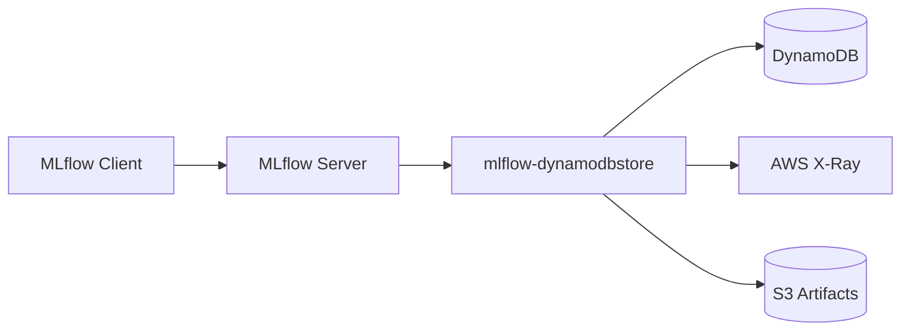

# mlflow-dynamodbstore

DynamoDB-backed MLflow tracking store, model registry, and auth plugin.

---

## Features

- **Tracking Store** -- experiments, runs, metrics, params, tags, and traces
- **Model Registry** -- registered models, model versions, aliases
- **Auth Plugin** -- users, permissions, workspace-scoped access control
- **Workspace Provider** -- multi-workspace isolation within a single table
- **X-Ray Integration** -- span proxy with lazy caching from AWS X-Ray
- **Full-Text Search** -- trigram-based indexing for fast substring search
- **TTL Lifecycle** -- automatic retention policies for traces, soft-deleted items, and metric history

## Architecture Highlights

All data lives in a **single DynamoDB table** with 5 Global Secondary Indexes (GSIs) and 5 Local Secondary Indexes (LSIs). The table is auto-provisioned via CloudFormation on first connection.



Key design decisions:

- **Single table design** -- one table, many access patterns (see [ADR-001](adr/001-single-table-design.md))
- **Tag denormalization** -- configurable tag patterns are copied onto META items for fast filter queries
- **Trigram FTS** -- entity names are indexed as trigrams on LSI4 for substring search
- **Lazy span caching** -- X-Ray spans are fetched and cached in DynamoDB on first read
- **TTL-based lifecycle** -- DynamoDB TTL handles automatic cleanup of expired data

## Installation

```bash
uv pip install mlflow-dynamodbstore
```

## Quick Start

```bash
export MLFLOW_FLASK_SERVER_SECRET_KEY=$(python -c "import secrets; print(secrets.token_hex(32))")

mlflow server \
  --app-name dynamodb-auth \
  --backend-store-uri dynamodb://us-east-1/my-table \
  --default-artifact-root s3://my-bucket/mlflow-artifacts
```

The DynamoDB table is auto-provisioned via CloudFormation on first connection.

See the [Quickstart](user-guide/quickstart.md) for a full walkthrough.

## Documentation

<div class="grid cards" markdown>

- :material-rocket-launch: **[Quickstart](user-guide/quickstart.md)**

    Get up and running in minutes.

- :material-cog: **[Configuration](user-guide/configuration.md)**

    URI format, environment variables, and config reconciliation.

- :material-folder-multiple: **[Workspaces](user-guide/workspaces.md)**

    Multi-workspace isolation for teams and environments.

- :material-ray-start-arrow: **[X-Ray Integration](user-guide/xray-integration.md)**

    Dual-export OTel setup and span caching.

- :material-console: **[CLI Reference](operator-guide/cli-reference.md)**

    Admin commands for denormalization, FTS, TTL, and more.

- :material-timer-sand: **[TTL Lifecycle](operator-guide/ttl-lifecycle.md)**

    Retention policies and expired data cleanup.

</div>
