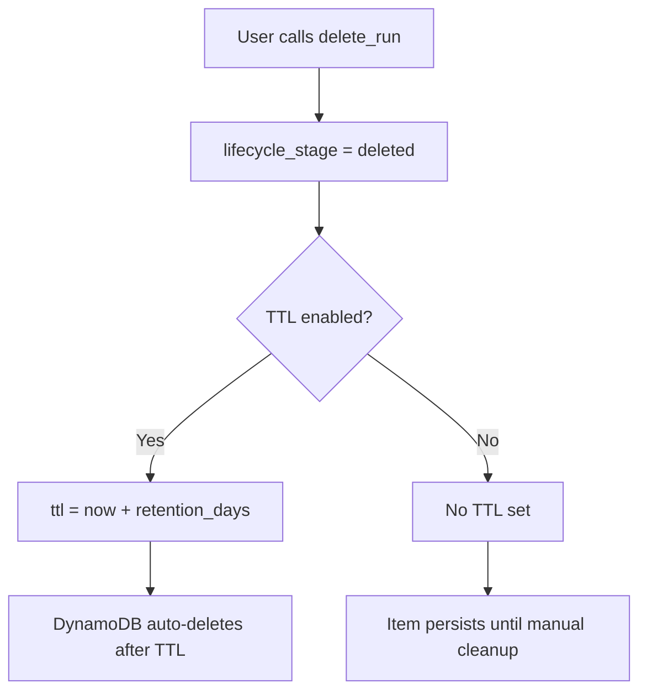

# TTL Lifecycle

DynamoDB Time-to-Live (TTL) automatically deletes items after a configurable
retention period. mlflow-dynamodbstore uses TTL to manage data lifecycle for
soft-deleted entities, traces, and metric history.

## Retention Policies

Three independent policies control TTL behavior:

| Policy                           | Default | Applies to                               |
|----------------------------------|---------|------------------------------------------|
| `soft_deleted_retention_days`    | 90      | Soft-deleted runs and experiments         |
| `trace_retention_days`           | 30      | Traces (set at creation time)             |
| `metric_history_retention_days`  | 365     | Metric history items (set at write time)  |

Set any policy to `0` to disable TTL for that category.

```bash
# View current policies
mlflow-dynamodbstore --name mlflow --region us-east-1 ttl show

# Update a policy
mlflow-dynamodbstore --name mlflow --region us-east-1 ttl set \
    --soft-deleted-retention-days 180
```

!!! info "DynamoDB TTL Mechanics"
    DynamoDB TTL deletion is **eventual** -- items may persist for up to 48 hours
    past their TTL timestamp. TTL deletions do not consume write capacity and do
    not count toward your provisioned throughput.

## Soft-Delete Flow

When a user calls `delete_run()` or `delete_experiment()`, the following happens:



1. The item's `lifecycle_stage` is set to `deleted`.
2. If `soft_deleted_retention_days > 0`, a `ttl` attribute is set to
   `now + soft_deleted_retention_days` (as a Unix epoch timestamp).
3. DynamoDB automatically removes the item after the TTL expires.

### Experiments

When an experiment is soft-deleted:

- The experiment META item gets a TTL.
- All runs under that experiment retain their individual TTLs (if any).
- After the META item expires, child items (runs, tags, params, metrics) become
  **orphaned** -- use [`ttl cleanup`](cli-reference.md#ttl) to
  expire them.

### Runs

When a run is soft-deleted:

- The run META item and all its child items (tags, params, latest metrics)
  receive the same TTL.
- Metric history items may have their own shorter TTL from
  `metric_history_retention_days`.

## Trace TTL

Traces receive a TTL at creation time based on `trace_retention_days`. Unlike
soft-delete TTL, trace TTL is always set at write time -- there is no
intermediate "deleted" state.

```bash
# Set trace retention to 60 days
mlflow-dynamodbstore --name mlflow --region us-east-1 ttl set \
    --trace-retention-days 60
```

!!! tip
    AWS X-Ray retains trace data for 30 days. If you set `trace_retention_days`
    longer than 30, use [`trace cache`](cli-reference.md#trace) to
    pre-cache span data before X-Ray expires it.

## Metric History TTL

Metric history items (individual logged metric values) receive a TTL at write
time. The latest metric value for each key is stored separately on the run META
item and is **not** affected by this TTL -- only the detailed history is pruned.

This is useful for long-running experiments where you want to keep the final
metric values but discard the step-by-step history.

## Data Recovery Window

The retention period is your recovery window. Within this window, you can
restore soft-deleted items:

```python
import mlflow

# Restore a deleted run before TTL expires
mlflow.tracking.MlflowClient().restore_run(run_id)

# Restore a deleted experiment before TTL expires
mlflow.tracking.MlflowClient().restore_experiment(experiment_id)
```

When an item is restored:

1. The `lifecycle_stage` is set back to `active`.
2. The `ttl` attribute is **removed**, preventing automatic deletion.

!!! warning
    Once DynamoDB TTL has deleted an item, restoration is **not possible**.
    Ensure your retention periods provide an adequate recovery window for your
    operational needs.

## Background Cleanup

DynamoDB TTL only deletes the item that carries the `ttl` attribute. When a
parent item (e.g., experiment META) is TTL-deleted, its children become orphans.

Run `ttl cleanup` periodically to handle orphans:

```bash
# Preview orphaned items
mlflow-dynamodbstore --name mlflow --region us-east-1 ttl cleanup --dry-run

# Set TTL on orphans for automatic cleanup
mlflow-dynamodbstore --name mlflow --region us-east-1 ttl cleanup
```

### Recommended Schedule

| Environment | Frequency   | Notes                            |
|-------------|-------------|----------------------------------|
| Production  | Daily       | Run during off-peak hours        |
| Staging     | Weekly      | Lower data volume                |
| Development | As needed   | Manual runs are usually sufficient|

!!! tip "Automation"
    In production, schedule `ttl cleanup` via cron, AWS EventBridge, or a
    Lambda function. See the [Upgrading](upgrading.md) guide for the v2
    EventBridge-scheduled cleanup approach.

## TTL and DynamoDB Streams

If you have DynamoDB Streams enabled, TTL deletions emit a `REMOVE` event with
`userIdentity.type = Service` and `userIdentity.principalId = dynamodb.amazonaws.com`.
This lets downstream consumers distinguish TTL-based removals from explicit
deletes.
