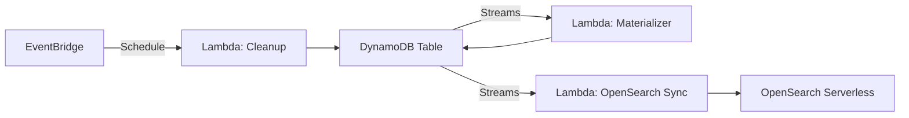

# Upgrading

This guide describes the v2 upgrade path for mlflow-dynamodbstore, moving from
manual CLI-driven operations to event-driven automation.

## Overview

The v1 architecture relies on manual CLI commands for maintenance tasks. The v2
architecture introduces:

| Component                   | Replaces                          | Benefit                              |
|-----------------------------|-----------------------------------|--------------------------------------|
| DynamoDB Streams + Lambda   | Manual `denormalize-tags backfill` | Real-time async materialization     |
| OpenSearch Serverless       | Trigram-based FTS                  | Full-text search with ranking       |
| EventBridge scheduled rules | Manual `cleanup-expired`           | Automated periodic cleanup           |



!!! info
    The v2 infrastructure is deployed via the
    [zae-mlflow](https://github.com/zeroae/zae-mlflow) CDK repository.
    mlflow-dynamodbstore itself remains the same Python package -- the upgrade
    is purely on the infrastructure side.

## DynamoDB Streams + Lambda

### What It Does

A Lambda function consumes DynamoDB Streams events and performs real-time
materialization:

- **Tag denormalization** -- When a tag item is written, the Lambda
  automatically updates the corresponding META item with the denormalized
  attribute. No more `backfill` needed for new data.
- **Trigram index updates** -- When a name field changes, trigrams are
  recomputed and written to the index partition.

### Migration Steps

1. **Deploy the CDK stack** with Streams enabled:

    ```bash
    cd zae-mlflow
    npx cdk deploy --context streams=true
    ```

2. **Verify the Lambda** is processing events:

    ```bash
    aws logs tail /aws/lambda/mlflow-materializer --follow
    ```

3. **Run a one-time backfill** to catch up existing data:

    ```bash
    mlflow-dynamodbstore denormalize-tags backfill \
        --table mlflow --region us-east-1
    ```

4. **Remove backfill from cron** -- the Lambda handles new data going forward.

!!! note
    The backfill CLI command remains available for disaster recovery or
    re-materialization after schema changes.

### Considerations

- **Lambda concurrency** -- Each shard gets its own Lambda invocation. For
  tables with high write throughput, monitor Lambda concurrent executions.
- **Error handling** -- The Lambda uses a dead-letter queue (DLQ) for failed
  events. Monitor the DLQ for poisoned records.
- **Ordering** -- DynamoDB Streams guarantees ordering within a shard. The
  Lambda processes events in order, ensuring consistency.

## OpenSearch Serverless

### What It Does

Replaces the trigram-based full-text search with OpenSearch Serverless,
providing:

- Proper tokenization and stemming
- Relevance-ranked results
- Fuzzy matching
- No 10 GB partition limit for search indexes

### Migration Steps

1. **Deploy OpenSearch Serverless collection** via CDK:

    ```bash
    cd zae-mlflow
    npx cdk deploy --context opensearch=true
    ```

2. **Configure the tracking store** to use OpenSearch for search:

    ```bash
    export MLFLOW_DYNAMODBSTORE_SEARCH_BACKEND=opensearch
    export MLFLOW_DYNAMODBSTORE_OPENSEARCH_ENDPOINT=https://...aoss.amazonaws.com
    ```

3. **Index existing data** -- The CDK stack includes a one-time indexing Lambda
   that scans the DynamoDB table and populates OpenSearch.

4. **Verify search** works through the MLflow UI.

### Considerations

- **Cost** -- OpenSearch Serverless has a minimum charge of ~2 OCU (OpenSearch
  Compute Units). Evaluate whether your search volume justifies the cost.
- **IAM** -- The MLflow server needs IAM permissions to call the OpenSearch
  endpoint. The CDK stack configures this automatically.
- **Fallback** -- The trigram search remains functional. You can switch back by
  unsetting `MLFLOW_DYNAMODBSTORE_SEARCH_BACKEND`.

## EventBridge Scheduled Cleanup

### What It Does

Replaces manual `cleanup-expired` CLI runs with an EventBridge rule that
triggers a Lambda on a schedule.

### Migration Steps

1. **Deploy the scheduled cleanup Lambda** via CDK:

    ```bash
    cd zae-mlflow
    npx cdk deploy --context scheduled-cleanup=true
    ```

2. **Configure the schedule** (default: daily at 03:00 UTC):

    ```bash
    cd zae-mlflow
    npx cdk deploy \
        --context scheduled-cleanup=true \
        --context cleanup-schedule="rate(1 day)"
    ```

3. **Remove the CLI from cron** -- EventBridge handles scheduling.

4. **Monitor via CloudWatch Logs**:

    ```bash
    aws logs tail /aws/lambda/mlflow-cleanup --follow
    ```

### Considerations

- The Lambda runs with the same logic as `cleanup-expired` -- it scans for
  orphaned items and sets `ttl = now`.
- **Timeout** -- For large tables, ensure the Lambda timeout is sufficient
  (default 5 minutes; increase for tables with millions of items).
- **Alerting** -- Set up a CloudWatch alarm on Lambda errors to catch failures.

## Upgrade Checklist

- [ ] Deploy CDK stack with desired v2 features
- [ ] Run one-time backfill / indexing for existing data
- [ ] Verify Lambda functions are processing events correctly
- [ ] Monitor CloudWatch Logs and DLQs for errors
- [ ] Remove manual CLI cron jobs
- [ ] Update runbooks to reference Lambda-based operations
- [ ] Update alerting to include Lambda error metrics

## Rollback

All v2 features are additive. To roll back:

1. **Disable Streams** -- Remove the Lambda trigger; the table continues to
   function without it.
2. **Switch search backend** -- Unset `MLFLOW_DYNAMODBSTORE_SEARCH_BACKEND`
   to fall back to trigram search.
3. **Disable EventBridge rule** -- Re-enable the CLI cron job.

The CLI commands remain fully functional regardless of whether v2 infrastructure
is deployed.
