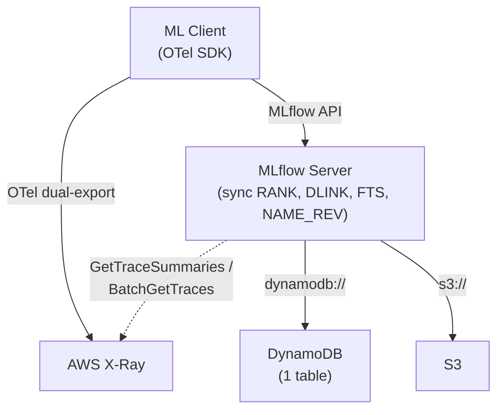

# mlflow-dynamodbstore — Design Specification

## Overview

A pip-installable MLflow plugin (`mlflow-dynamodbstore`) that provides DynamoDB-backed implementations of MLflow's tracking store, model registry store, and auth plugin. Part of a serverless-first architecture for small teams with bursty, cost-sensitive workloads.

### Scope

| Component | Backend | Package |
|-----------|---------|---------|
| Tracking Store (experiments, runs, metrics, params, tags, datasets, inputs, logged models, trace metadata, assessments) | DynamoDB | `mlflow-dynamodbstore` |
| Model Registry Store (registered models, versions, tags, aliases) | DynamoDB | `mlflow-dynamodbstore` |
| Auth Plugin (users, permissions) | DynamoDB | `mlflow-dynamodbstore` |
| Workspace Provider (workspace CRUD, artifact root resolution) | DynamoDB | `mlflow-dynamodbstore` |
| Artifacts (model files, plots) | S3 | MLflow built-in |
| Spans (timing, flamegraphs, service maps) | AWS X-Ray | OTel dual-export |
| Full serverless deployment (API GW, Lambda, CDK) | AWS | `zae-mlflow` (separate repo, v2) |

### Target User

Small team (< 10 data scientists), serverless AWS stack, bursty usage, cost-sensitive. DynamoDB on-demand (pay-per-request) billing.

### Two-Repo Structure

| Repo | Package | Purpose | Timeline |
|------|---------|---------|----------|
| `mlflow-dynamodbstore` | `uv pip install mlflow-dynamodbstore` | MLflow plugin — pure Python, auto-provisions DynamoDB table via CloudFormation on first use | v1 (now) |
| `zae-mlflow` | CDK app | Full serverless stack: API Gateway + Lambda + DynamoDB + S3 + X-Ray + OTel collector + async stream Lambda | v2 (later) |

## Architecture



**URI scheme:** `dynamodb://` registered via `pyproject.toml` entry points.

```bash
uv pip install mlflow-dynamodbstore

mlflow server \
  --app-name dynamodb-auth \
  --backend-store-uri dynamodb://us-east-1/my-table \
  --default-artifact-root s3://bucket/artifacts
```

The DynamoDB table (with all LSIs and GSIs) is auto-provisioned via CloudFormation on first connection. No separate infrastructure deployment step needed for v1.

### v1: Synchronous Materialization

All materialized views (RANK, DLINK, NAME_REV, FTS) are written synchronously in the tracking store code alongside the primary writes. No DynamoDB Streams, no Lambda function.

| Tradeoff | Sync (v1) | Async Streams (v2 via zae-mlflow CDK) |
|----------|-----------|--------------------------------------|
| Infrastructure | 1 DynamoDB table | Table + Lambda + Stream + IAM |
| Auto-provision | Trivial (one CFN resource) | Complex (Lambda code packaging) |
| Write latency | +5-15ms (extra BatchWriteItems) | No impact on API response |
| Consistency | Immediate | Eventually consistent (~50ms) |
| Failure mode | API call fails → caller retries | Lambda fails → stale view until retry |

The materialized items have identical schemas in both modes. The v2 upgrade path is: add Streams + Lambda, remove sync writes from store code.

## ID Strategy

All store-generated IDs use ULIDs with the entity's logical timestamp. This makes the DynamoDB sort key itself time-sortable, eliminating the need for separate time-sort indexes.

| ID | Generated By | Timestamp Source | Format |
|----|-------------|-----------------|--------|
| `experiment_id` | Store | creation time | ULID |
| `run_id` | Store | creation time (MLflow calls this `start_time`) | ULID |
| `registered_model_id` | Store | creation time | ULID |
| `dataset_uuid` | Store | creation time | ULID |
| `model_id` (LoggedModel) | Store | creation time | ULID |
| `assessment_id` | Store | creation time | ULID |
| `trace_id` | OTel client | Not controlled | Passthrough |
| `model version` | Store | N/A | Sequential int per model |

### Why creation time in ULIDs

Using the entity's creation timestamp as the ULID timestamp means:

- SK ordering = creation time ordering exactly (no approximation)
- Range queries like `start_time > X` become SK key conditions: `SK > R#<ulid_from_timestamp(X)>` — resolved at the index level
- Historical imports slot into the correct sort position
- Default sort (`start_time DESC`) is free from the base table SK

## Single Table Design

One DynamoDB table, pay-per-request billing, 4 partition families, 20 entity types + 4 materialized types.

All workspace-scoped entities carry a `workspace` attribute. Both experiments and registered models use globally unique ULIDs as partition keys (`EXP#<experiment_id>`, `RM#<registered_model_id>`), with names resolved via GSI3. This makes renames trivial (single `UpdateItem`) and keeps the design consistent across entity types. When workspaces are disabled, all operations use workspace `"default"`.

LSI attributes are only populated on META-level items. Sub-items (tags, params, metrics, etc.) omit them and are automatically excluded from LSI projections.

### Experiment Partition: `PK = EXP#<experiment_id>`

Experiment META items carry a `workspace` attribute (default: `"default"`).

| Entity | SK | lsi1sk | lsi2sk | lsi3sk | lsi4sk | lsi5sk |
|--------|-----|--------|--------|--------|--------|--------|
| Experiment META | `E#META` | `<lifecycle>#<ulid>` | `last_update_time` | `lower(name)` | `rev(lower(name))` | — |
| Experiment Tag | `E#TAG#<key>` | — | — | — | — | — |
| Experiment NAME_REV | `E#NAME_REV` | — | — | — | — | — |
| Run META | `R#<ulid_run_id>` | `<lifecycle>#<ulid>` | `end_time` | `<status>#<ulid>` | `lower(run_name)` | `duration_ms` |
| Run Tag | `R#<ulid>#TAG#<key>` | — | — | — | — | — |
| Run Param | `R#<ulid>#PARAM#<key>` | — | — | — | — | — |
| Metric Latest | `R#<ulid>#METRIC#<key>` | — | — | — | — | — |
| Metric History | `R#<ulid>#MHIST#<key>#<zero_padded_step>#<ts>` | — | — | — | — | — |
| Dataset | `D#<name>#<digest>` | — | — | — | — | — |
| Input Link | `R#<ulid>#INPUT#<ds_uuid>` | — | — | — | — | — |
| Input Tag | `R#<ulid>#INPUT#<ds_uuid>#ITAG#<name>` | — | — | — | — | — |
| Logged Model | `R#<ulid>#LM#<model_id>` | — | — | — | — | — |
| Logged Model Tag | `R#<ulid>#LM#<model_id>#TAG#<key>` | — | — | — | — | — |
| Trace META | `T#<trace_id>` | `timestamp_ms` | `end_time_ms` | `<status>#<timestamp_ms>` | `lower(trace_name)` | `execution_time_ms` |
| Trace Tag | `T#<trace_id>#TAG#<key>` | — | — | — | — | — |
| Trace Req Metadata | `T#<trace_id>#RMETA#<key>` | — | — | — | — | — |
| Assessment | `T#<trace_id>#ASSESS#<id>` | — | — | — | — | — |
| Trace Span Cache *(lazy)* | `T#<trace_id>#SPANS` | — | — | — | — | — |
| Trace Client Req Ptr *(materialized)* | `T#<trace_id>#CLIENTPTR` | — | — | — | — | — |
| DLINK *(materialized)* | `DLINK#<ds_name>#<ds_digest>#R#<ulid>` | — | — | — | — | — |
| RANK metric *(materialized)* | `RANK#m#<key>#<inv_value>#<ulid>` | — | — | — | — | — |
| RANK param *(materialized)* | `RANK#p#<key>#<value>#<ulid>` | — | — | — | — | — |
| FTS token *(materialized)* | `FTS#<level>#<token>#<entity_type>#<entity_id>[#<field>]` | — | — | — | — | — |
| FTS reverse *(materialized)* | `FTS_REV#<entity_type>#<entity_id>[#<field>]#<level>#<token>` | — | — | — | — | — |

DLINK items carry a `context` attribute (denormalized from input tags) for dataset context filtering.

RANK metric items use inverted values (`9999999999.9999 - value`, zero-padded) so that ascending SK scan (`ScanIndexForward=True`) yields descending original-value order.

FTS items carry `field` (assessment/tag/metadata) and `key` attributes for filtering by source.

### Model Partition: `PK = RM#<registered_model_id>`

Registered models use globally unique ULIDs as partition keys, same as experiments. Model names are resolved via GSI3 (`MODEL_NAME#<workspace>#<name>` → `<model_ulid>`). The store caches `model_name → model_ulid` mappings in the same LRU cache as `run_id → experiment_id`.

Model META items carry `workspace` and `name` attributes.

| Entity | SK | lsi1sk | lsi2sk | lsi3sk | lsi4sk | lsi5sk |
|--------|-----|--------|--------|--------|--------|--------|
| Model META | `M#META` | — | `last_update_time` | `lower(name)` | `rev(lower(name))` | — |
| Model Tag | `M#TAG#<key>` | — | — | — | — | — |
| Model Alias | `M#ALIAS#<alias>` | — | — | — | — | — |
| Model NAME_REV *(materialized)* | `M#NAME_REV` | — | — | — | — | — |
| Model Name FTS *(materialized)* | `FTS#<token>#M#<model_id>` | — | — | — | — | — |
| Model Name FTS_REV *(materialized)* | `FTS_REV#M#<model_id>#<token>` | — | — | — | — | — |
| Version META | `V#<padded_ver>` | `creation_time` | `last_update_time` | `<stage>#<padded_ver>` | `lower(source_path)` | `<run_id>#<padded_ver>` |
| Version Tag | `V#<padded_ver>#TAG#<key>` | — | — | — | — | — |

### Workspace Partition: `PK = WORKSPACE#<workspace_name>`

| Entity | SK |
|--------|-----|
| Workspace META | `META` |

Attributes: `name`, `description`, `default_artifact_root`. A `default` workspace is created during table provisioning.

### Auth Partition: `PK = USER#<username>`

| Entity | SK | GSI4 (gsi4pk → gsi4sk) |
|--------|-----|------------------------|
| User META | `U#META` | — |
| Experiment Permission | `U#PERM#EXP#<experiment_id>` | `PERM#EXP#<experiment_id>` → `USER#<username>` |
| Model Permission | `U#PERM#MODEL#<workspace>#<model_name>` | `PERM#MODEL#<workspace>#<model_name>` → `USER#<username>` |
| Workspace Permission | `U#PERM#WORKSPACE#<workspace_name>` | `PERM#WORKSPACE#<workspace_name>` → `USER#<username>` |
| Scorer Permission | `U#PERM#SCORER#<experiment_id>#<scorer_name>` | `PERM#SCORER#<experiment_id>#<scorer_name>` → `USER#<username>` |

Attributes: `permission` (READ / USE / EDIT / MANAGE / NO_PERMISSIONS).

User META attributes: `password_hash` (Werkzeug scrypt), `is_admin` (bool).

Gateway secret, endpoint, and model definition permissions are out of scope (Databricks-specific) — raise `NotImplementedError`.

**Authentication and permission checks use strongly consistent reads** (`ConsistentRead=True`).

**No abstract base class** — MLflow's auth store is duck-typed (~50 methods). Our `DynamoDBAuthStore` implements the same interface as `mlflow.server.auth.sqlalchemy_store.SqlAlchemyStore`. The `dynamodb-auth` app plugin provides its own `create_app` that initializes our store and reuses MLflow's auth middleware/validators.

## Index Design

### LSIs (5 overloaded)

| LSI | Attribute | Experiments | Runs | Traces | Reg Models | Model Versions |
|-----|-----------|-------------|------|--------|------------|----------------|
| LSI1 | `lsi1sk` | `<lifecycle>#<ulid>` | `<lifecycle>#<ulid>` | `timestamp_ms` | — | `creation_time` |
| LSI2 | `lsi2sk` | `last_update_time` | `end_time` | `end_time_ms` | `last_update_time` | `last_update_time` |
| LSI3 | `lsi3sk` | `lower(name)` | `<status>#<ulid>` | `<status>#<timestamp_ms>` | `lower(name)` | `<stage>#<padded_ver>` |
| LSI4 | `lsi4sk` | `rev(lower(name))` | `lower(run_name)` | `lower(trace_name)` | `rev(lower(name))` | `lower(source_path)` |
| LSI5 | `lsi5sk` | — | `duration_ms` | `execution_time_ms` | — | `<run_id>#<padded_ver>` |

**LSI1 — Lifecycle/time/creation:** Experiments/runs: `<lifecycle>#<ulid>` for active/deleted filtering with time sort. Traces: `timestamp_ms` for default time-ordered listing. Model versions: `creation_time` for `ORDER BY creation_timestamp`.

**LSI2 — End/update time:** Sort runs by completion, experiments/models by last modification, traces by end time.

**LSI3 — Name or status composite:** Experiments/models: `lower(name)` for prefix ILIKE via `begins_with`. Runs/traces: `<status>#<ulid>` for status filter + time sort in one key condition. Model versions: `<stage>#<padded_ver>` for `get_latest_versions` per stage.

**LSI4 — Reversed name or secondary name:** Experiments/models: `rev(lower(name))` for suffix ILIKE. Runs: `lower(run_name)` for prefix ILIKE. Traces: `lower(trace_name)` for prefix ILIKE on trace name. Model versions: `lower(source_path)` for prefix ILIKE.

**LSI5 — Duration/run linkage:** Runs: `duration_ms` (set on completion). Traces: `execution_time_ms`. Model versions: `<run_id>#<padded_ver>` for finding versions from a specific run within a model (`begins_with("<run_id>#")`).

### GSIs (5 overloaded)

#### GSI1 — Reverse ID Lookups

| Entity | gsi1pk | gsi1sk | Query |
|--------|--------|--------|-------|
| Run META | `RUN#<run_id>` | `EXP#<exp_id>` | Get run by ID → find experiment |
| Model Version | `RUN#<run_id>` | `MV#<model_ulid>#<ver>` | Model versions by run_id |
| Trace META | `TRACE#<trace_id>` | `EXP#<exp_id>` | Get trace by request ID |
| Trace Client Req Ptr *(materialized)* | `CLIENT#<client_req_id>` | `TRACE#<trace_id>` | Trace by client request ID |
| Input Link | `DS#<ds_uuid>` | `R#<run_id>` | Find runs using a dataset |

`gsi1pk = RUN#<run_id>` serves three purposes in one query: run lookup, experiment discovery, and model version linkage.

Note: The `CLIENT#<client_req_id>` entry is a separate materialized pointer item (written alongside the Trace META item at `start_trace` time), not an attribute on the Trace META item itself. A single DynamoDB item can only have one `gsi1pk` value.

#### GSI2 — Workspace-Scoped Entity Listings

| Entity | gsi2pk | gsi2sk | Query |
|--------|--------|--------|-------|
| Experiment META | `EXPERIMENTS#<workspace>#<lifecycle>` | `<ulid>` | List experiments in workspace by lifecycle. `ViewType.ALL` requires two queries (`#active` + `#deleted`) merged client-side |
| Model META | `MODELS#<workspace>` | `<last_update_time>#<name>` | List registered models in workspace |
| Auth User META | `AUTH_USERS` | `<username>` | List all auth users (workspace-independent) |
| Workspace META | `WORKSPACES` | `<workspace_name>` | List all workspaces |
| Experiment name FTS | `FTS_NAMES#<workspace>` | `<level>#<token>#EXP#<exp_id>` | Cross-partition experiment name LIKE (word-level `W#` and trigram `3#`) |
| Model name FTS | `FTS_NAMES#<workspace>` | `<level>#<token>#RM#<model_id>` | Cross-partition model name LIKE (word-level `W#` and trigram `3#`) |

When workspaces are disabled, all queries use `workspace = "default"` (e.g., `EXPERIMENTS#default#active`).

Experiment and model name FTS tokens share the `FTS_NAMES#<workspace>` partition, differentiated by `EXP#` vs `RM#` prefix in the sort key. These are not extra items — the existing experiment/model name FTS items gain `gsi2pk` and `gsi2sk` attributes for cross-partition projection.

#### GSI3 — Uniqueness & Named Lookups (workspace-scoped)

| Entity | gsi3pk | gsi3sk | Query |
|--------|--------|--------|-------|
| Experiment META | `EXP_NAME#<workspace>#<name>` | `<exp_id>` | `get_experiment_by_name()`, uniqueness check within workspace |
| Model META | `MODEL_NAME#<workspace>#<name>` | `<model_ulid>` | `get_registered_model(name)`, uniqueness check within workspace |
| Model Alias | `ALIAS#<workspace>#<model_name>#<alias>` | `<version>` | `get_model_version_by_alias()` within workspace |

#### GSI4 — Auth Inverted Queries

| Entity | gsi4pk | gsi4sk | Query |
|--------|--------|--------|-------|
| Permission | `PERM#<resource_type>#<resource_id>` | `USER#<username>` | "Who has access to resource X?" |

#### GSI5 — Name Prefix/Suffix Search (workspace-scoped)

| Entity | gsi5pk | gsi5sk | Query |
|--------|--------|--------|-------|
| Experiment META | `EXP_NAMES#<workspace>` | `FWD#<lower(name)>#<id>` | Prefix ILIKE within workspace |
| Experiment NAME_REV *(materialized)* | `EXP_NAMES#<workspace>` | `REV#<rev(lower(name))>#<id>` | Suffix ILIKE within workspace |
| Model META | `MODEL_NAMES#<workspace>` | `FWD#<lower(name)>` | Prefix ILIKE within workspace |
| Model NAME_REV *(materialized)* | `MODEL_NAMES#<workspace>` | `REV#<rev(lower(name))>` | Suffix ILIKE within workspace |

Forward direction lives on the META item. Reverse direction is a separate materialized item (one DynamoDB item can only appear once per GSI).

## Materialized Views

Written synchronously in v1, async via DynamoDB Streams + Lambda in v2.

### RANK Items (metric/param sorting)

Written when `log_batch` records metrics or params.

```
PK: EXP#<experiment_id>
SK: RANK#m#<metric_key>#<inverted_value>#<run_ulid>
```

Inverted value: `inv = 9999999999.9999 - value`, zero-padded to fixed width. Enables descending numeric sort via ascending SK scan.

Query: `ORDER BY metric.accuracy DESC` → `PK=EXP#1, SK begins_with("RANK#m#accuracy#"), ScanIndexForward=True` (inverted values give descending order).

Only the **latest value** per (metric_key, run) is materialized as a RANK item. When a metric is logged at a new step, the previous RANK item for that (key, run) is deleted and replaced with the new value. This avoids write amplification from high-frequency metric logging (e.g., loss per training step).

On run soft-deletion: RANK items are NOT immediately deleted. They receive TTL along with all other run children (see TTL and Data Lifecycle). RANK items are excluded from `search_runs` results by the LSI1 lifecycle filter — deleted runs never appear in active queries. On restore: TTL is removed from RANK items along with all other children.

### DLINK Items (dataset→run linkage)

Written when `log_inputs` creates input links.

```
PK: EXP#<experiment_id>
SK: DLINK#<dataset_name>#<dataset_digest>#R#<run_ulid>
Attrs: context (from input tag "mlflow.data.context")
```

Query: `dataset.name = 'my_data'` → `PK=EXP#1, SK begins_with("DLINK#my_data#")`.

### NAME_REV Items (suffix ILIKE)

Written when experiments or models are created/renamed.

```
PK: EXP#<experiment_id>    SK: E#NAME_REV    gsi5pk: EXP_NAMES    gsi5sk: REV#<rev(lower(name))>#<id>
PK: RM#<model_name>        SK: M#NAME_REV    gsi5pk: MODEL_NAMES  gsi5sk: REV#<rev(lower(name))>
```

### FTS Items (full-text search)

Written for all text fields within an experiment partition that support `LIKE '%...%'` queries. FTS uses two index levels:

- **`W#` (word-level)** — stemmed whole-word tokens. Handles `LIKE '%pipeline%'` (complete word matches).
- **`3#` (trigram-level)** — 3-character sliding window. Handles `LIKE '%pipe%'` (partial word matches).

Each token is written as two items — a forward index for search and a reverse index for cleanup.

**Indexed fields and SK patterns:**

| Field | Forward SK | Reverse SK | Index Levels | Written When |
|-------|-----------|------------|-------------|-------------|
| Experiment name | `FTS#<level>#<token>#E#<exp_id>` + `gsi2pk/gsi2sk` | `FTS_REV#E#<exp_id>#<level>#<token>` | W + 3 (always) | Experiment create/rename |
| Run name | `FTS#<level>#<token>#R#<run_id>` | `FTS_REV#R#<run_id>#<level>#<token>` | W + 3 (always) | Run create / `update_run_info` |
| Run param value | `FTS#<level>#<token>#R#<run_id>#P#<key>` | `FTS_REV#R#<run_id>#P#<key>#<level>#<token>` | W (always) + 3 (configurable) | `log_batch` param write |
| Run tag value | `FTS#<level>#<token>#R#<run_id>#TAG#<key>` | `FTS_REV#R#<run_id>#TAG#<key>#<level>#<token>` | W (always) + 3 (configurable) | `set_tag` |
| Trace tag value | `FTS#<level>#<token>#T#<trace_id>#TAG#<key>` | `FTS_REV#T#<trace_id>#TAG#<key>#<level>#<token>` | W (always) + 3 (configurable) | `set_trace_tag` |
| Trace req metadata value | `FTS#<level>#<token>#T#<trace_id>#RMETA#<key>` | `FTS_REV#T#<trace_id>#RMETA#<key>#<level>#<token>` | W (always) + 3 (configurable) | Trace metadata write |
| Assessment value | `FTS#<level>#<token>#T#<trace_id>#ASSESS#<id>` | `FTS_REV#T#<trace_id>#ASSESS#<id>#<level>#<token>` | W (always) + 3 (configurable) | Assessment create/update |

Where `<level>` is `W` (word) or `3` (trigram).

All FTS items share `PK = EXP#<experiment_id>`.

**Forward index** enables search: `SK begins_with("FTS#W#<stemmed_token>#R#")` for word match, `SK begins_with("FTS#3#<trigram>#R#")` for partial match.

**Reverse index** enables cleanup: `SK begins_with("FTS_REV#R#<run_id>#")` → all tokens (both levels) for that run.

**Cross-partition LIKE** (experiment/model names): Experiment and model name FTS items carry `gsi2pk = FTS_NAMES#<workspace>` and `gsi2sk = <level>#<token>#EXP#<exp_id>` (or `#RM#<model_id>`), enabling cross-partition name search via GSI2. Model name FTS items live in the model partition (`PK = RM#<model_id>`) with the same GSI2 projection.

**Trigram configuration** — stored in the CONFIG partition:

```
PK: CONFIG    SK: FTS_TRIGRAM_FIELDS
attrs: fields = ["run_param_value", "run_tag_value", "trace_tag_value",
                  "trace_metadata_value", "assessment_value", "span_content"]
```

Entity names (experiment, run, model) always have trigram indexing enabled — not configurable. Additional fields are opt-in via the config above, reconciled from environment variable on every server startup (see Auto-Provisioning § Config Reconciliation):

```bash
MLFLOW_DYNAMODB_FTS_TRIGRAM_FIELDS=run_param_value,run_tag_value
```

Admin CLI:

```bash
# View trigram-enabled fields
mlflow-dynamodbstore fts-trigrams list --table my-table

# Add fields
mlflow-dynamodbstore fts-trigrams add run_param_value run_tag_value --table my-table

# Backfill trigrams on existing data
mlflow-dynamodbstore fts-trigrams backfill --table my-table
```

## Full-Text Search

Dual-level inverted index: word-level (stemmed) for whole-word matches and trigram-level for partial-word matches.

### Tokenizers

```python
import re
import snowballstemmer

STOP_WORDS = frozenset({
    "the", "a", "an", "is", "in", "on", "at", "to", "for",
    "of", "and", "or", "not", "it", "this", "that", "with",
    "be", "has", "have", "had", "do", "does", "did", "but",
    "if", "no", "so", "as", "by", "from", "are", "was", "were",
})
_stemmer = snowballstemmer.stemmer("english")

def tokenize_words(text: str) -> set[str]:
    """Stemmed whole-word tokens for LIKE '%complete_word%' matches."""
    words = re.findall(r'[a-z0-9]+', text.lower())
    words = [w for w in words if w not in STOP_WORDS and len(w) > 1]
    return set(_stemmer.stemWords(words))

def tokenize_trigrams(text: str) -> set[str]:
    """Character trigrams for LIKE '%partial%' matches."""
    words = re.findall(r'[a-z0-9]+', text.lower())
    grams = set()
    for word in words:
        for i in range(len(word) - 2):
            grams.add(word[i:i+3])
    return grams
```

**Indexed fields:** experiment names, run names, run param values, run tag values, trace tag values, trace request metadata values, assessment values. Span content is NOT indexed (lives in X-Ray).

**Index levels per field:**

| Field | Word (W) | Trigram (3) |
|-------|----------|------------|
| Experiment name | Always | Always |
| Run name | Always | Always |
| Model name | Always | Always |
| Run param value | Always | Configurable |
| Run tag value | Always | Configurable |
| Trace tag value | Always | Configurable |
| Trace req metadata value | Always | Configurable |
| Assessment value | Always | Configurable |

### Search Strategy

The query planner selects the index level based on the search term:

| LIKE Pattern | Strategy |
|-------------|----------|
| `'%pipeline%'` (complete word) | Word-level FTS: stem → single `FTS#W#` query |
| `'%pipe%'` (partial word, ≥ 3 chars) | Trigram FTS: trigrams of "pipe" → `FTS#3#pip` ∩ `FTS#3#ipe` → intersect → verify |
| `'%pi%'` (< 3 chars) | Too short for trigrams — `contains()` FilterExpression fallback |
| `'%foo bar%'` (multi-word phrase) | Word-level: stem each word → intersect → verify phrase order |
| `'%foo ba%'` (phrase with partial word) | Trigram on partial word + word on complete words → intersect → verify |

**How to determine "complete word" vs "partial word":** Stem the search term. If the stem matches a token in the word-level index, it's a complete word match. If not, fall back to trigrams. In practice, the query planner tries word-level first (cheaper), falls back to trigrams if no results.

### Cross-Partition FTS

Experiment and model name FTS items carry GSI2 attributes for cross-partition queries:

```
gsi2pk: FTS_NAMES#<workspace>    gsi2sk: <level>#<token>#EXP#<exp_id>
gsi2pk: FTS_NAMES#<workspace>    gsi2sk: <level>#<token>#RM#<model_id>
```

| Search | Mechanism |
|--------|-----------|
| `experiment.name LIKE '%pipeline%'` | GSI2 `FTS_NAMES#<ws>`, SK `begins_with("W#pipelin#EXP#")` |
| `experiment.name LIKE '%pipe%'` | GSI2 `FTS_NAMES#<ws>`, SK `begins_with("3#pip#EXP#")` ∩ `begins_with("3#ipe#EXP#")` → verify |
| `model.name LIKE '%transformer%'` | GSI2 `FTS_NAMES#<ws>`, SK `begins_with("W#transform#RM#")` |

### Multi-Word Phrase Search

`LIKE '%foo bar%'` is a phrase search — both words must appear adjacent and in order. FTS handles this via intersect + client-side verify:

1. Tokenize the search phrase: `"foo bar"` → stem → `{"foo", "bar"}`
2. Query FTS for each token independently, intersect result sets (runs containing ALL words)
3. Client-side verify the exact phrase on the intersected candidates: `"foo bar" in value.lower()`

The FTS intersection eliminates most non-matching entities (e.g., narrows 10,000 runs to ~50 candidates containing both words). The client-side phrase check runs only on this small set.

Edge cases:
- All search words are stop words or < 2 chars (e.g., `'%a%'`): no FTS tokens produced, falls back to full scan + `contains()` FilterExpression
- Single search word: no intersection needed, standard single-token FTS query + client-side verify
- Mixed partial + complete words (e.g., `'%pipe bar%'`): trigram FTS on "pipe" ∩ word FTS on "bar" → intersect → verify

### Write Amplification

| Entity | Word Tokens | Trigrams | Total Items (fwd + rev) |
|--------|------------|----------|------------------------|
| Experiment name "my-data-pipeline-v2" | ~4 | ~17 | (4 + 17) × 2 = 42 |
| Run name "training-run-42" | ~3 | ~11 | (3 + 11) × 2 = 28 |
| Param value "gpt-4-turbo" (trigrams enabled) | ~3 | ~8 | (3 + 8) × 2 = 22 |
| Param value "gpt-4-turbo" (trigrams disabled) | ~3 | 0 | 3 × 2 = 6 |

Entity names (experiment, run, model) are written infrequently. Params/tags can be high-volume, hence trigrams are configurable for those fields.

### Upgrade Path

v2: Replace token-level FTS with DynamoDB Zero-ETL → OpenSearch Serverless when full-text search demands grow. Same query interface, different backend.

## X-Ray Integration

Spans live in X-Ray, not DynamoDB. `span.*` filters in `search_traces` are proxied to the X-Ray API.

### Annotation Mapping

A configurable OTel `SpanProcessor` ensures key MLflow span attributes are exported as X-Ray annotations (searchable, max 50 per segment):

| MLflow Span Attribute | X-Ray Annotation | Searchable |
|-----------------------|-----------------|------------|
| `mlflow.spanType` | `mlflow_spanType` | Yes |
| `mlflow.llm.model` | `mlflow_model` | Yes |
| `mlflow.llm.provider` | `mlflow_provider` | Yes |
| span `name` | `mlflow_spanName` | Yes |
| span `status` | `mlflow_spanStatus` | Yes |

Mapping is configurable — users can add more attributes within X-Ray's 50 annotation limit.

### Search Flow

`search_traces` with `span.*` filters uses a **hybrid strategy**: DynamoDB for cached traces, X-Ray for uncached traces.

```
search_traces(filter_string="status = 'OK' AND tag.env = 'prod' AND span.type = 'LLM'")
```

1. Partition filters: DynamoDB (`status`, `tag.env`), span filters (`span.type`)
2. For span filters, check both sources:
   a. **DynamoDB (cached traces):** FilterExpression `contains(span_types, 'LLM')` on trace META — instant, covers all previously viewed traces
   b. **X-Ray (uncached traces):** `GetTraceSummaries` with `annotation.mlflow_spanType = 'LLM'` — covers traces not yet cached
3. Union DynamoDB + X-Ray results, deduplicate
4. Intersect with non-span filters (status, tags)
5. Return full trace metadata

Over time, as more traces are viewed (or pre-cached), more data lives in DynamoDB and fewer X-Ray calls are needed. After X-Ray's 30-day retention, only DynamoDB-indexed data remains.

### Trace Detail View (get_trace with spans + span indexing)

MLflow's UI calls `get_trace(request_id)` to render the span tree / flamegraph. On first view, our store fetches spans from X-Ray, caches them, and **indexes span attributes** for future search queries:

```
get_trace(request_id):
  1. Read from DynamoDB: trace META, tags, request metadata, assessments
  2. Check DynamoDB for cached spans: T#<trace_id>#SPANS
  3. If cached spans exist → use them
  4. If not cached:
     a. Call X-Ray BatchGetTraces(trace_id)
     b. Convert X-Ray segments → MLflow Span objects (via span_converter.py)
     c. Cache to DynamoDB: PutItem T#<trace_id>#SPANS (JSON blob, same TTL as trace)
     d. Index span attributes on trace META:
        UpdateItem trace META: SET
          span_types = {'LLM', 'CHAIN', 'TOOL', ...},    (set of all span types)
          span_statuses = {'OK', 'ERROR', ...},            (set of all span statuses)
          span_models = {'gpt-4', ...},                    (set of all mlflow.llm.model values)
          span_names = {'ChatModel', 'retrieve', ...}      (set of all span names)
     e. Write FTS items for span names:
        FTS#W#<stem>#T#<trace_id>#SPAN_NAME   (word-level, per unique span name)
        FTS#3#<trigram>#T#<trace_id>#SPAN_NAME (trigram-level, per unique span name)
     f. Write FTS items for span content (inputs/outputs, if trigrams enabled for span_content):
        FTS#W#<stem>#T#<trace_id>#SPAN_CONTENT
     g. Write FTS_REV items for all of the above (for cleanup)
     h. If X-Ray returns nothing (expired, > 30 days) → return trace without spans
  5. Return complete Trace (metadata + spans)
```

The span cache item:

```
PK: EXP#<experiment_id>
SK: T#<trace_id>#SPANS
attrs: spans (JSON), cached_at (timestamp), ttl (same as trace META)
```

Denormalized span attributes on trace META:

```
PK: EXP#<experiment_id>
SK: T#<trace_id>
attrs (added on cache): span_types (string set), span_statuses (string set),
                        span_models (string set), span_names (string set)
```

This is **lazy caching with progressive indexing** — spans are fetched, cached, and indexed when someone views a specific trace. Each view enriches the DynamoDB data, making future `span.*` searches faster.

### Span Search After Caching

| Filter | Before Cache (X-Ray only) | After Cache (DynamoDB) |
|--------|--------------------------|----------------------|
| `span.type = 'LLM'` | X-Ray `GetTraceSummaries` | FilterExpression: `contains(span_types, 'LLM')` |
| `span.name = 'ChatModel'` | X-Ray annotation query | FilterExpression: `contains(span_names, 'ChatModel')` |
| `span.name LIKE '%chat%'` | X-Ray + client-side | FTS: `FTS#W#chat#T#` or trigram `FTS#3#cha#T#` |
| `span.status = 'ERROR'` | X-Ray annotation query | FilterExpression: `contains(span_statuses, 'ERROR')` |
| `span.content LIKE '%error%'` | X-Ray `BatchGetTraces` + client-side | FTS: `FTS#W#error#T#...#SPAN_CONTENT` |

### Pre-Cache CLI

For teams that want all span data indexed without manually viewing each trace:

```bash
# Pre-cache all traces in an experiment from X-Ray → DynamoDB
mlflow-dynamodbstore cache-spans --table my-table --experiment-id 01JQXYZ

# Pre-cache all traces within last N days
mlflow-dynamodbstore cache-spans --table my-table --days 30

# Pre-cache + index spans for all experiments
mlflow-dynamodbstore cache-spans --table my-table --all
```

This fetches spans from X-Ray for all uncached traces, writes the SPANS item, indexes span attributes on trace META, and writes FTS items. Idempotent — safe to re-run. Run before X-Ray retention expires to ensure no span data loss.

### X-Ray → MLflow Span Conversion

The OTel exporter preserves MLflow span attributes as X-Ray annotations/metadata. The reverse mapping in `span_converter.py`:

| X-Ray Segment Field | MLflow Span Field |
|---------------------|------------------|
| Segment/subsegment ID | `span_id` |
| Parent ID | `parent_span_id` |
| Start/end time | `start_time_ns`, `end_time_ns` |
| Annotation `mlflow_spanType` | `span_type` |
| Annotation `mlflow_spanName` | `name` |
| Annotation `mlflow_spanStatus` | `status` |
| Metadata `mlflow.spanInputs` | `inputs` |
| Metadata `mlflow.spanOutputs` | `outputs` |
| Metadata `mlflow.chat.tokenUsage` | `token_usage` |
| Metadata `mlflow.llm.cost` | `cost` |

### Retention

X-Ray trace retention is **fixed at 30 days** (AWS hard limit, not configurable). Our default `trace_retention_days` matches at 30 days so both expire together.

If a team sets `trace_retention_days > 30`:
- Traces < 30 days: spans served from X-Ray (cached on first view)
- Traces 30-N days: spans served from DynamoDB cache (if previously viewed) or unavailable
- The lazy caching ensures that any trace viewed within the 30-day X-Ray window has its spans preserved in DynamoDB for the full `trace_retention_days` period

### Limitations

- X-Ray annotations support `=` only — `span.name LIKE 'Chat%'` requires `BatchGetTraces` + client-side filter (until trace is cached, then FTS handles it)
- X-Ray requires a time window (max 6 hours per query) — derived from timestamp filters or chunked
- `span.*` filters on uncached traces older than 30 days: X-Ray data expired, only DynamoDB-indexed data available (traces must have been viewed or pre-cached within the 30-day window)
- Span cache item could be large for traces with many spans — 400KB DynamoDB item limit applies. For traces with > ~1000 spans, split across multiple items or compress
- Span FTS items (names, content) only exist for cached traces — `span.name LIKE '%chat%'` searches only return previously viewed/pre-cached traces. Use `cache-spans` CLI to ensure comprehensive coverage

## One-Sided LIKE/ILIKE Support

DynamoDB's `begins_with` handles prefix patterns. Reversed strings handle suffix patterns.

### Prefix ILIKE (`name ILIKE 'prod%'`)

- Within partition: LSI3 stores `lower(name)` → `begins_with("prod")`
- Cross-partition: GSI5 stores `FWD#<lower(name)>#<id>` → `begins_with("FWD#prod")`

### Suffix ILIKE (`name ILIKE '%prod'`)

- Cross-partition: GSI5 stores `REV#<rev(lower(name))>#<id>` → `begins_with("REV#dorp")`
- Within partition: `rev(lower(name))` stored in LSI4 (experiments/models) for `begins_with`

### Case-Sensitive LIKE

Query the lowercase index (superset), add a filter expression on the original-case attribute.

### Param/Tag LIKE

Tags and params are separate items fetched via BatchGetItem. LIKE/ILIKE filtering happens in Python with `value_lower` attribute stored on each item.

### Double-Sided LIKE (`'%foo%'`)

No index trick exists. Client-side `if "foo" in value.lower()` on the result set. Acceptable at small scale.

## Access Pattern Coverage

### Index-Native (~45 patterns)

| Pattern | Mechanism |
|---------|-----------|
| `get_run(run_id)` | GSI1 point query |
| `get_experiment(id)` | PK+SK point read |
| `get_experiment_by_name(name)` | GSI3 point query |
| `get_registered_model(name)` | PK point read |
| `get_model_version(name, version)` | PK+SK point read |
| `get_model_version_by_alias(name, alias)` | GSI3 point query |
| `get_trace_info(request_id)` | GSI1 point query |
| `get_trace(request_id)` (with spans) | GSI1 → DynamoDB (metadata + span cache check) → X-Ray `BatchGetTraces` if not cached → cache spans to DynamoDB |
| `get_metric_history(run_id, key)` | GSI1 (resolve run_id → experiment_id) + PK+SK range query. Store caches run→experiment mappings after first lookup |
| `search_runs` default sort (`start_time DESC`) | Base SK (ULID) |
| `search_runs` ORDER BY `end_time` | LSI2 |
| `search_runs` ORDER BY `run_name` | LSI4 |
| `search_runs` ORDER BY `duration` | LSI5 |
| `search_runs` filter `status` + time sort | LSI3 composite |
| `search_runs` filter `lifecycle_stage` | LSI1 |
| `search_runs` filter `start_time > X` | SK key condition via ULID |
| `search_runs` ORDER BY `metric.<key>` | RANK items |
| `search_runs` filter `metric.<key> > X` | RANK items key condition |
| `search_runs` ORDER BY `param.<key>` | RANK items |
| `search_runs` filter `dataset.name = X` | DLINK items |
| `search_experiments` default sort | GSI2 `EXPERIMENTS#<workspace>#<lifecycle>` (ULID) |
| `search_experiments` name ILIKE prefix/suffix | GSI5 `EXP_NAMES#<workspace>` |
| `search_experiments` name LIKE '%word%' (cross-partition, word) | GSI2 `FTS_NAMES#<ws>`, SK `begins_with("W#<stem>#EXP#")` |
| `search_experiments` name LIKE '%part%' (cross-partition, partial) | GSI2 `FTS_NAMES#<ws>`, trigram intersect on `3#<trigram>#EXP#` |
| `search_registered_models` default sort | GSI2 `MODELS#<workspace>` |
| `search_registered_models` name ILIKE prefix/suffix | GSI5 `MODEL_NAMES#<workspace>` |
| `search_registered_models` name LIKE '%word%' (cross-partition, word) | GSI2 `FTS_NAMES#<ws>`, SK `begins_with("W#<stem>#RM#")` |
| `search_registered_models` name LIKE '%part%' (cross-partition, partial) | GSI2 `FTS_NAMES#<ws>`, trigram intersect on `3#<trigram>#RM#` |
| `search_model_versions` ORDER BY `version` | Base SK |
| `search_model_versions` ORDER BY `creation_timestamp` | LSI1 |
| `search_model_versions` filter `run_id` | GSI1 (cross-model) or LSI5 `begins_with("<run_id>#")` (within model) |
| `get_latest_versions(name, stages)` | LSI3 reverse limit 1 |
| `search_traces` ORDER BY `timestamp` | LSI1 (`timestamp_ms`) — direct time-ordered query |
| `search_traces` filter `status` + time sort | LSI3 composite |
| `search_traces` ORDER BY `execution_time` | LSI5 |
| `search_traces` filter `name LIKE 'prefix%'` | LSI4 `begins_with(lower("prefix"))` |
| `search_traces` FTS keyword | FTS items |
| `search_runs` filter `run_name LIKE '%word%'` | FTS word: `begins_with("FTS#W#<stem>#R#")` |
| `search_runs` filter `run_name LIKE '%part%'` (partial) | FTS trigram: intersect `FTS#3#<trigram>#R#` queries |
| `search_runs` filter `param.<key> LIKE '%word%'` | FTS word: `begins_with("FTS#W#<stem>#R#")` with field filter |
| `search_runs` filter `tag.<key> LIKE '%word%'` (non-denormalized) | FTS word: `begins_with("FTS#W#<stem>#R#")` with field filter |
| `create_experiment` uniqueness check | GSI3 `EXP_NAME#<workspace>#<name>` condition |
| `list_workspaces` | GSI2 `WORKSPACES` |
| `get_workspace(name)` | PK point read `WORKSPACE#<name>` |
| Auth: who can access resource X? | GSI4 |

### 1 Extra Round Trip (~10 patterns)

| Pattern | Mechanism |
|---------|-----------|
| `search_runs` filter `tag.<key> = X` | Query runs → BatchGetItem tags → filter |
| `search_runs` filter `param.<key> = X` | Query runs → BatchGetItem params → filter |
| `search_runs` compound `metric.acc > 0.9 AND param.lr = '0.01'` | RANK for selective filter → BatchGetItem second → filter |
| `search_runs` filter `dataset.context = 'training'` | DLINK `context` attr → filter expression |
| `search_experiments` filter `tag.<key> = X` | GSI2 → BatchGetItem tags → filter |
| `search_model_versions` filter `tag.<key>` | Query versions → BatchGetItem tags → filter |
| `search_traces` filter `tag.<key>` / `metadata.<key>` | LSI query → BatchGetItem items → filter |
| `search_traces` filter `span.type = 'LLM'` | Hybrid: DynamoDB FilterExpression `contains(span_types, 'LLM')` for cached traces ∪ X-Ray `GetTraceSummaries` for uncached |
| `search_traces` filter `span.name = 'X'` | Hybrid: DynamoDB FilterExpression `contains(span_names, 'X')` for cached ∪ X-Ray annotation query for uncached |
| `search_traces` filter `span.name LIKE '%chat%'` | Cached traces: FTS `FTS#W#chat#T#...#SPAN_NAME` or trigram. Uncached: X-Ray + client-side |
| `search_traces` filter `span.content LIKE '%error%'` | Cached traces: FTS `FTS#W#error#T#...#SPAN_CONTENT`. Uncached: X-Ray `BatchGetTraces` + client-side |
| Multi-experiment `search_runs` | Parallel queries per experiment, merge |

### Server-Side FilterExpression (not index-native, but no Python filtering)

These use DynamoDB `FilterExpression` — evaluated server-side, reducing data transfer, but still consuming read capacity on non-matching items:

| Pattern | FilterExpression |
|---------|-----------------|
| `LIKE '%ab%'` (< 3 chars, too short for trigrams) | `contains(attribute, 'ab')` |
| `IS NULL` on denormalized tags | `attribute_not_exists(tags.<key>)` |
| `IS NOT NULL` on denormalized tags | `attribute_exists(tags.<key>)` |

### Client-Side Filter (~3 patterns)

True client-side filtering in Python, after fetching candidate items from DynamoDB:

| Pattern | Why | How |
|---------|-----|-----|
| `IS NULL` / `IS NOT NULL` on non-denormalized tags | Tag is a separate item, not on META | BatchGetItem for tag SK → check presence/absence |
| Assessment filters (`feedback.<key>`, `expectation.<key>`) | Dynamic keys, child items | Query traces → query assessments per trace → Python filter |
| `RLIKE` (regex, traces only) | No regex engine in DynamoDB | Fetch candidates → `re.match()` in Python |

### Data Unavailable (~1 pattern)

| Pattern | Why | Mitigation |
|---------|-----|-----------|
| `span.*` on uncached traces > 30 days | X-Ray expired, trace never viewed/pre-cached | Run `cache-spans` CLI proactively within X-Ray's 30-day window |

All client-side filters are bounded by partition scope (experiment) or page size. Sub-second for small teams.

## Pagination

MLflow page tokens are opaque strings. Our implementation encodes DynamoDB cursor state as base64:

```json
{
  "lek": {"PK": {"S": "EXP#01JQ..."}, "SK": {"S": "R#01JR..."}},
  "exp_idx": 0,
  "accumulated": 45
}
```

- `lek` — DynamoDB `LastEvaluatedKey` for cursor-based continuation
- `exp_idx` — index into experiment list for multi-experiment queries
- `accumulated` — results returned so far (for client-side filtered queries where DynamoDB pages may yield fewer results than `max_results`)

## Auto-Provisioning

On first connection, the tracking store provisions the table and reconciles configuration:

```python
def __init__(self, store_uri, artifact_uri):
    region, table_name = parse_dynamodb_uri(store_uri)
    self._ensure_stack_exists(region, table_name)   # CloudFormation (first run only)
    self._reconcile_config(region, table_name)       # Every startup
```

### CloudFormation Stack (first run only)

The CloudFormation template is embedded as a Python dict in the package. Stack name: `mlflow-dynamodbstore-<table-name>`. It creates:

- DynamoDB table with 5 LSIs and 5 GSIs
- Pay-per-request billing
- Point-in-time recovery enabled
- TTL enabled on `ttl` attribute
- Server-side encryption (AWS owned key)

No Lambda, no Streams, no IAM roles. One resource. `delete-stack` removes everything.

After stack creation, seed initial data items:
- `WORKSPACE#default` META (default workspace)
- `EXP#0` experiment with name "Default" (MLflow's `DEFAULT_EXPERIMENT_ID`)
- `CONFIG#DENORMALIZE_TAGS` with `{"patterns": ["mlflow.*"]}`
- `CONFIG#TTL_POLICY` with `{"soft_deleted_retention_days": 90, "trace_retention_days": 30, "metric_history_retention_days": 365}`
- `CONFIG#FTS_TRIGRAM_FIELDS` with `{"fields": []}`

### Config Reconciliation (every startup)

On every server startup (not just first run), the store reads CONFIG items from DynamoDB and reconciles with environment variables. **Env vars override DynamoDB values when set; DynamoDB values persist when env vars are absent.**

```
For each CONFIG item:
  1. Read current value from DynamoDB
  2. Check corresponding env var
  3. If env var IS set → update DynamoDB item with env var value
  4. If env var is NOT set → keep existing DynamoDB value
  5. Cache effective value in memory
```

| CONFIG Item | Env Var | Default (seed) |
|------------|---------|---------------|
| `CONFIG#DENORMALIZE_TAGS` | `MLFLOW_DYNAMODB_DENORMALIZE_TAGS` | `mlflow.*` |
| `CONFIG#TTL_POLICY` | `MLFLOW_DYNAMODB_SOFT_DELETED_RETENTION_DAYS`, `MLFLOW_DYNAMODB_TRACE_RETENTION_DAYS`, `MLFLOW_DYNAMODB_METRIC_HISTORY_RETENTION_DAYS` | 90, 30, 365 |
| `CONFIG#FTS_TRIGRAM_FIELDS` | `MLFLOW_DYNAMODB_FTS_TRIGRAM_FIELDS` | (empty) |

This means:
- **First run, no env vars:** Seeds defaults, uses defaults
- **First run, with env vars:** Seeds defaults, immediately overridden by env vars, persisted to DynamoDB
- **Subsequent run, no env vars:** Uses whatever is in DynamoDB (from last override or admin CLI change)
- **Subsequent run, with env vars:** Overrides DynamoDB with new env var values

The DynamoDB CONFIG items are the **persistent state** (also modifiable via admin CLI). Env vars are **runtime overrides** that take effect on startup and persist to DynamoDB.

`mlflow.*` in `DENORMALIZE_TAGS` is always present — if reconciliation would remove it, it's re-added.

## Package Structure

```
mlflow-dynamodbstore/
├── pyproject.toml
│   └── [project.entry-points]
│       ├── "mlflow.tracking_store"
│       │   └── dynamodb = "mlflow_dynamodbstore.tracking_store:DynamoDBTrackingStore"
│       ├── "mlflow.model_registry_store"
│       │   └── dynamodb = "mlflow_dynamodbstore.registry_store:DynamoDBRegistryStore"
│       ├── "mlflow.app"
│       │   └── dynamodb-auth = "mlflow_dynamodbstore.auth.app:create_app"
│       ├── "mlflow.app.client"
│       │   └── dynamodb-auth = "mlflow_dynamodbstore.auth.client:DynamoDBAuthClient"
│       └── "mlflow.workspace_provider"
│           └── dynamodb = "mlflow_dynamodbstore.workspace_store:DynamoDBWorkspaceStore"
│
├── src/mlflow_dynamodbstore/
│   ├── __init__.py
│   ├── tracking_store.py          # AbstractStore (~16 required methods)
│   ├── registry_store.py          # Registry AbstractStore (~21 required methods)
│   ├── workspace_store.py         # Workspace provider (list/get/create/update/delete workspaces)
│   │
│   ├── auth/
│   │   ├── __init__.py
│   │   ├── app.py                 # create_app(Flask) → Flask
│   │   └── client.py              # DynamoDBAuthClient
│   │
│   ├── dynamodb/
│   │   ├── __init__.py
│   │   ├── client.py              # DynamoDB table operations, key builders
│   │   ├── schema.py              # Key/attribute constants, entity definitions
│   │   ├── search.py              # MLflow filter parser → DynamoDB query planner
│   │   ├── fts.py                 # Tokenizer (snowballstemmer), FTS query builder
│   │   └── provisioner.py         # CloudFormation auto-provisioning
│   │
│   ├── xray/
│   │   ├── __init__.py
│   │   ├── client.py              # X-Ray API (GetTraceSummaries, BatchGetTraces)
│   │   ├── filter_translator.py   # MLflow span.* filter → X-Ray filter expression
│   │   ├── span_converter.py      # X-Ray segments → MLflow Span objects
│   │   └── annotation_config.py   # Configurable mlflow attr → X-Ray annotation mapping
│   │
│   └── otel/
│       ├── __init__.py
│       └── annotation_processor.py  # OTel SpanProcessor: mlflow.* → X-Ray annotations
│
├── tests/
└── docs/
```

### Dependencies

Managed via `uv`:

```
mlflow >= 3.0
boto3
python-ulid>=3.0.0
snowballstemmer
```

## Configuration

```python
# pyproject.toml or runtime config
[tool.mlflow-dynamodbstore]
region = "us-east-1"

[tool.mlflow-dynamodbstore.xray]
enabled = true
annotation_mapping = [
    "mlflow.spanType:mlflow_spanType",
    "mlflow.llm.model:mlflow_model",
    "mlflow.llm.provider:mlflow_provider",
]
```

When `xray.enabled = false`, `span.*` filters raise `MlflowException("Span filters require X-Ray integration. Set xray.enabled = true.")`.

## Implementation Notes

### Name/ID Resolution Cache

Many store methods accept names or IDs that must be resolved to partition keys:
- `run_id → experiment_id` (via GSI1)
- `model_name → registered_model_id` (via GSI3)
- `experiment_name → experiment_id` (via GSI3)

The store maintains an in-memory LRU cache for all three mappings. After the first resolution, subsequent operations on the same entity are single-call operations with no GSI round trip. Cache entries are invalidated on renames and deletes.

### LSI 10GB Partition Limit

DynamoDB enforces a 10GB limit per partition key value when LSIs are present. The experiment partition aggregates all runs, metrics, params, tags, datasets, traces, assessments, RANK items, DLINK items, and FTS items. For a small team this is unlikely to be hit, but for safety:

- Monitor partition size via CloudWatch `AccountProvisionedWriteCapacityUtilization` and item count
- Metric history is the highest-volume entity: 10K steps × 10 metrics × 100 runs = 10M items at ~200 bytes each = ~2GB. Well within limits for typical small-team usage
- If approaching 10GB: archive old metric history to S3, or split experiments

### FTS Token Cleanup

When an assessment, trace tag, or trace metadata value is updated or deleted, the old FTS token items must be cleaned up. The store reads the old value, tokenizes it, computes the diff against the new tokens, and deletes removed tokens / writes new tokens in the same BatchWriteItem.

### Metric History Step Padding

Steps are zero-padded to 20 digits (e.g., `00000000000000010000`) for correct lexicographic ordering. Negative steps (which MLflow allows) use a sign prefix: positive steps get `P#<zero_padded>`, negative steps get `N#<inverted_zero_padded>` where the value is `MAX_INT - abs(step)`. This ensures negative steps sort before positive steps.

### MLflow Interface Method Counts

**Tracking store:** 16 abstract methods implemented. Additional methods with default `raise NotImplementedError` that we implement: `search_traces`, `start_trace`, `get_trace_info`, `get_trace`, `set_trace_tag`, `delete_trace_tag`, `create_assessment`, `update_assessment`, `delete_assessment`, `create_logged_model`, `search_logged_models`, `finalize_logged_model`, `delete_logged_model`, `set_logged_model_tags`, `get_logged_model`, `log_inputs`.

**Model registry store:** 21 abstract methods implemented (including `transition_model_version_stage`, full alias/tag CRUD, and the complete `set_registered_model_alias` / `delete_registered_model_alias` / `get_model_version_by_alias` set).

**Not implemented (raise NotImplementedError):** Gateway endpoints, gateway model definitions, gateway secrets, and related CRUD. These are Databricks-specific features not applicable to a DynamoDB backend. Online scoring methods are also out of scope.

### Auth Interface

MLflow's auth store is duck-typed (~50 methods, no abstract base class). Our `DynamoDBAuthStore` implements the same interface as `mlflow.server.auth.sqlalchemy_store.SqlAlchemyStore`.

**Permission types and SK patterns:**

| Permission Type | SK Pattern | GSI4 PK | Methods |
|----------------|-----------|---------|---------|
| Experiment | `U#PERM#EXP#<experiment_id>` | `PERM#EXP#<experiment_id>` | CRUD + list by user |
| Registered Model | `U#PERM#MODEL#<workspace>#<model_name>` | `PERM#MODEL#<workspace>#<model_name>` | CRUD + list by user + bulk delete + rename |
| Workspace | `U#PERM#WORKSPACE#<workspace_name>` | `PERM#WORKSPACE#<workspace_name>` | CRUD + list by workspace + list accessible workspaces |
| Scorer | `U#PERM#SCORER#<experiment_id>#<scorer_name>` | `PERM#SCORER#<experiment_id>#<scorer_name>` | CRUD + list by user + bulk delete |

**Query patterns:**

| Method | DynamoDB Operation |
|--------|-------------------|
| `authenticate_user(username, password)` | GetItem `USER#<username>, U#META` (strongly consistent) → `check_password_hash` |
| `create_user(username, password)` | PutItem with `attribute_not_exists(PK)` condition |
| `get_user(username)` | GetItem (strongly consistent) |
| `list_users()` | GSI2 `AUTH_USERS` |
| `delete_user(username)` | Query `PK=USER#<username>` → delete all items (META + all permissions) |
| `list_experiment_permissions(username)` | Query `PK=USER#<username>, SK begins_with("U#PERM#EXP#")` |
| `list_workspace_permissions(workspace)` | GSI4 `PERM#WORKSPACE#<workspace>` |
| `list_accessible_workspace_names(username)` | Query `PK=USER#<username>, SK begins_with("U#PERM#WORKSPACE#")` |
| `delete_registered_model_permissions(name)` | GSI4 `PERM#MODEL#<ws>#<name>` → all users → BatchWriteItem deletes |
| `rename_registered_model_permissions(old, new)` | GSI4 → all users → for each: delete old SK, write new SK |

**Password hashing:** Werkzeug's `generate_password_hash` / `check_password_hash` (scrypt). Independent of storage backend.

**`create_app` entry point:** Our `dynamodb-auth` app plugin provides its own `create_app` that initializes `DynamoDBAuthStore` and reuses MLflow's auth middleware, before/after request hooks, and permission validators.

Gateway secret, endpoint, and model definition permissions raise `NotImplementedError` (Databricks-specific).

### Prompts

MLflow 3.x Prompts are built on top of registered models via default method implementations (`create_prompt`, `get_prompt`, etc.) that delegate to registered model CRUD with special `mlflow.prompt.*` tags. Our registered model implementation handles this automatically — no special prompt code needed.

## Update Strategy

Updates range from simple single-item `UpdateItem` calls (where LSI/GSI attributes auto-propagate) to complex multi-item operations requiring materialized view maintenance.

### Simple Updates (single UpdateItem)

These require no materialized view cleanup — DynamoDB automatically propagates attribute changes to LSIs and GSIs:

| Operation | Fields Changed | Auto-Updated Indexes |
|-----------|---------------|---------------------|
| `update_run_info(run_id, status, end_time, run_name)` | status, end_time, run_name on run META | LSI2 (`end_time`), LSI3 (`<status>#<ulid>`), LSI4 (`lower(run_name)`), LSI5 (`duration_ms`). **If run_name changes:** also update FTS tokens (see below) |
| `update_registered_model(name, description)` | description on model META | None (description not indexed) |
| `update_model_version(name, version, description)` | description on version META | None |
| `transition_model_version_stage(name, version, stage)` | stage on version META | LSI3 (`<stage>#<padded_ver>`) |
| `set_registered_model_alias(name, alias, version)` | PutItem on alias item | GSI3 (`ALIAS#<ws>#<model>#<alias>`) |
| `delete_registered_model_alias(name, alias)` | DeleteItem on alias item | GSI3 auto-cleaned |
| `update_workspace(workspace)` | description, default_artifact_root | None |

### Tag Overwrites

`set_tag` can overwrite an existing tag value. This must update both the tag item and the denormalized `tags` map:

```
set_tag(run_id, key, value):
  1. GetItem old tag → tokenize old value (if exists)
  2. Tokenize new value
  3. Compute diff: tokens_to_delete = old - new, tokens_to_add = new - old
  4. PutItem: PK=EXP#<id>, SK=R#<ulid>#TAG#<key>  (overwrites old value)
  5. If key matches denormalize pattern:
     UpdateItem on run META: SET tags.<key> = new_value
  6. BatchWriteItem: delete old FTS + FTS_REV items, write new FTS + FTS_REV items
     (SK pattern: FTS#<token>#R#<run_id>#TAG#<key>)
```

Same pattern for `set_experiment_tag` (FTS on experiment name tokens already handled by rename).

`set_registered_model_tag` and `set_model_version_tag` do NOT write FTS items (model partition, not experiment partition — model name search uses GSI5).

For trace tags, FTS tokens must also be maintained:

```
set_trace_tag(trace_id, key, value):
  1. GetItem old tag → tokenize old value (if exists)
  2. Tokenize new value
  3. Compute diff: tokens_to_delete = old - new, tokens_to_add = new - old
  4. PutItem tag (overwrite)
  5. If key matches denormalize pattern:
     UpdateItem on trace META: SET tags.<key> = new_value
  6. BatchWriteItem: delete old FTS + FTS_REV items, write new FTS + FTS_REV items
```

### Metric Updates (log_batch)

`log_batch` writes metric latest values and history. When the latest value changes, the RANK item must be updated.

To efficiently find the old RANK SK for deletion, store `rank_sk` as an attribute on the Metric Latest item:

```
log_batch(run_id, metrics, params, tags):
  For each metric:
    1. GetItem metric latest: R#<ulid>#METRIC#<key> → read old rank_sk (if exists)
    2. PutItem metric latest with new value + new rank_sk attribute
    3. PutItem metric history: R#<ulid>#MHIST#<key>#<step>#<ts>
    4. If rank_sk changed:
       DeleteItem: old RANK item (using stored rank_sk)
       PutItem: new RANK item
       (Skip if value unchanged — same rank_sk means same RANK item)

  For each param:
    1. GetItem param: R#<ulid>#PARAM#<key> → read old rank_sk + old value (if exists)
    2. PutItem param with new value + new rank_sk attribute
    3. If rank_sk changed:
       DeleteItem: old RANK item
       PutItem: new RANK item
    4. Tokenize old value (if exists) and new value, compute diff
    5. BatchWriteItem: delete old FTS + FTS_REV, write new FTS + FTS_REV
       (SK pattern: FTS#<token>#R#<run_id>#P#<key>)

  For each tag:
    1. GetItem old tag → tokenize old value (if exists)
    2. Tokenize new value, compute diff
    3. PutItem tag: R#<ulid>#TAG#<key>
    4. If key matches denormalize pattern:
       UpdateItem on run META: SET tags.<key> = new_value
    5. BatchWriteItem: delete old FTS + FTS_REV, write new FTS + FTS_REV
       (SK pattern: FTS#<token>#R#<run_id>#TAG#<key>)
```

The `rank_sk` attribute on Metric Latest / Param items avoids recomputing the inverted value and ensures we always know the exact old RANK SK to delete.

### Rename Experiment

Experiment renames update the META item and the NAME_REV materialized item. Since the experiment PK (`EXP#<experiment_id>`) doesn't contain the name, no partition migration is needed:

```
rename_experiment(id, new_name):
  1. Uniqueness check: Query GSI3 gsi3pk=EXP_NAME#<ws>#<new_name>
     ConditionExpression: must return empty
  2. Read old name from experiment META
  3. UpdateItem on experiment META:
     SET name = new_name,
         lsi3sk = lower(new_name),
         lsi4sk = rev(lower(new_name)),
         gsi3pk = EXP_NAME#<ws>#<new_name>,
         gsi5sk = FWD#<lower(new_name)>#<id>
     (DynamoDB auto-removes old GSI3/GSI5 entries, creates new ones)
  4. UpdateItem on NAME_REV item:
     SET gsi5sk = REV#<rev(lower(new_name))>#<id>
     (DynamoDB auto-updates GSI5 reverse entry)
  5. Tokenize old name and new name, compute diff
  6. BatchWriteItem: delete old FTS + FTS_REV, write new FTS + FTS_REV
     (SK pattern: FTS#<token>#E#<exp_id>)
```

### Rename Registered Model

Since the model PK is `RM#<registered_model_id>` (a ULID, not the name), renaming is identical to renaming an experiment — a single `UpdateItem` on the META item plus the NAME_REV item. No partition migration needed.

```
rename_registered_model(old_name, new_name):
  1. Resolve old_name → model_ulid via GSI3 (MODEL_NAME#<ws>#<old_name>)
  2. Uniqueness check: Query GSI3 gsi3pk=MODEL_NAME#<ws>#<new_name> must be empty
  3. UpdateItem on model META (PK=RM#<model_ulid>):
     SET name = new_name,
         lsi3sk = lower(new_name),
         lsi4sk = rev(lower(new_name)),
         gsi3pk = MODEL_NAME#<ws>#<new_name>,
         gsi5sk = FWD#<lower(new_name)>
     (DynamoDB auto-removes old GSI3/GSI5 entries, creates new ones)
  4. UpdateItem on NAME_REV item:
     SET gsi5sk = REV#<rev(lower(new_name))>
  5. Invalidate cache entry for old_name
```

This is the payoff of using ULIDs as partition keys with name indirection via GSI3 — renames are trivial for all entity types.

## TTL and Data Lifecycle

DynamoDB TTL automatically deletes items after a configured retention period. TTL deletes are free (no WCU cost).

### TTL Configuration

Stored in the CONFIG partition:

```
PK: CONFIG    SK: TTL_POLICY
attrs: {
  soft_deleted_retention_days: 90,
  trace_retention_days: 30,
  metric_history_retention_days: 365
}
```

Reconciled from environment variables on every server startup (see Auto-Provisioning § Config Reconciliation):

```bash
MLFLOW_DYNAMODB_SOFT_DELETED_RETENTION_DAYS=90
MLFLOW_DYNAMODB_TRACE_RETENTION_DAYS=30
MLFLOW_DYNAMODB_METRIC_HISTORY_RETENTION_DAYS=365
```

Set to `0` to disable TTL for that entity type (keep forever).

### TTL by Entity Type

| Entity | TTL Set When | TTL Removed When | Retention Config |
|--------|-------------|-----------------|-----------------|
| Run META + all children (tags, params, metrics latest, RANK, DLINK) | `delete_run` | `restore_run` | `soft_deleted_retention_days` |
| Experiment META | `delete_experiment` | `restore_experiment` | `soft_deleted_retention_days` |
| Experiment children (orphaned after META TTL) | Background cleanup | N/A | Same as experiment META |
| Trace META + all children (tags, req metadata, assessments, FTS, FTS_REV, span cache) | `start_trace` (creation time); span cache on first `get_trace` | Never | `trace_retention_days` |
| Metric history items | `log_batch` (creation time) | Never | `metric_history_retention_days` |
| Registered models / versions | Never | N/A | Kept forever |
| Auth / Workspace / Config | Never | N/A | Kept forever |

### Soft Deletes with TTL

The key principle: **no immediate deletes on soft-delete**. TTL is set on all items, and DynamoDB handles expiration. This keeps `restore_run` / `restore_experiment` safe — nothing is lost until TTL expires.

#### delete_run

```
delete_run(run_id):
  ttl = now + soft_deleted_retention
  1. Update run META: SET lifecycle_stage='deleted', ttl=<ttl>
     LSI1 moves from active#<ulid> to deleted#<ulid>
  2. Query all child items: SK begins_with("R#<ulid>#") → tags, params, metrics, RANK, DLINK
  3. BatchWriteItem: SET ttl=<ttl> on each child item
  # RANK items are NOT deleted — they get TTL like everything else
  # Deleted runs are excluded from search_runs by LSI1 lifecycle filter
```

RANK items remain queryable during the soft-deleted period, but `search_runs` with `ACTIVE_ONLY` (the default) filters by LSI1 (`active#<ulid>`), so deleted runs never appear in results.

#### restore_run

```
restore_run(run_id):
  1. Update run META: SET lifecycle_stage='active', REMOVE ttl
     LSI1 moves from deleted#<ulid> back to active#<ulid>
  2. Query all child items: SK begins_with("R#<ulid>#")
  3. BatchWriteItem: REMOVE ttl from each child item
  # Everything is intact — nothing was deleted
```

#### delete_experiment

```
delete_experiment(experiment_id):
  ttl = now + soft_deleted_retention
  1. Update experiment META: SET lifecycle_stage='deleted', ttl=<ttl>
     GSI2 moves from EXPERIMENTS#<ws>#active to EXPERIMENTS#<ws>#deleted
  # Children NOT touched — runs are still individually restorable
  # Too many items to walk synchronously (could be millions)
```

#### restore_experiment

```
restore_experiment(experiment_id):
  1. Update experiment META: SET lifecycle_stage='active', REMOVE ttl
  # Children were never modified — nothing to undo
```

#### Background Cleanup (experiment children)

When an experiment META's TTL expires (DynamoDB auto-deletes it), the experiment's child items become orphans. A background cleanup job propagates TTL to them:

```bash
# CLI command — run periodically via cron or EventBridge
mlflow-dynamodbstore cleanup-expired --table my-table --region us-east-1

# Dry run
mlflow-dynamodbstore cleanup-expired --table my-table --dry-run
```

The cleanup job:
1. Scans for experiment partitions where `E#META` has been TTL-deleted (query each known experiment, check if META exists)
2. For each orphaned partition: set `ttl = now` on all remaining items
3. DynamoDB TTL auto-deletes them within ~48 hours
4. Reports progress

In v2 (zae-mlflow CDK), this becomes an EventBridge-scheduled Lambda.

### Trace TTL (set at creation time)

Traces have TTL set when they're created, not when they're deleted:

```
start_trace(trace_info):
  ttl = now + trace_retention
  1. Write trace META with ttl attribute
  # All subsequent child writes also get same ttl:

set_trace_tag(trace_id, key, value):
  1. Write tag item with ttl from trace META

create_assessment(trace_id, ...):
  1. Write assessment item with ttl from trace META
  2. Write FTS + FTS_REV items with same ttl
```

All items for a trace share the same TTL and expire together. No cleanup needed.

### Metric History TTL

Separate from run TTL — old step-by-step history can expire while the run and its latest metric values persist:

```
log_batch(run_id, metrics):
  For each metric history item:
    ttl = now + metric_history_retention
    PutItem: R#<ulid>#MHIST#<key>#<step>#<ts> with ttl attribute
  # Metric latest item does NOT get TTL — lives as long as the run
  # RANK items do NOT get TTL — live as long as the run
```

### Admin CLI

```bash
# View current TTL policy
mlflow-dynamodbstore ttl-policy show --table my-table

# Update TTL policy
mlflow-dynamodbstore ttl-policy set \
  --soft-deleted-retention-days 90 \
  --trace-retention-days 30 \
  --metric-history-retention-days 365 \
  --table my-table

# Clean up orphaned items from TTL-expired experiment METAs
mlflow-dynamodbstore cleanup-expired --table my-table

# Dry run
mlflow-dynamodbstore cleanup-expired --table my-table --dry-run
```

## Deletion Strategy

MLflow uses both soft deletes (lifecycle_stage change, handled by TTL above) and physical deletes (immediate item removal). Physical deletes require cleanup of associated materialized views.

### Soft Deletes

Handled entirely by TTL (see TTL and Data Lifecycle section above):

| Operation | Store Action | Materialized View Cleanup |
|-----------|-------------|--------------------------|
| `delete_run` | Set lifecycle='deleted' + TTL on META + all children | None immediate — RANK/DLINK items get TTL, excluded from queries by LSI1 lifecycle filter |
| `restore_run` | Set lifecycle='active' + remove TTL from META + all children | None — everything is intact |
| `delete_experiment` | Set lifecycle='deleted' + TTL on experiment META only | None immediate — children untouched, cleaned up by background job after META TTL expires |
| `restore_experiment` | Set lifecycle='active' + remove TTL on experiment META | None — children were never modified |

### Physical Deletes — Tags

Tag deletion must clean up both the tag item and the denormalized `tags` map attribute on the META item:

```
delete_tag(run_id, key):
  1. DeleteItem: PK=EXP#<id>, SK=R#<ulid>#TAG#<key>
  2. UpdateItem on run META: REMOVE tags.<key>

delete_experiment_tag(experiment_id, key):
  1. DeleteItem: PK=EXP#<id>, SK=E#TAG#<key>
  2. UpdateItem on experiment META: REMOVE tags.<key>

delete_registered_model_tag(name, key):
  1. Resolve name → model_ulid via GSI3
  2. DeleteItem: PK=RM#<model_ulid>, SK=M#TAG#<key>
  3. UpdateItem on model META: REMOVE tags.<key>

delete_model_version_tag(name, version, key):
  1. Resolve name → model_ulid via GSI3
  2. DeleteItem: PK=RM#<model_ulid>, SK=V#<ver>#TAG#<key>
  3. UpdateItem on version META: REMOVE tags.<key>

delete_trace_tag(trace_id, key):
  1. GetItem old tag → tokenize old value → compute FTS tokens to delete
  2. DeleteItem: PK=EXP#<id>, SK=T#<trace_id>#TAG#<key>
  3. UpdateItem on trace META: REMOVE tags.<key>
  4. BatchWriteItem: delete FTS#<token>#T#<trace_id> and FTS_REV#T#<trace_id>#<token> for each old token
```

### Physical Deletes — Assessments

Assessment updates and deletes must maintain the FTS index:

```
delete_assessment(trace_id, assessment_id):
  1. GetItem old assessment → tokenize old value
  2. DeleteItem: PK=EXP#<id>, SK=T#<trace_id>#ASSESS#<id>
  3. BatchWriteItem: delete FTS#<token>#T#<trace_id> and FTS_REV#T#<trace_id>#<token> for each old token

update_assessment(trace_id, assessment_id, new_value):
  1. GetItem old assessment → tokenize old value
  2. Tokenize new value
  3. Compute diff: tokens_to_delete = old - new, tokens_to_add = new - old
  4. UpdateItem assessment with new value
  5. BatchWriteItem: delete old FTS + FTS_REV items, write new FTS + FTS_REV items
```

### Physical Deletes — Model Versions

```
delete_model_version(name, version):
  1. Resolve name → model_ulid via GSI3
  2. Query PK=RM#<model_ulid>, SK begins_with("V#<padded_ver>") → version META + version tags
  3. BatchWriteItem: delete all matched items
  4. GSI1 entries (model version by run_id) cleaned up automatically by DynamoDB
```

### Physical Deletes — Registered Models (partition wipe)

Deleting a registered model removes the entire model partition:

```
delete_registered_model(name):
  1. Resolve name → model_ulid via GSI3 (MODEL_NAME#<ws>#<name>)
  2. Query PK=RM#<model_ulid> (paginated) → all items (META, tags, aliases, NAME_REV, all versions + version tags)
  3. For each page: BatchWriteItem deletes (25 items per call)
  4. GSI entries (GSI2, GSI3, GSI5) cleaned up automatically by DynamoDB when base items are deleted
```

### Physical Deletes — Traces

```
delete_traces(experiment_id, trace_ids):
  For each trace_id:
    1. Query PK=EXP#<id>, SK begins_with("T#<trace_id>")
       → trace META, tags, req metadata, assessments, client req ptr
    2. Query PK=EXP#<id>, SK begins_with("FTS_REV#T#<trace_id>#")
       → all FTS reverse index items for this trace
    3. For each FTS_REV item, derive the forward FTS SK:
       FTS_REV#T#<trace_id>#<token> → FTS#<token>#T#<trace_id>
    4. BatchWriteItem: delete all items from steps 1-3 (trace items + FTS forward + FTS reverse)
```

The FTS reverse index (`FTS_REV#T#<trace_id>#<token>`) enables this — without it, finding FTS tokens for a specific trace would require a full partition scan.

### Physical Deletes — Experiments (partition wipe)

Rarely needed (soft-delete is the norm), but for permanent cleanup:

```
delete_experiment_permanent(experiment_id):
  1. Query PK=EXP#<id> (paginated) → all items in partition
     (experiment META, tags, runs, run sub-items, traces, trace sub-items,
      datasets, inputs, logged models, DLINK, RANK, FTS, FTS_REV, NAME_REV,
      denormalize config)
  2. For each page: BatchWriteItem deletes (25 items per call)
  3. GSI entries cleaned up automatically by DynamoDB
```

For large experiments this could be millions of items. Implement as a background task with progress reporting.

### Workspace Deletion

```
delete_workspace(name, mode):
  if mode == SOFT_DELETE:
    UpdateItem: PK=WORKSPACE#<name>, SK=META → set status='deleted'
    # Data preserved, workspace hidden from list_workspaces

  if mode == CASCADE:
    1. Query GSI2: gsi2pk=EXPERIMENTS#<name>#active → all experiment ULIDs
       Query GSI2: gsi2pk=EXPERIMENTS#<name>#deleted → all deleted experiment ULIDs
    2. For each experiment: run delete_experiment_permanent(id)
    3. Query GSI2: gsi2pk=MODELS#<name> → all model ULIDs
    4. For each model: run delete_registered_model(model_name) (resolves via GSI3)
    5. DeleteItem: PK=WORKSPACE#<name>, SK=META

  # "default" workspace cannot be deleted
```

Cascade deletion is a long-running operation (potentially millions of items across many experiments and models). Implement as an async CLI command with progress reporting:

```bash
mlflow-dynamodbstore delete-workspace team-ml --mode cascade --table my-table
# Progress: deleting 12 experiments, 3 models...
# Experiment 01JQXYZ: 45,000 items deleted
# Experiment 01JQABC: 12,000 items deleted
# ...
# Workspace team-ml deleted.
```

### Materialized View Cleanup Summary

| Materialized Item | Soft Delete | Physical Delete | TTL |
|-------------------|------------|----------------|-----|
| RANK items | TTL set with parent run — excluded from queries by LSI1 lifecycle filter | `delete_experiment_permanent`, `delete_workspace` (cascade) | Expires with parent run |
| DLINK items | TTL set with parent run | `delete_experiment_permanent`, `delete_workspace` (cascade) | Expires with parent run |
| NAME_REV items | N/A (experiments/models don't soft-delete NAME_REV) | `delete_registered_model`, `rename_experiment`, `rename_registered_model`, `delete_experiment_permanent`, `delete_workspace` (cascade) | Expires with parent entity |
| FTS + FTS_REV items | N/A | `delete_trace_tag`, `delete_assessment`, `update_assessment`, `delete_traces`, `delete_experiment_permanent`, `delete_workspace` (cascade) | Expires with parent trace (`trace_retention`) |
| Denormalized `tags` map | N/A (lives on META item) | `delete_tag` (all entity types) — REMOVE attribute from META item | Expires with META item |
| Client Req Ptr | TTL set with parent trace | `delete_traces`, `delete_experiment_permanent`, `delete_workspace` (cascade) | Expires with parent trace |
| GSI projections | Automatic — DynamoDB handles | Automatic — DynamoDB removes GSI entries when base item is deleted | Automatic — DynamoDB removes GSI entries when TTL deletes base item |

## Tag Denormalization

Tags are stored as separate items (`R#<ulid>#TAG#<key>`) and also denormalized onto META items as a `tags` map attribute for query-time optimization. The tag item remains the source of truth.

### How It Works

Every tag write (`set_tag`, `log_batch`) does two things:

1. Writes the tag item: `PK=EXP#<id>, SK=R#<ulid>#TAG#<key>`
2. If the key matches a denormalize pattern, also updates the META item: `tags.<key> = value`

### Denormalize Patterns

Glob patterns (standard `fnmatch`) control which tags are denormalized:

| Pattern | Matches |
|---------|---------|
| `mlflow.*` | All system tags (always present, re-added if removed) |
| `env` | Exact key `env` |
| `team.*` | `team.name`, `team.org`, ... |
| `*` | Everything |

### Pattern Storage (global + per-experiment)

```
PK: CONFIG              SK: DENORMALIZE_TAGS              patterns: ["mlflow.*"]
PK: EXP#<experiment_id> SK: E#DENORMALIZE_TAGS            patterns: ["team.*", "dataset.*"]
```

**Merge logic:** effective patterns = global ∪ experiment-specific (additive). `mlflow.*` is always in the global config — if removed, re-added on server startup. Experiments can only add patterns, not override or remove global ones.

Patterns are cached in memory per experiment at first access. The `CONFIG#DENORMALIZE_TAGS` item is read once at store initialization. Experiment-specific patterns are read on first access to that experiment.

The global config is reconciled from `MLFLOW_DYNAMODB_DENORMALIZE_TAGS` env var on every server startup (see Auto-Provisioning § Config Reconciliation). `mlflow.*` is always included.

### META Item Structure

```json
{
  "PK": "EXP#01JQXYZ",
  "SK": "R#01JRABC",
  "status": "FINISHED",
  "start_time": 1709251200000,
  "tags": {
    "mlflow.user": "alice",
    "mlflow.runName": "training-v3",
    "mlflow.source.type": "NOTEBOOK",
    "env": "production",
    "team.name": "ml-platform"
  }
}
```

`tags` is a DynamoDB Map attribute. Tag keys with dots (e.g., `mlflow.user`) require expression attribute names in queries:

```
FilterExpression: #tags.#user = :val
ExpressionAttributeNames: {"#tags": "tags", "#user": "mlflow.user"}
```

### Applies To All Entity Types

| Entity | META Item | Denormalized Tags Attribute |
|--------|-----------|---------------------------|
| Experiment | `E#META` | `tags` map |
| Run | `R#<ulid>` | `tags` map |
| Registered Model | `M#META` | `tags` map |
| Model Version | `V#<padded_ver>` | `tags` map |
| Trace | `T#<trace_id>` | `tags` map (trace tags only, not request metadata) |

### Access Pattern Impact

| Pattern | Before | After (if tag matches denormalize pattern) |
|---------|--------|-------------------------------------------|
| `tag.<key> = 'X'` | Query + BatchGetItem (2 calls) | Query with FilterExpression (1 call) |
| `tag.<key> != 'X'` | Query + BatchGetItem (2 calls) | Query with FilterExpression (1 call) |
| `tag.<key> LIKE 'X%'` | Query + BatchGetItem + Python | FilterExpression: `begins_with` |
| `tag.<key> LIKE '%X%'` | Client-side Python | FilterExpression: `contains` (server-side) |
| `tag.<key> IS NULL` | Client-side existence check | FilterExpression: `attribute_not_exists` |
| `tag.<key> IS NOT NULL` | Client-side existence check | FilterExpression: `attribute_exists` |
| Compound: `tag.a = 'X' AND tag.b = 'Y'` | Query + 2× BatchGetItem | Single FilterExpression with AND |
| `ORDER BY tag.<key>` | Fetch all + batch-get + in-memory sort | Fetch all (tags included) + in-memory sort (eliminates batch-get) |
| `tag.<key>` (not matching any pattern) | Query + BatchGetItem | Unchanged — still BatchGetItem |

### 400KB Item Size Safety

MLflow system tags: ~15 keys × ~50 bytes = ~750 bytes. Typical user tags are similarly small. With `*` (denormalize everything) and 200 tags × 100 bytes avg = 20KB — well within 400KB.

Soft limit: if adding a denormalized tag would push the META item above 350KB, skip denormalization for that tag and log a warning. The tag item is still written.

### Admin CLI

```bash
# View current patterns
mlflow-dynamodbstore denormalize-tags list --table my-table --region us-east-1

# View patterns for a specific experiment
mlflow-dynamodbstore denormalize-tags list --table my-table --experiment-id 01JQXYZ

# Add global patterns
mlflow-dynamodbstore denormalize-tags add "env" "team.*" --table my-table

# Add per-experiment patterns
mlflow-dynamodbstore denormalize-tags add "dataset.*" --table my-table --experiment-id 01JQXYZ

# Remove patterns (mlflow.* is re-added on next server start)
mlflow-dynamodbstore denormalize-tags remove "env" --table my-table

# Backfill: denormalize tags on existing META items (all experiments)
mlflow-dynamodbstore denormalize-tags backfill --table my-table

# Backfill: single experiment
mlflow-dynamodbstore denormalize-tags backfill --table my-table --experiment-id 01JQXYZ
```

The `backfill` command scans tag items, checks against current effective patterns, and updates META items. Reports progress. Idempotent.

## Workspaces

Workspaces provide logical separation of experiments, models, prompts, and AI Gateway resources within a single MLflow deployment. Enabled via `MLFLOW_ENABLE_WORKSPACES=1`.

### How MLflow Workspaces Work

Workspace scoping is handled above the store layer:

1. Server middleware reads the `X-MLFLOW-WORKSPACE` header and sets a `ContextVar`
2. A workspace-aware store subclass intercepts all queries, injecting workspace filters
3. The base store is workspace-unaware — it never sees workspace parameters directly

Our DynamoDB store follows this pattern: the base `DynamoDBTrackingStore` always uses `workspace = "default"`. A `WorkspaceAwareDynamoDBTrackingStore` subclass overrides key-building methods to substitute the active workspace.

### Key Design

Workspace is baked into the key structure from day one:

- **Experiment partition** (`PK = EXP#<experiment_id>`): Experiment IDs are globally unique ULIDs, so workspace is an **attribute** on the META item, not part of the PK. Cross-partition queries (GSI2, GSI3, GSI5) include workspace in the GSI partition key.
- **Model partition** (`PK = RM#<registered_model_id>`): Uses globally unique ULIDs, same as experiments. Model names resolved via GSI3 (`MODEL_NAME#<workspace>#<name>` → ULID). Workspace is an **attribute** on the META item.
- **Auth partition** (`PK = USER#<username>`): Workspace-independent.
- **Workspace partition** (`PK = WORKSPACE#<workspace_name>`): Workspace metadata.

When workspaces are disabled, all operations use `workspace = "default"`. No migration needed to enable workspaces later.

### Workspace-Scoped GSI Keys

| GSI | Without Workspace | With Workspace |
|-----|------------------|----------------|
| GSI2 (listings) | `EXPERIMENTS#<lifecycle>` | `EXPERIMENTS#<workspace>#<lifecycle>` |
| GSI2 (listings) | `MODELS` | `MODELS#<workspace>` |
| GSI3 (uniqueness) | `EXP_NAME#<name>` | `EXP_NAME#<workspace>#<name>` |
| GSI3 (uniqueness) | `MODEL_NAME#<name>` | `MODEL_NAME#<workspace>#<name>` |
| GSI3 (uniqueness) | `ALIAS#<model>#<alias>` | `ALIAS#<workspace>#<model_name>#<alias>` |
| GSI5 (name search) | `EXP_NAMES` | `EXP_NAMES#<workspace>` |
| GSI5 (name search) | `MODEL_NAMES` | `MODEL_NAMES#<workspace>` |

### Workspace Provider

Implements `mlflow.store.workspace.abstract_store.AbstractStore`:

```python
class DynamoDBWorkspaceStore(AbstractStore):
    def list_workspaces(self) -> Iterable[Workspace]       # GSI2: gsi2pk=WORKSPACES
    def get_workspace(self, name) -> Workspace              # PK=WORKSPACE#<name>, SK=META
    def create_workspace(self, workspace) -> Workspace      # PutItem, condition: not exists
    def update_workspace(self, workspace) -> Workspace      # UpdateItem
    def delete_workspace(self, name, mode) -> None          # DeleteItem (or soft-delete)
    def resolve_artifact_root(self, default, name) -> tuple # Read workspace default_artifact_root
```

Registered via entry point:

```toml
[project.entry-points."mlflow.workspace_provider"]
dynamodb = "mlflow_dynamodbstore.workspace_store:DynamoDBWorkspaceStore"
```

### Artifact Isolation

Workspaces automatically scope artifact paths:

```
# Default workspace (backward-compatible):
s3://bucket/artifacts/<experiment-id>/

# Named workspace:
s3://bucket/artifacts/workspaces/<workspace-name>/<experiment-id>/

# Workspace with custom artifact root:
s3://custom-bucket/<experiment-id>/
```

The workspace provider's `resolve_artifact_root()` method handles this resolution.

### Workspace Permissions

Auth permissions support workspace as a resource type:

```
PK: USER#alice    SK: U#PERM#workspace#team-ml
attrs: permission = "MANAGE"
```

Workspace-level permissions (`READ`, `USE`, `MANAGE`) are checked before resource-level permissions. Individual resource permissions take precedence over workspace-level grants.

## Open Decisions

1. **Compute layer** — Lambda + API Gateway vs ECS Fargate (deferred to zae-mlflow CDK)
2. **IaC tool for zae-mlflow** — CDK vs Terraform
3. **OpenSearch upgrade** — v2: replace token-level FTS with Zero-ETL → OpenSearch Serverless
4. **Async materialization** — v2 via zae-mlflow CDK: DynamoDB Streams + Lambda replaces sync writes
