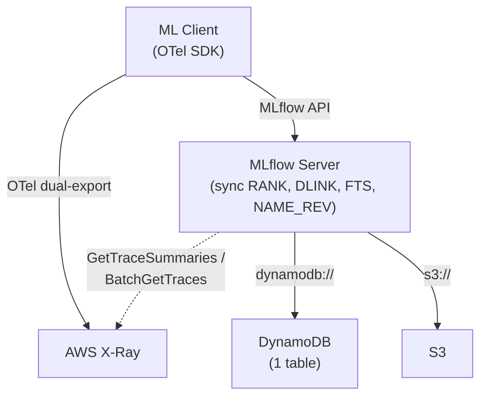

# mlflow-dynamodbstore — Design Specification

## Overview

A pip-installable MLflow plugin (`mlflow-dynamodbstore`) that provides DynamoDB-backed implementations of MLflow's tracking store, model registry store, and auth plugin. Part of a serverless-first architecture for small teams with bursty, cost-sensitive workloads.

### Scope

| Component | Backend | Package |
|-----------|---------|---------|
| Tracking Store (experiments, runs, metrics, params, tags, datasets, inputs, logged models, trace metadata, assessments) | DynamoDB | `mlflow-dynamodbstore` |
| Model Registry Store (registered models, versions, tags, aliases) | DynamoDB | `mlflow-dynamodbstore` |
| Auth Plugin (users, permissions) | DynamoDB | `mlflow-dynamodbstore` |
| Artifacts (model files, plots) | S3 | MLflow built-in |
| Spans (timing, flamegraphs, service maps) | AWS X-Ray | OTel dual-export |
| Full serverless deployment (API GW, Lambda, CDK) | AWS | `zae-mlflow` (separate repo, v2) |

### Target User

Small team (< 10 data scientists), serverless AWS stack, bursty usage, cost-sensitive. DynamoDB on-demand (pay-per-request) billing.

### Two-Repo Structure

| Repo | Package | Purpose | Timeline |
|------|---------|---------|----------|
| `mlflow-dynamodbstore` | `uv pip install mlflow-dynamodbstore` | MLflow plugin — pure Python, auto-provisions DynamoDB table via CloudFormation on first use | v1 (now) |
| `zae-mlflow` | CDK app | Full serverless stack: API Gateway + Lambda + DynamoDB + S3 + X-Ray + OTel collector + async stream Lambda | v2 (later) |

## Architecture



**URI scheme:** `dynamodb://` registered via `pyproject.toml` entry points.

```bash
uv pip install mlflow-dynamodbstore

mlflow server \
  --app-name dynamodb-auth \
  --backend-store-uri dynamodb://us-east-1/my-table \
  --default-artifact-root s3://bucket/artifacts
```

The DynamoDB table (with all LSIs and GSIs) is auto-provisioned via CloudFormation on first connection. No separate infrastructure deployment step needed for v1.

### v1: Synchronous Materialization

All materialized views (RANK, DLINK, NAME_REV, FTS) are written synchronously in the tracking store code alongside the primary writes. No DynamoDB Streams, no Lambda function.

| Tradeoff | Sync (v1) | Async Streams (v2 via zae-mlflow CDK) |
|----------|-----------|--------------------------------------|
| Infrastructure | 1 DynamoDB table | Table + Lambda + Stream + IAM |
| Auto-provision | Trivial (one CFN resource) | Complex (Lambda code packaging) |
| Write latency | +5-15ms (extra BatchWriteItems) | No impact on API response |
| Consistency | Immediate | Eventually consistent (~50ms) |
| Failure mode | API call fails → caller retries | Lambda fails → stale view until retry |

The materialized items have identical schemas in both modes. The v2 upgrade path is: add Streams + Lambda, remove sync writes from store code.

## ID Strategy

All store-generated IDs use ULIDs with the entity's logical timestamp. This makes the DynamoDB sort key itself time-sortable, eliminating the need for separate time-sort indexes.

| ID | Generated By | Timestamp Source | Format |
|----|-------------|-----------------|--------|
| `experiment_id` | Store | creation time | ULID |
| `run_id` | Store | creation time (MLflow calls this `start_time`) | ULID |
| `dataset_uuid` | Store | creation time | ULID |
| `model_id` (LoggedModel) | Store | creation time | ULID |
| `assessment_id` | Store | creation time | ULID |
| `trace_id` | OTel client | Not controlled | Passthrough |
| `model version` | Store | N/A | Sequential int per model |

### Why creation time in ULIDs

Using the entity's creation timestamp as the ULID timestamp means:

- SK ordering = creation time ordering exactly (no approximation)
- Range queries like `start_time > X` become SK key conditions: `SK > R#<ulid_from_timestamp(X)>` — resolved at the index level
- Historical imports slot into the correct sort position
- Default sort (`start_time DESC`) is free from the base table SK

## Single Table Design

One DynamoDB table, pay-per-request billing, 3 partition families, 19 entity types + 4 materialized types.

LSI attributes are only populated on META-level items. Sub-items (tags, params, metrics, etc.) omit them and are automatically excluded from LSI projections.

### Experiment Partition: `PK = EXP#<experiment_id>`

| Entity | SK | lsi1sk | lsi2sk | lsi3sk | lsi4sk | lsi5sk |
|--------|-----|--------|--------|--------|--------|--------|
| Experiment META | `E#META` | `<lifecycle>#<ulid>` | `last_update_time` | `lower(name)` | `rev(lower(name))` | — |
| Experiment Tag | `E#TAG#<key>` | — | — | — | — | — |
| Experiment NAME_REV | `E#NAME_REV` | — | — | — | — | — |
| Run META | `R#<ulid_run_id>` | `<lifecycle>#<ulid>` | `end_time` | `<status>#<ulid>` | `lower(run_name)` | `duration_ms` |
| Run Tag | `R#<ulid>#TAG#<key>` | — | — | — | — | — |
| Run Param | `R#<ulid>#PARAM#<key>` | — | — | — | — | — |
| Metric Latest | `R#<ulid>#METRIC#<key>` | — | — | — | — | — |
| Metric History | `R#<ulid>#MHIST#<key>#<zero_padded_step>#<ts>` | — | — | — | — | — |
| Dataset | `D#<name>#<digest>` | — | — | — | — | — |
| Input Link | `R#<ulid>#INPUT#<ds_uuid>` | — | — | — | — | — |
| Input Tag | `R#<ulid>#INPUT#<ds_uuid>#ITAG#<name>` | — | — | — | — | — |
| Logged Model | `R#<ulid>#LM#<model_id>` | — | — | — | — | — |
| Logged Model Tag | `R#<ulid>#LM#<model_id>#TAG#<key>` | — | — | — | — | — |
| Trace META | `T#<trace_id>` | — | `end_time_ms` | `<status>#<timestamp_ms>` | — | `execution_time_ms` |
| Trace Tag | `T#<trace_id>#TAG#<key>` | — | — | — | — | — |
| Trace Req Metadata | `T#<trace_id>#RMETA#<key>` | — | — | — | — | — |
| Assessment | `T#<trace_id>#ASSESS#<id>` | — | — | — | — | — |
| Trace Client Req Ptr *(materialized)* | `T#<trace_id>#CLIENTPTR` | — | — | — | — | — |
| DLINK *(materialized)* | `DLINK#<ds_name>#<ds_digest>#R#<ulid>` | — | — | — | — | — |
| RANK metric *(materialized)* | `RANK#m#<key>#<inv_value>#<ulid>` | — | — | — | — | — |
| RANK param *(materialized)* | `RANK#p#<key>#<value>#<ulid>` | — | — | — | — | — |
| FTS token *(materialized)* | `FTS#<stemmed_token>#T#<trace_id>` | — | — | — | — | — |

DLINK items carry a `context` attribute (denormalized from input tags) for dataset context filtering.

RANK metric items use inverted values (`9999999999.9999 - value`, zero-padded) so that ascending SK scan (`ScanIndexForward=True`) yields descending original-value order.

FTS items carry `field` (assessment/tag/metadata) and `key` attributes for filtering by source.

### Model Partition: `PK = RM#<model_name>`

| Entity | SK | lsi1sk | lsi2sk | lsi3sk | lsi4sk | lsi5sk |
|--------|-----|--------|--------|--------|--------|--------|
| Model META | `M#META` | — | `last_update_time` | `lower(name)` | `rev(lower(name))` | — |
| Model Tag | `M#TAG#<key>` | — | — | — | — | — |
| Model Alias | `M#ALIAS#<alias>` | — | — | — | — | — |
| Model NAME_REV *(materialized)* | `M#NAME_REV` | — | — | — | — | — |
| Version META | `V#<padded_ver>` | — | `last_update_time` | `<stage>#<padded_ver>` | `lower(source_path)` | — |
| Version Tag | `V#<padded_ver>#TAG#<key>` | — | — | — | — | — |

### Auth Partition: `PK = USER#<username>`

| Entity | SK |
|--------|-----|
| User META | `U#META` |
| Permission | `U#PERM#<resource_type>#<resource_id>` |

## Index Design

### LSIs (5 overloaded)

| LSI | Attribute | Experiments | Runs | Traces | Reg Models | Model Versions |
|-----|-----------|-------------|------|--------|------------|----------------|
| LSI1 | `lsi1sk` | `<lifecycle>#<ulid>` | `<lifecycle>#<ulid>` | — | — | — |
| LSI2 | `lsi2sk` | `last_update_time` | `end_time` | `end_time_ms` | `last_update_time` | `last_update_time` |
| LSI3 | `lsi3sk` | `lower(name)` | `<status>#<ulid>` | `<status>#<timestamp_ms>` | `lower(name)` | `<stage>#<padded_ver>` |
| LSI4 | `lsi4sk` | `rev(lower(name))` | `lower(run_name)` | — | `rev(lower(name))` | `lower(source_path)` |
| LSI5 | `lsi5sk` | — | `duration_ms` | `execution_time_ms` | — | — |

**LSI1 — Lifecycle + time:** `begins_with("active#")` returns only active runs/experiments sorted by time (ULID). `begins_with("deleted#")` returns only soft-deleted. Eliminates post-filtering deleted items.

**LSI2 — End/update time:** Sort runs by completion, experiments/models by last modification, traces by end time.

**LSI3 — Name or status composite:** Experiments/models: `lower(name)` for prefix ILIKE via `begins_with`. Runs/traces: `<status>#<ulid>` for status filter + time sort in one key condition. Model versions: `<stage>#<padded_ver>` for `get_latest_versions` per stage.

**LSI4 — Reversed name or secondary name:** Experiments/models: `rev(lower(name))` for suffix ILIKE. Runs: `lower(run_name)` for prefix ILIKE. Model versions: `lower(source_path)` for prefix ILIKE.

**LSI5 — Duration:** Runs: `duration_ms` (set on completion). Traces: `execution_time_ms`. In-progress runs without duration are auto-excluded from the index.

### GSIs (5 overloaded)

#### GSI1 — Reverse ID Lookups

| Entity | gsi1pk | gsi1sk | Query |
|--------|--------|--------|-------|
| Run META | `RUN#<run_id>` | `EXP#<exp_id>` | Get run by ID → find experiment |
| Model Version | `RUN#<run_id>` | `MV#<model>#<ver>` | Model versions by run_id |
| Trace META | `TRACE#<trace_id>` | `EXP#<exp_id>` | Get trace by request ID |
| Trace Client Req Ptr *(materialized)* | `CLIENT#<client_req_id>` | `TRACE#<trace_id>` | Trace by client request ID |
| Input Link | `DS#<ds_uuid>` | `R#<run_id>` | Find runs using a dataset |

`gsi1pk = RUN#<run_id>` serves three purposes in one query: run lookup, experiment discovery, and model version linkage.

Note: The `CLIENT#<client_req_id>` entry is a separate materialized pointer item (written alongside the Trace META item at `start_trace` time), not an attribute on the Trace META item itself. A single DynamoDB item can only have one `gsi1pk` value.

#### GSI2 — Global Entity Listings

| Entity | gsi2pk | gsi2sk | Query |
|--------|--------|--------|-------|
| Experiment META | `EXPERIMENTS#<lifecycle>` | `<ulid>` | List all experiments by lifecycle (e.g., `EXPERIMENTS#active`), time-sorted via ULID. `ViewType.ALL` requires two queries (`#active` + `#deleted`) merged client-side |
| Model META | `MODELS` | `<last_update_time>#<name>` | List all registered models |
| Auth User META | `AUTH_USERS` | `<username>` | List all auth users |

#### GSI3 — Uniqueness & Named Lookups

| Entity | gsi3pk | gsi3sk | Query |
|--------|--------|--------|-------|
| Experiment META | `EXP_NAME#<name>` | `<exp_id>` | `get_experiment_by_name()`, uniqueness check |
| Model Alias | `ALIAS#<model>#<alias>` | `<version>` | `get_model_version_by_alias()` |

#### GSI4 — Auth Inverted Queries

| Entity | gsi4pk | gsi4sk | Query |
|--------|--------|--------|-------|
| Permission | `PERM#<resource_type>#<resource_id>` | `USER#<username>` | "Who has access to resource X?" |

#### GSI5 — Name Prefix/Suffix Search (cross-partition)

| Entity | gsi5pk | gsi5sk | Query |
|--------|--------|--------|-------|
| Experiment META | `EXP_NAMES` | `FWD#<lower(name)>#<id>` | Prefix ILIKE |
| Experiment NAME_REV *(materialized)* | `EXP_NAMES` | `REV#<rev(lower(name))>#<id>` | Suffix ILIKE |
| Model META | `MODEL_NAMES` | `FWD#<lower(name)>` | Prefix ILIKE |
| Model NAME_REV *(materialized)* | `MODEL_NAMES` | `REV#<rev(lower(name))>` | Suffix ILIKE |

Forward direction lives on the META item. Reverse direction is a separate materialized item (one DynamoDB item can only appear once per GSI).

## Materialized Views

Written synchronously in v1, async via DynamoDB Streams + Lambda in v2.

### RANK Items (metric/param sorting)

Written when `log_batch` records metrics or params.

```
PK: EXP#<experiment_id>
SK: RANK#m#<metric_key>#<inverted_value>#<run_ulid>
```

Inverted value: `inv = 9999999999.9999 - value`, zero-padded to fixed width. Enables descending numeric sort via ascending SK scan.

Query: `ORDER BY metric.accuracy DESC` → `PK=EXP#1, SK begins_with("RANK#m#accuracy#"), ScanIndexForward=True` (inverted values give descending order).

Only the **latest value** per (metric_key, run) is materialized as a RANK item. When a metric is logged at a new step, the previous RANK item for that (key, run) is deleted and replaced with the new value. This avoids write amplification from high-frequency metric logging (e.g., loss per training step).

On run deletion (lifecycle → deleted): all RANK items for that run are deleted. Deletion strategy: enumerate the run's Metric Latest (`R#<ulid>#METRIC#*`) and Param (`R#<ulid>#PARAM#*`) items to construct exact RANK SKs, then BatchWriteItem deletes. This avoids scanning all RANK items in the partition. On restore: same enumeration, re-create RANK items.

### DLINK Items (dataset→run linkage)

Written when `log_inputs` creates input links.

```
PK: EXP#<experiment_id>
SK: DLINK#<dataset_name>#<dataset_digest>#R#<run_ulid>
Attrs: context (from input tag "mlflow.data.context")
```

Query: `dataset.name = 'my_data'` → `PK=EXP#1, SK begins_with("DLINK#my_data#")`.

### NAME_REV Items (suffix ILIKE)

Written when experiments or models are created/renamed.

```
PK: EXP#<experiment_id>    SK: E#NAME_REV    gsi5pk: EXP_NAMES    gsi5sk: REV#<rev(lower(name))>#<id>
PK: RM#<model_name>        SK: M#NAME_REV    gsi5pk: MODEL_NAMES  gsi5sk: REV#<rev(lower(name))>
```

### FTS Items (full-text search)

Written when assessments, trace tags, or trace request metadata are created/updated.

```
PK: EXP#<experiment_id>
SK: FTS#<stemmed_token>#T#<trace_id>
Attrs: field, key, trace_id
```

## Full-Text Search

Token-level inverted index with stemming via `snowballstemmer` (pure Python, 100KB, zero data files).

### Tokenizer

```python
import re
import snowballstemmer

STOP_WORDS = frozenset({
    "the", "a", "an", "is", "in", "on", "at", "to", "for",
    "of", "and", "or", "not", "it", "this", "that", "with",
    "be", "has", "have", "had", "do", "does", "did", "but",
    "if", "no", "so", "as", "by", "from", "are", "was", "were",
})
_stemmer = snowballstemmer.stemmer("english")

def tokenize(text: str) -> set[str]:
    words = re.findall(r'[a-z0-9]+', text.lower())
    words = [w for w in words if w not in STOP_WORDS and len(w) > 1]
    return set(_stemmer.stemWords(words))
```

Indexed fields: assessment values, trace tag values, trace request metadata values. Span content is NOT indexed (lives in X-Ray).

Search queries apply the same tokenizer+stemmer, so `error`, `errors`, `errored` all resolve to the same stem.

### Upgrade Path

v2: Replace token-level FTS with DynamoDB Zero-ETL → OpenSearch Serverless when full-text search demands grow. Same query interface, different backend.

## X-Ray Integration

Spans live in X-Ray, not DynamoDB. `span.*` filters in `search_traces` are proxied to the X-Ray API.

### Annotation Mapping

A configurable OTel `SpanProcessor` ensures key MLflow span attributes are exported as X-Ray annotations (searchable, max 50 per segment):

| MLflow Span Attribute | X-Ray Annotation | Searchable |
|-----------------------|-----------------|------------|
| `mlflow.spanType` | `mlflow_spanType` | Yes |
| `mlflow.llm.model` | `mlflow_model` | Yes |
| `mlflow.llm.provider` | `mlflow_provider` | Yes |
| span `name` | `mlflow_spanName` | Yes |
| span `status` | `mlflow_spanStatus` | Yes |

Mapping is configurable — users can add more attributes within X-Ray's 50 annotation limit.

### Search Flow

```
search_traces(filter_string="status = 'OK' AND tag.env = 'prod' AND span.type = 'LLM'")
```

1. Partition filters: DynamoDB (`status`, `tag.env`), X-Ray (`span.type`)
2. Execute DynamoDB query and X-Ray `GetTraceSummaries` in parallel
3. Intersect trace ID sets
4. Return full trace metadata from DynamoDB for intersected IDs

If only DynamoDB filters exist, skip X-Ray. If only span filters exist, query X-Ray first then BatchGetItem from DynamoDB.

### Limitations

- X-Ray annotations support `=` only — `span.name LIKE 'Chat%'` requires `BatchGetTraces` + client-side filter
- X-Ray requires a time window (max 6 hours per query) — derived from timestamp filters or chunked
- X-Ray trace retention is 30 days — `span.*` filters on older traces are silently excluded
- `span.content LIKE '%error%'` requires `BatchGetTraces` + client-side string match

## One-Sided LIKE/ILIKE Support

DynamoDB's `begins_with` handles prefix patterns. Reversed strings handle suffix patterns.

### Prefix ILIKE (`name ILIKE 'prod%'`)

- Within partition: LSI3 stores `lower(name)` → `begins_with("prod")`
- Cross-partition: GSI5 stores `FWD#<lower(name)>#<id>` → `begins_with("FWD#prod")`

### Suffix ILIKE (`name ILIKE '%prod'`)

- Cross-partition: GSI5 stores `REV#<rev(lower(name))>#<id>` → `begins_with("REV#dorp")`
- Within partition: `rev(lower(name))` stored in LSI4 (experiments/models) for `begins_with`

### Case-Sensitive LIKE

Query the lowercase index (superset), add a filter expression on the original-case attribute.

### Param/Tag LIKE

Tags and params are separate items fetched via BatchGetItem. LIKE/ILIKE filtering happens in Python with `value_lower` attribute stored on each item.

### Double-Sided LIKE (`'%foo%'`)

No index trick exists. Client-side `if "foo" in value.lower()` on the result set. Acceptable at small scale.

## Access Pattern Coverage

### Index-Native (~30 patterns)

| Pattern | Mechanism |
|---------|-----------|
| `get_run(run_id)` | GSI1 point query |
| `get_experiment(id)` | PK+SK point read |
| `get_experiment_by_name(name)` | GSI3 point query |
| `get_registered_model(name)` | PK point read |
| `get_model_version(name, version)` | PK+SK point read |
| `get_model_version_by_alias(name, alias)` | GSI3 point query |
| `get_trace_info(request_id)` | GSI1 point query |
| `get_metric_history(run_id, key)` | GSI1 (resolve run_id → experiment_id) + PK+SK range query. Store caches run→experiment mappings after first lookup |
| `search_runs` default sort (`start_time DESC`) | Base SK (ULID) |
| `search_runs` ORDER BY `end_time` | LSI2 |
| `search_runs` ORDER BY `run_name` | LSI4 |
| `search_runs` ORDER BY `duration` | LSI5 |
| `search_runs` filter `status` + time sort | LSI3 composite |
| `search_runs` filter `lifecycle_stage` | LSI1 |
| `search_runs` filter `start_time > X` | SK key condition via ULID |
| `search_runs` ORDER BY `metric.<key>` | RANK items |
| `search_runs` filter `metric.<key> > X` | RANK items key condition |
| `search_runs` ORDER BY `param.<key>` | RANK items |
| `search_runs` filter `dataset.name = X` | DLINK items |
| `search_experiments` default sort | GSI2 (ULID) |
| `search_experiments` name ILIKE prefix/suffix | GSI5 |
| `search_registered_models` default sort | GSI2 |
| `search_registered_models` name ILIKE prefix/suffix | GSI5 |
| `search_model_versions` ORDER BY `version` | Base SK |
| `search_model_versions` filter `run_id` | GSI1 |
| `get_latest_versions(name, stages)` | LSI3 reverse limit 1 |
| `search_traces` ORDER BY `timestamp` | LSI2 (`end_time_ms`) or LSI3 (`<status>#<timestamp_ms>`). Note: `trace_id` is OTel-provided and not time-sortable, so base SK cannot be used for trace time-ordering |
| `search_traces` filter `status` + time sort | LSI3 composite |
| `search_traces` ORDER BY `execution_time` | LSI5 |
| `search_traces` FTS keyword | FTS items |
| `create_experiment` uniqueness check | GSI3 condition |
| Auth: who can access resource X? | GSI4 |

### 1 Extra Round Trip (~10 patterns)

| Pattern | Mechanism |
|---------|-----------|
| `search_runs` filter `tag.<key> = X` | Query runs → BatchGetItem tags → filter |
| `search_runs` filter `param.<key> = X` | Query runs → BatchGetItem params → filter |
| `search_runs` compound `metric.acc > 0.9 AND param.lr = '0.01'` | RANK for selective filter → BatchGetItem second → filter |
| `search_runs` filter `dataset.context = 'training'` | DLINK `context` attr → filter expression |
| `search_experiments` filter `tag.<key> = X` | GSI2 → BatchGetItem tags → filter |
| `search_model_versions` filter `tag.<key>` | Query versions → BatchGetItem tags → filter |
| `search_traces` filter `tag.<key>` / `metadata.<key>` | LSI query → BatchGetItem items → filter |
| `search_traces` filter `span.type = 'LLM'` | X-Ray `GetTraceSummaries` → intersect |
| `search_traces` filter `span.name = 'X'` | X-Ray annotation query → intersect |
| Multi-experiment `search_runs` | Parallel queries per experiment, merge |

### Client-Side Filter (~5 patterns)

| Pattern | Why | How |
|---------|-----|-----|
| `LIKE '%foo%'` (double-sided) | No substring index in DynamoDB | Query candidates → Python `"foo" in value.lower()` |
| `IS NULL` / `IS NOT NULL` on tags | Proving absence requires checking item existence | BatchGetItem for tag SK → include/exclude by presence |
| Assessment filters (`feedback.<key>`) | Dynamic keys, child items | Query traces → query assessments per trace → filter |
| `RLIKE` (regex, traces only) | No regex engine in DynamoDB | BatchGetItem → `re.match()` in Python |
| `span.*` with LIKE/ILIKE | X-Ray only supports `=` on annotations | `BatchGetTraces` → client-side match |

All client-side filters are bounded by partition scope (experiment) or page size. Sub-second for small teams.

## Pagination

MLflow page tokens are opaque strings. Our implementation encodes DynamoDB cursor state as base64:

```json
{
  "lek": {"PK": {"S": "EXP#01JQ..."}, "SK": {"S": "R#01JR..."}},
  "exp_idx": 0,
  "accumulated": 45
}
```

- `lek` — DynamoDB `LastEvaluatedKey` for cursor-based continuation
- `exp_idx` — index into experiment list for multi-experiment queries
- `accumulated` — results returned so far (for client-side filtered queries where DynamoDB pages may yield fewer results than `max_results`)

## Auto-Provisioning

On first connection, the tracking store checks for table existence and creates it via CloudFormation if missing:

```python
def __init__(self, store_uri, artifact_uri):
    region, table_name = parse_dynamodb_uri(store_uri)
    self._ensure_table_exists(region, table_name)
```

The CloudFormation template is embedded as a Python dict in the package. It creates:

- DynamoDB table with 5 LSIs and 5 GSIs
- Pay-per-request billing
- Point-in-time recovery enabled
- Server-side encryption (AWS owned key)

No Lambda, no Streams, no IAM roles. One resource.

## Package Structure

```
mlflow-dynamodbstore/
├── pyproject.toml
│   └── [project.entry-points]
│       ├── "mlflow.tracking_store"
│       │   └── dynamodb = "mlflow_dynamodbstore.tracking_store:DynamoDBTrackingStore"
│       ├── "mlflow.model_registry_store"
│       │   └── dynamodb = "mlflow_dynamodbstore.registry_store:DynamoDBRegistryStore"
│       ├── "mlflow.app"
│       │   └── dynamodb-auth = "mlflow_dynamodbstore.auth.app:create_app"
│       └── "mlflow.app.client"
│           └── dynamodb-auth = "mlflow_dynamodbstore.auth.client:DynamoDBAuthClient"
│
├── src/mlflow_dynamodbstore/
│   ├── __init__.py
│   ├── tracking_store.py          # AbstractStore (~16 required methods)
│   ├── registry_store.py          # Registry AbstractStore (~17 required methods)
│   │
│   ├── auth/
│   │   ├── __init__.py
│   │   ├── app.py                 # create_app(Flask) → Flask
│   │   └── client.py              # DynamoDBAuthClient
│   │
│   ├── dynamodb/
│   │   ├── __init__.py
│   │   ├── client.py              # DynamoDB table operations, key builders
│   │   ├── schema.py              # Key/attribute constants, entity definitions
│   │   ├── search.py              # MLflow filter parser → DynamoDB query planner
│   │   ├── fts.py                 # Tokenizer (snowballstemmer), FTS query builder
│   │   └── provisioner.py         # CloudFormation auto-provisioning
│   │
│   ├── xray/
│   │   ├── __init__.py
│   │   ├── client.py              # X-Ray API (GetTraceSummaries, BatchGetTraces)
│   │   ├── filter_translator.py   # MLflow span.* filter → X-Ray filter expression
│   │   └── annotation_config.py   # Configurable mlflow attr → X-Ray annotation mapping
│   │
│   └── otel/
│       ├── __init__.py
│       └── annotation_processor.py  # OTel SpanProcessor: mlflow.* → X-Ray annotations
│
├── tests/
└── docs/
```

### Dependencies

Managed via `uv`:

```
mlflow >= 3.0
boto3
python-ulid
snowballstemmer
```

## Configuration

```python
# pyproject.toml or runtime config
[tool.mlflow-dynamodbstore]
region = "us-east-1"

[tool.mlflow-dynamodbstore.xray]
enabled = true
annotation_mapping = [
    "mlflow.spanType:mlflow_spanType",
    "mlflow.llm.model:mlflow_model",
    "mlflow.llm.provider:mlflow_provider",
]
```

When `xray.enabled = false`, `span.*` filters raise `MlflowException("Span filters require X-Ray integration. Set xray.enabled = true.")`.

## Implementation Notes

### Run-ID Resolution Cache

Many tracking store methods accept `run_id` but the data lives under `PK=EXP#<experiment_id>`. The store maintains an in-memory LRU cache of `run_id → experiment_id` mappings (populated from GSI1 lookups). After the first resolution, subsequent operations on the same run (log metrics, set tags, etc.) are single-call operations with no GSI round trip.

### LSI 10GB Partition Limit

DynamoDB enforces a 10GB limit per partition key value when LSIs are present. The experiment partition aggregates all runs, metrics, params, tags, datasets, traces, assessments, RANK items, DLINK items, and FTS items. For a small team this is unlikely to be hit, but for safety:

- Monitor partition size via CloudWatch `AccountProvisionedWriteCapacityUtilization` and item count
- Metric history is the highest-volume entity: 10K steps × 10 metrics × 100 runs = 10M items at ~200 bytes each = ~2GB. Well within limits for typical small-team usage
- If approaching 10GB: archive old metric history to S3, or split experiments

### FTS Token Cleanup

When an assessment, trace tag, or trace metadata value is updated or deleted, the old FTS token items must be cleaned up. The store reads the old value, tokenizes it, computes the diff against the new tokens, and deletes removed tokens / writes new tokens in the same BatchWriteItem.

### Metric History Step Padding

Steps are zero-padded to 20 digits (e.g., `00000000000000010000`) for correct lexicographic ordering. Negative steps (which MLflow allows) use a sign prefix: positive steps get `P#<zero_padded>`, negative steps get `N#<inverted_zero_padded>` where the value is `MAX_INT - abs(step)`. This ensures negative steps sort before positive steps.

### MLflow Interface Method Counts

**Tracking store:** 16 abstract methods implemented. Additional methods with default `raise NotImplementedError` that we implement: `search_traces`, `start_trace`, `get_trace_info`, `get_trace`, `set_trace_tag`, `delete_trace_tag`, `create_assessment`, `update_assessment`, `delete_assessment`, `create_logged_model`, `search_logged_models`, `finalize_logged_model`, `delete_logged_model`, `set_logged_model_tags`, `get_logged_model`, `log_inputs`.

**Model registry store:** 21 abstract methods implemented (including `transition_model_version_stage`, full alias/tag CRUD, and the complete `set_registered_model_alias` / `delete_registered_model_alias` / `get_model_version_by_alias` set).

**Not implemented (raise NotImplementedError):** Gateway endpoints, gateway model definitions, gateway secrets, and related CRUD. These are Databricks-specific features not applicable to a DynamoDB backend. Online scoring methods are also out of scope.

### Auth Interface

The `Permission` item with SK `U#PERM#<resource_type>#<resource_id>` handles all permission types generically:

| resource_type | Examples |
|--------------|---------|
| `experiment` | Read/write/manage access to experiments |
| `registered_model` | Read/write/manage access to models |
| `workspace` | Workspace-level permissions (CAN_MANAGE, etc.) |

Supported operations:
- `list_permissions_for_user(username)`: Query `PK=USER#<username>, SK begins_with("U#PERM#")`
- `list_permissions_for_resource(type, id)`: GSI4 query `PERM#<type>#<id>`
- `create/update/delete_permission`: PutItem/DeleteItem on the permission SK

Scorer, gateway secret, gateway endpoint, and gateway model definition permissions are out of scope (Databricks-specific).

### Prompts

MLflow 3.x Prompts are built on top of registered models via default method implementations (`create_prompt`, `get_prompt`, etc.) that delegate to registered model CRUD with special `mlflow.prompt.*` tags. Our registered model implementation handles this automatically — no special prompt code needed.

## Tag Denormalization

Tags are stored as separate items (`R#<ulid>#TAG#<key>`) and also denormalized onto META items as a `tags` map attribute for query-time optimization. The tag item remains the source of truth.

### How It Works

Every tag write (`set_tag`, `log_batch`) does two things:

1. Writes the tag item: `PK=EXP#<id>, SK=R#<ulid>#TAG#<key>`
2. If the key matches a denormalize pattern, also updates the META item: `tags.<key> = value`

### Denormalize Patterns

Glob patterns (standard `fnmatch`) control which tags are denormalized:

| Pattern | Matches |
|---------|---------|
| `mlflow.*` | All system tags (always present, re-added if removed) |
| `env` | Exact key `env` |
| `team.*` | `team.name`, `team.org`, ... |
| `*` | Everything |

### Pattern Storage (global + per-experiment)

```
PK: CONFIG              SK: DENORMALIZE_TAGS              patterns: ["mlflow.*"]
PK: EXP#<experiment_id> SK: E#DENORMALIZE_TAGS            patterns: ["team.*", "dataset.*"]
```

**Merge logic:** effective patterns = global ∪ experiment-specific (additive). `mlflow.*` is always in the global config — if removed, re-added on server startup. Experiments can only add patterns, not override or remove global ones.

Patterns are cached in memory per experiment at first access. The `CONFIG#DENORMALIZE_TAGS` item is read once at store initialization. Experiment-specific patterns are read on first access to that experiment.

On first table creation, the global config is seeded from `MLFLOW_DYNAMODB_DENORMALIZE_TAGS` env var (if set), with `mlflow.*` always included.

### META Item Structure

```json
{
  "PK": "EXP#01JQXYZ",
  "SK": "R#01JRABC",
  "status": "FINISHED",
  "start_time": 1709251200000,
  "tags": {
    "mlflow.user": "alice",
    "mlflow.runName": "training-v3",
    "mlflow.source.type": "NOTEBOOK",
    "env": "production",
    "team.name": "ml-platform"
  }
}
```

`tags` is a DynamoDB Map attribute. Tag keys with dots (e.g., `mlflow.user`) require expression attribute names in queries:

```
FilterExpression: #tags.#user = :val
ExpressionAttributeNames: {"#tags": "tags", "#user": "mlflow.user"}
```

### Applies To All Entity Types

| Entity | META Item | Denormalized Tags Attribute |
|--------|-----------|---------------------------|
| Experiment | `E#META` | `tags` map |
| Run | `R#<ulid>` | `tags` map |
| Registered Model | `M#META` | `tags` map |
| Model Version | `V#<padded_ver>` | `tags` map |
| Trace | `T#<trace_id>` | `tags` map (trace tags only, not request metadata) |

### Access Pattern Impact

| Pattern | Before | After (if tag matches denormalize pattern) |
|---------|--------|-------------------------------------------|
| `tag.<key> = 'X'` | Query + BatchGetItem (2 calls) | Query with FilterExpression (1 call) |
| `tag.<key> != 'X'` | Query + BatchGetItem (2 calls) | Query with FilterExpression (1 call) |
| `tag.<key> LIKE 'X%'` | Query + BatchGetItem + Python | FilterExpression: `begins_with` |
| `tag.<key> LIKE '%X%'` | Client-side Python | FilterExpression: `contains` (server-side) |
| `tag.<key> IS NULL` | Client-side existence check | FilterExpression: `attribute_not_exists` |
| `tag.<key> IS NOT NULL` | Client-side existence check | FilterExpression: `attribute_exists` |
| Compound: `tag.a = 'X' AND tag.b = 'Y'` | Query + 2× BatchGetItem | Single FilterExpression with AND |
| `ORDER BY tag.<key>` | Fetch all + batch-get + in-memory sort | Fetch all (tags included) + in-memory sort (eliminates batch-get) |
| `tag.<key>` (not matching any pattern) | Query + BatchGetItem | Unchanged — still BatchGetItem |

### 400KB Item Size Safety

MLflow system tags: ~15 keys × ~50 bytes = ~750 bytes. Typical user tags are similarly small. With `*` (denormalize everything) and 200 tags × 100 bytes avg = 20KB — well within 400KB.

Soft limit: if adding a denormalized tag would push the META item above 350KB, skip denormalization for that tag and log a warning. The tag item is still written.

### Admin CLI

```bash
# View current patterns
mlflow-dynamodbstore denormalize-tags list --table my-table --region us-east-1

# View patterns for a specific experiment
mlflow-dynamodbstore denormalize-tags list --table my-table --experiment-id 01JQXYZ

# Add global patterns
mlflow-dynamodbstore denormalize-tags add "env" "team.*" --table my-table

# Add per-experiment patterns
mlflow-dynamodbstore denormalize-tags add "dataset.*" --table my-table --experiment-id 01JQXYZ

# Remove patterns (mlflow.* is re-added on next server start)
mlflow-dynamodbstore denormalize-tags remove "env" --table my-table

# Backfill: denormalize tags on existing META items (all experiments)
mlflow-dynamodbstore denormalize-tags backfill --table my-table

# Backfill: single experiment
mlflow-dynamodbstore denormalize-tags backfill --table my-table --experiment-id 01JQXYZ
```

The `backfill` command scans tag items, checks against current effective patterns, and updates META items. Reports progress. Idempotent.

## Open Decisions

1. **Compute layer** — Lambda + API Gateway vs ECS Fargate (deferred to zae-mlflow CDK)
2. **IaC tool for zae-mlflow** — CDK vs Terraform
3. **OpenSearch upgrade** — v2: replace token-level FTS with Zero-ETL → OpenSearch Serverless
4. **Async materialization** — v2 via zae-mlflow CDK: DynamoDB Streams + Lambda replaces sync writes
