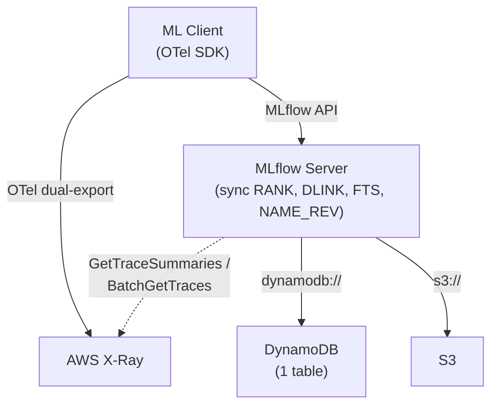

# mlflow-dynamodbstore — Design Specification

## Overview

A pip-installable MLflow plugin (`mlflow-dynamodbstore`) that provides DynamoDB-backed implementations of MLflow's tracking store, model registry store, and auth plugin. Part of a serverless-first architecture for small teams with bursty, cost-sensitive workloads.

### Scope

| Component | Backend | Package |
|-----------|---------|---------|
| Tracking Store (experiments, runs, metrics, params, tags, datasets, inputs, logged models, trace metadata, assessments) | DynamoDB | `mlflow-dynamodbstore` |
| Model Registry Store (registered models, versions, tags, aliases) | DynamoDB | `mlflow-dynamodbstore` |
| Auth Plugin (users, permissions) | DynamoDB | `mlflow-dynamodbstore` |
| Workspace Provider (workspace CRUD, artifact root resolution) | DynamoDB | `mlflow-dynamodbstore` |
| Artifacts (model files, plots) | S3 | MLflow built-in |
| Spans (timing, flamegraphs, service maps) | AWS X-Ray | OTel dual-export |
| Full serverless deployment (API GW, Lambda, CDK) | AWS | `zae-mlflow` (separate repo, v2) |

### Target User

Small team (< 10 data scientists), serverless AWS stack, bursty usage, cost-sensitive. DynamoDB on-demand (pay-per-request) billing.

### Two-Repo Structure

| Repo | Package | Purpose | Timeline |
|------|---------|---------|----------|
| `mlflow-dynamodbstore` | `uv pip install mlflow-dynamodbstore` | MLflow plugin — pure Python, auto-provisions DynamoDB table via CloudFormation on first use | v1 (now) |
| `zae-mlflow` | CDK app | Full serverless stack: API Gateway + Lambda + DynamoDB + S3 + X-Ray + OTel collector + async stream Lambda | v2 (later) |

## Architecture



**URI scheme:** `dynamodb://` registered via `pyproject.toml` entry points.

```bash
uv pip install mlflow-dynamodbstore

mlflow server \
  --app-name dynamodb-auth \
  --backend-store-uri dynamodb://us-east-1/my-table \
  --default-artifact-root s3://bucket/artifacts
```

The DynamoDB table (with all LSIs and GSIs) is auto-provisioned via CloudFormation on first connection. No separate infrastructure deployment step needed for v1.

### v1: Synchronous Materialization

All materialized views (RANK, DLINK, NAME_REV, FTS) are written synchronously in the tracking store code alongside the primary writes. No DynamoDB Streams, no Lambda function.

| Tradeoff | Sync (v1) | Async Streams (v2 via zae-mlflow CDK) |
|----------|-----------|--------------------------------------|
| Infrastructure | 1 DynamoDB table | Table + Lambda + Stream + IAM |
| Auto-provision | Trivial (one CFN resource) | Complex (Lambda code packaging) |
| Write latency | +5-15ms (extra BatchWriteItems) | No impact on API response |
| Consistency | Immediate | Eventually consistent (~50ms) |
| Failure mode | API call fails → caller retries | Lambda fails → stale view until retry |

The materialized items have identical schemas in both modes. The v2 upgrade path is: add Streams + Lambda, remove sync writes from store code.

## ID Strategy

All store-generated IDs use ULIDs with the entity's logical timestamp. This makes the DynamoDB sort key itself time-sortable, eliminating the need for separate time-sort indexes.

| ID | Generated By | Timestamp Source | Format |
|----|-------------|-----------------|--------|
| `experiment_id` | Store | creation time | ULID |
| `run_id` | Store | creation time (MLflow calls this `start_time`) | ULID |
| `dataset_uuid` | Store | creation time | ULID |
| `model_id` (LoggedModel) | Store | creation time | ULID |
| `assessment_id` | Store | creation time | ULID |
| `trace_id` | OTel client | Not controlled | Passthrough |
| `model version` | Store | N/A | Sequential int per model |

### Why creation time in ULIDs

Using the entity's creation timestamp as the ULID timestamp means:

- SK ordering = creation time ordering exactly (no approximation)
- Range queries like `start_time > X` become SK key conditions: `SK > R#<ulid_from_timestamp(X)>` — resolved at the index level
- Historical imports slot into the correct sort position
- Default sort (`start_time DESC`) is free from the base table SK

## Single Table Design

One DynamoDB table, pay-per-request billing, 4 partition families, 20 entity types + 4 materialized types.

All workspace-scoped entities carry a `workspace` attribute. Experiment IDs are globally unique (ULIDs), so `EXP#<experiment_id>` remains the PK — workspace is an attribute, not part of the experiment PK. Model names are unique per workspace, so workspace IS part of the model PK: `RM#<workspace>#<model_name>`. When workspaces are disabled, all operations use workspace `"default"`.

LSI attributes are only populated on META-level items. Sub-items (tags, params, metrics, etc.) omit them and are automatically excluded from LSI projections.

### Experiment Partition: `PK = EXP#<experiment_id>`

Experiment META items carry a `workspace` attribute (default: `"default"`).

| Entity | SK | lsi1sk | lsi2sk | lsi3sk | lsi4sk | lsi5sk |
|--------|-----|--------|--------|--------|--------|--------|
| Experiment META | `E#META` | `<lifecycle>#<ulid>` | `last_update_time` | `lower(name)` | `rev(lower(name))` | — |
| Experiment Tag | `E#TAG#<key>` | — | — | — | — | — |
| Experiment NAME_REV | `E#NAME_REV` | — | — | — | — | — |
| Run META | `R#<ulid_run_id>` | `<lifecycle>#<ulid>` | `end_time` | `<status>#<ulid>` | `lower(run_name)` | `duration_ms` |
| Run Tag | `R#<ulid>#TAG#<key>` | — | — | — | — | — |
| Run Param | `R#<ulid>#PARAM#<key>` | — | — | — | — | — |
| Metric Latest | `R#<ulid>#METRIC#<key>` | — | — | — | — | — |
| Metric History | `R#<ulid>#MHIST#<key>#<zero_padded_step>#<ts>` | — | — | — | — | — |
| Dataset | `D#<name>#<digest>` | — | — | — | — | — |
| Input Link | `R#<ulid>#INPUT#<ds_uuid>` | — | — | — | — | — |
| Input Tag | `R#<ulid>#INPUT#<ds_uuid>#ITAG#<name>` | — | — | — | — | — |
| Logged Model | `R#<ulid>#LM#<model_id>` | — | — | — | — | — |
| Logged Model Tag | `R#<ulid>#LM#<model_id>#TAG#<key>` | — | — | — | — | — |
| Trace META | `T#<trace_id>` | — | `end_time_ms` | `<status>#<timestamp_ms>` | — | `execution_time_ms` |
| Trace Tag | `T#<trace_id>#TAG#<key>` | — | — | — | — | — |
| Trace Req Metadata | `T#<trace_id>#RMETA#<key>` | — | — | — | — | — |
| Assessment | `T#<trace_id>#ASSESS#<id>` | — | — | — | — | — |
| Trace Client Req Ptr *(materialized)* | `T#<trace_id>#CLIENTPTR` | — | — | — | — | — |
| DLINK *(materialized)* | `DLINK#<ds_name>#<ds_digest>#R#<ulid>` | — | — | — | — | — |
| RANK metric *(materialized)* | `RANK#m#<key>#<inv_value>#<ulid>` | — | — | — | — | — |
| RANK param *(materialized)* | `RANK#p#<key>#<value>#<ulid>` | — | — | — | — | — |
| FTS token *(materialized)* | `FTS#<stemmed_token>#T#<trace_id>` | — | — | — | — | — |
| FTS reverse *(materialized)* | `FTS_REV#T#<trace_id>#<stemmed_token>` | — | — | — | — | — |

DLINK items carry a `context` attribute (denormalized from input tags) for dataset context filtering.

RANK metric items use inverted values (`9999999999.9999 - value`, zero-padded) so that ascending SK scan (`ScanIndexForward=True`) yields descending original-value order.

FTS items carry `field` (assessment/tag/metadata) and `key` attributes for filtering by source.

### Model Partition: `PK = RM#<workspace>#<model_name>`

Model names are unique per workspace, so the workspace is part of the partition key.

| Entity | SK | lsi1sk | lsi2sk | lsi3sk | lsi4sk | lsi5sk |
|--------|-----|--------|--------|--------|--------|--------|
| Model META | `M#META` | — | `last_update_time` | `lower(name)` | `rev(lower(name))` | — |
| Model Tag | `M#TAG#<key>` | — | — | — | — | — |
| Model Alias | `M#ALIAS#<alias>` | — | — | — | — | — |
| Model NAME_REV *(materialized)* | `M#NAME_REV` | — | — | — | — | — |
| Version META | `V#<padded_ver>` | — | `last_update_time` | `<stage>#<padded_ver>` | `lower(source_path)` | — |
| Version Tag | `V#<padded_ver>#TAG#<key>` | — | — | — | — | — |

### Workspace Partition: `PK = WORKSPACE#<workspace_name>`

| Entity | SK |
|--------|-----|
| Workspace META | `META` |

Attributes: `name`, `description`, `default_artifact_root`. A `default` workspace is created during table provisioning.

### Auth Partition: `PK = USER#<username>`

| Entity | SK |
|--------|-----|
| User META | `U#META` |
| Permission | `U#PERM#<resource_type>#<resource_id>` |

## Index Design

### LSIs (5 overloaded)

| LSI | Attribute | Experiments | Runs | Traces | Reg Models | Model Versions |
|-----|-----------|-------------|------|--------|------------|----------------|
| LSI1 | `lsi1sk` | `<lifecycle>#<ulid>` | `<lifecycle>#<ulid>` | — | — | — |
| LSI2 | `lsi2sk` | `last_update_time` | `end_time` | `end_time_ms` | `last_update_time` | `last_update_time` |
| LSI3 | `lsi3sk` | `lower(name)` | `<status>#<ulid>` | `<status>#<timestamp_ms>` | `lower(name)` | `<stage>#<padded_ver>` |
| LSI4 | `lsi4sk` | `rev(lower(name))` | `lower(run_name)` | — | `rev(lower(name))` | `lower(source_path)` |
| LSI5 | `lsi5sk` | — | `duration_ms` | `execution_time_ms` | — | — |

**LSI1 — Lifecycle + time:** `begins_with("active#")` returns only active runs/experiments sorted by time (ULID). `begins_with("deleted#")` returns only soft-deleted. Eliminates post-filtering deleted items.

**LSI2 — End/update time:** Sort runs by completion, experiments/models by last modification, traces by end time.

**LSI3 — Name or status composite:** Experiments/models: `lower(name)` for prefix ILIKE via `begins_with`. Runs/traces: `<status>#<ulid>` for status filter + time sort in one key condition. Model versions: `<stage>#<padded_ver>` for `get_latest_versions` per stage.

**LSI4 — Reversed name or secondary name:** Experiments/models: `rev(lower(name))` for suffix ILIKE. Runs: `lower(run_name)` for prefix ILIKE. Model versions: `lower(source_path)` for prefix ILIKE.

**LSI5 — Duration:** Runs: `duration_ms` (set on completion). Traces: `execution_time_ms`. In-progress runs without duration are auto-excluded from the index.

### GSIs (5 overloaded)

#### GSI1 — Reverse ID Lookups

| Entity | gsi1pk | gsi1sk | Query |
|--------|--------|--------|-------|
| Run META | `RUN#<run_id>` | `EXP#<exp_id>` | Get run by ID → find experiment |
| Model Version | `RUN#<run_id>` | `MV#<workspace>#<model>#<ver>` | Model versions by run_id |
| Trace META | `TRACE#<trace_id>` | `EXP#<exp_id>` | Get trace by request ID |
| Trace Client Req Ptr *(materialized)* | `CLIENT#<client_req_id>` | `TRACE#<trace_id>` | Trace by client request ID |
| Input Link | `DS#<ds_uuid>` | `R#<run_id>` | Find runs using a dataset |

`gsi1pk = RUN#<run_id>` serves three purposes in one query: run lookup, experiment discovery, and model version linkage.

Note: The `CLIENT#<client_req_id>` entry is a separate materialized pointer item (written alongside the Trace META item at `start_trace` time), not an attribute on the Trace META item itself. A single DynamoDB item can only have one `gsi1pk` value.

#### GSI2 — Workspace-Scoped Entity Listings

| Entity | gsi2pk | gsi2sk | Query |
|--------|--------|--------|-------|
| Experiment META | `EXPERIMENTS#<workspace>#<lifecycle>` | `<ulid>` | List experiments in workspace by lifecycle. `ViewType.ALL` requires two queries (`#active` + `#deleted`) merged client-side |
| Model META | `MODELS#<workspace>` | `<last_update_time>#<name>` | List registered models in workspace |
| Auth User META | `AUTH_USERS` | `<username>` | List all auth users (workspace-independent) |
| Workspace META | `WORKSPACES` | `<workspace_name>` | List all workspaces |

When workspaces are disabled, all queries use `workspace = "default"` (e.g., `EXPERIMENTS#default#active`).

#### GSI3 — Uniqueness & Named Lookups (workspace-scoped)

| Entity | gsi3pk | gsi3sk | Query |
|--------|--------|--------|-------|
| Experiment META | `EXP_NAME#<workspace>#<name>` | `<exp_id>` | `get_experiment_by_name()`, uniqueness check within workspace |
| Model Alias | `ALIAS#<workspace>#<model>#<alias>` | `<version>` | `get_model_version_by_alias()` within workspace |

#### GSI4 — Auth Inverted Queries

| Entity | gsi4pk | gsi4sk | Query |
|--------|--------|--------|-------|
| Permission | `PERM#<resource_type>#<resource_id>` | `USER#<username>` | "Who has access to resource X?" |

#### GSI5 — Name Prefix/Suffix Search (workspace-scoped)

| Entity | gsi5pk | gsi5sk | Query |
|--------|--------|--------|-------|
| Experiment META | `EXP_NAMES#<workspace>` | `FWD#<lower(name)>#<id>` | Prefix ILIKE within workspace |
| Experiment NAME_REV *(materialized)* | `EXP_NAMES#<workspace>` | `REV#<rev(lower(name))>#<id>` | Suffix ILIKE within workspace |
| Model META | `MODEL_NAMES#<workspace>` | `FWD#<lower(name)>` | Prefix ILIKE within workspace |
| Model NAME_REV *(materialized)* | `MODEL_NAMES#<workspace>` | `REV#<rev(lower(name))>` | Suffix ILIKE within workspace |

Forward direction lives on the META item. Reverse direction is a separate materialized item (one DynamoDB item can only appear once per GSI).

## Materialized Views

Written synchronously in v1, async via DynamoDB Streams + Lambda in v2.

### RANK Items (metric/param sorting)

Written when `log_batch` records metrics or params.

```
PK: EXP#<experiment_id>
SK: RANK#m#<metric_key>#<inverted_value>#<run_ulid>
```

Inverted value: `inv = 9999999999.9999 - value`, zero-padded to fixed width. Enables descending numeric sort via ascending SK scan.

Query: `ORDER BY metric.accuracy DESC` → `PK=EXP#1, SK begins_with("RANK#m#accuracy#"), ScanIndexForward=True` (inverted values give descending order).

Only the **latest value** per (metric_key, run) is materialized as a RANK item. When a metric is logged at a new step, the previous RANK item for that (key, run) is deleted and replaced with the new value. This avoids write amplification from high-frequency metric logging (e.g., loss per training step).

On run deletion (lifecycle → deleted): all RANK items for that run are deleted. Deletion strategy: enumerate the run's Metric Latest (`R#<ulid>#METRIC#*`) and Param (`R#<ulid>#PARAM#*`) items to construct exact RANK SKs, then BatchWriteItem deletes. This avoids scanning all RANK items in the partition. On restore: same enumeration, re-create RANK items.

### DLINK Items (dataset→run linkage)

Written when `log_inputs` creates input links.

```
PK: EXP#<experiment_id>
SK: DLINK#<dataset_name>#<dataset_digest>#R#<run_ulid>
Attrs: context (from input tag "mlflow.data.context")
```

Query: `dataset.name = 'my_data'` → `PK=EXP#1, SK begins_with("DLINK#my_data#")`.

### NAME_REV Items (suffix ILIKE)

Written when experiments or models are created/renamed.

```
PK: EXP#<experiment_id>    SK: E#NAME_REV    gsi5pk: EXP_NAMES    gsi5sk: REV#<rev(lower(name))>#<id>
PK: RM#<model_name>        SK: M#NAME_REV    gsi5pk: MODEL_NAMES  gsi5sk: REV#<rev(lower(name))>
```

### FTS Items (full-text search)

Written when assessments, trace tags, or trace request metadata are created/updated. Each token is written as two items — a forward index for search and a reverse index for cleanup:

```
# Forward index (for search queries):
PK: EXP#<experiment_id>
SK: FTS#<stemmed_token>#T#<trace_id>
Attrs: field, key, trace_id

# Reverse index (for deletion cleanup):
PK: EXP#<experiment_id>
SK: FTS_REV#T#<trace_id>#<stemmed_token>
```

The reverse index enables efficient cleanup when a trace is deleted: `Query SK begins_with("FTS_REV#T#<trace_id>#")` returns all tokens to delete.

## Full-Text Search

Token-level inverted index with stemming via `snowballstemmer` (pure Python, 100KB, zero data files).

### Tokenizer

```python
import re
import snowballstemmer

STOP_WORDS = frozenset({
    "the", "a", "an", "is", "in", "on", "at", "to", "for",
    "of", "and", "or", "not", "it", "this", "that", "with",
    "be", "has", "have", "had", "do", "does", "did", "but",
    "if", "no", "so", "as", "by", "from", "are", "was", "were",
})
_stemmer = snowballstemmer.stemmer("english")

def tokenize(text: str) -> set[str]:
    words = re.findall(r'[a-z0-9]+', text.lower())
    words = [w for w in words if w not in STOP_WORDS and len(w) > 1]
    return set(_stemmer.stemWords(words))
```

Indexed fields: assessment values, trace tag values, trace request metadata values. Span content is NOT indexed (lives in X-Ray).

Search queries apply the same tokenizer+stemmer, so `error`, `errors`, `errored` all resolve to the same stem.

### Upgrade Path

v2: Replace token-level FTS with DynamoDB Zero-ETL → OpenSearch Serverless when full-text search demands grow. Same query interface, different backend.

## X-Ray Integration

Spans live in X-Ray, not DynamoDB. `span.*` filters in `search_traces` are proxied to the X-Ray API.

### Annotation Mapping

A configurable OTel `SpanProcessor` ensures key MLflow span attributes are exported as X-Ray annotations (searchable, max 50 per segment):

| MLflow Span Attribute | X-Ray Annotation | Searchable |
|-----------------------|-----------------|------------|
| `mlflow.spanType` | `mlflow_spanType` | Yes |
| `mlflow.llm.model` | `mlflow_model` | Yes |
| `mlflow.llm.provider` | `mlflow_provider` | Yes |
| span `name` | `mlflow_spanName` | Yes |
| span `status` | `mlflow_spanStatus` | Yes |

Mapping is configurable — users can add more attributes within X-Ray's 50 annotation limit.

### Search Flow

```
search_traces(filter_string="status = 'OK' AND tag.env = 'prod' AND span.type = 'LLM'")
```

1. Partition filters: DynamoDB (`status`, `tag.env`), X-Ray (`span.type`)
2. Execute DynamoDB query and X-Ray `GetTraceSummaries` in parallel
3. Intersect trace ID sets
4. Return full trace metadata from DynamoDB for intersected IDs

If only DynamoDB filters exist, skip X-Ray. If only span filters exist, query X-Ray first then BatchGetItem from DynamoDB.

### Limitations

- X-Ray annotations support `=` only — `span.name LIKE 'Chat%'` requires `BatchGetTraces` + client-side filter
- X-Ray requires a time window (max 6 hours per query) — derived from timestamp filters or chunked
- X-Ray trace retention is 30 days — `span.*` filters on older traces are silently excluded
- `span.content LIKE '%error%'` requires `BatchGetTraces` + client-side string match

## One-Sided LIKE/ILIKE Support

DynamoDB's `begins_with` handles prefix patterns. Reversed strings handle suffix patterns.

### Prefix ILIKE (`name ILIKE 'prod%'`)

- Within partition: LSI3 stores `lower(name)` → `begins_with("prod")`
- Cross-partition: GSI5 stores `FWD#<lower(name)>#<id>` → `begins_with("FWD#prod")`

### Suffix ILIKE (`name ILIKE '%prod'`)

- Cross-partition: GSI5 stores `REV#<rev(lower(name))>#<id>` → `begins_with("REV#dorp")`
- Within partition: `rev(lower(name))` stored in LSI4 (experiments/models) for `begins_with`

### Case-Sensitive LIKE

Query the lowercase index (superset), add a filter expression on the original-case attribute.

### Param/Tag LIKE

Tags and params are separate items fetched via BatchGetItem. LIKE/ILIKE filtering happens in Python with `value_lower` attribute stored on each item.

### Double-Sided LIKE (`'%foo%'`)

No index trick exists. Client-side `if "foo" in value.lower()` on the result set. Acceptable at small scale.

## Access Pattern Coverage

### Index-Native (~30 patterns)

| Pattern | Mechanism |
|---------|-----------|
| `get_run(run_id)` | GSI1 point query |
| `get_experiment(id)` | PK+SK point read |
| `get_experiment_by_name(name)` | GSI3 point query |
| `get_registered_model(name)` | PK point read |
| `get_model_version(name, version)` | PK+SK point read |
| `get_model_version_by_alias(name, alias)` | GSI3 point query |
| `get_trace_info(request_id)` | GSI1 point query |
| `get_metric_history(run_id, key)` | GSI1 (resolve run_id → experiment_id) + PK+SK range query. Store caches run→experiment mappings after first lookup |
| `search_runs` default sort (`start_time DESC`) | Base SK (ULID) |
| `search_runs` ORDER BY `end_time` | LSI2 |
| `search_runs` ORDER BY `run_name` | LSI4 |
| `search_runs` ORDER BY `duration` | LSI5 |
| `search_runs` filter `status` + time sort | LSI3 composite |
| `search_runs` filter `lifecycle_stage` | LSI1 |
| `search_runs` filter `start_time > X` | SK key condition via ULID |
| `search_runs` ORDER BY `metric.<key>` | RANK items |
| `search_runs` filter `metric.<key> > X` | RANK items key condition |
| `search_runs` ORDER BY `param.<key>` | RANK items |
| `search_runs` filter `dataset.name = X` | DLINK items |
| `search_experiments` default sort | GSI2 `EXPERIMENTS#<workspace>#<lifecycle>` (ULID) |
| `search_experiments` name ILIKE prefix/suffix | GSI5 `EXP_NAMES#<workspace>` |
| `search_registered_models` default sort | GSI2 `MODELS#<workspace>` |
| `search_registered_models` name ILIKE prefix/suffix | GSI5 `MODEL_NAMES#<workspace>` |
| `search_model_versions` ORDER BY `version` | Base SK |
| `search_model_versions` filter `run_id` | GSI1 |
| `get_latest_versions(name, stages)` | LSI3 reverse limit 1 |
| `search_traces` ORDER BY `timestamp` | LSI2 (`end_time_ms`) or LSI3 (`<status>#<timestamp_ms>`). Note: `trace_id` is OTel-provided and not time-sortable, so base SK cannot be used for trace time-ordering |
| `search_traces` filter `status` + time sort | LSI3 composite |
| `search_traces` ORDER BY `execution_time` | LSI5 |
| `search_traces` FTS keyword | FTS items |
| `create_experiment` uniqueness check | GSI3 `EXP_NAME#<workspace>#<name>` condition |
| `list_workspaces` | GSI2 `WORKSPACES` |
| `get_workspace(name)` | PK point read `WORKSPACE#<name>` |
| Auth: who can access resource X? | GSI4 |

### 1 Extra Round Trip (~10 patterns)

| Pattern | Mechanism |
|---------|-----------|
| `search_runs` filter `tag.<key> = X` | Query runs → BatchGetItem tags → filter |
| `search_runs` filter `param.<key> = X` | Query runs → BatchGetItem params → filter |
| `search_runs` compound `metric.acc > 0.9 AND param.lr = '0.01'` | RANK for selective filter → BatchGetItem second → filter |
| `search_runs` filter `dataset.context = 'training'` | DLINK `context` attr → filter expression |
| `search_experiments` filter `tag.<key> = X` | GSI2 → BatchGetItem tags → filter |
| `search_model_versions` filter `tag.<key>` | Query versions → BatchGetItem tags → filter |
| `search_traces` filter `tag.<key>` / `metadata.<key>` | LSI query → BatchGetItem items → filter |
| `search_traces` filter `span.type = 'LLM'` | X-Ray `GetTraceSummaries` → intersect |
| `search_traces` filter `span.name = 'X'` | X-Ray annotation query → intersect |
| Multi-experiment `search_runs` | Parallel queries per experiment, merge |

### Client-Side Filter (~5 patterns)

| Pattern | Why | How |
|---------|-----|-----|
| `LIKE '%foo%'` (double-sided) | No substring index in DynamoDB | Query candidates → Python `"foo" in value.lower()` |
| `IS NULL` / `IS NOT NULL` on tags | Proving absence requires checking item existence | BatchGetItem for tag SK → include/exclude by presence |
| Assessment filters (`feedback.<key>`) | Dynamic keys, child items | Query traces → query assessments per trace → filter |
| `RLIKE` (regex, traces only) | No regex engine in DynamoDB | BatchGetItem → `re.match()` in Python |
| `span.*` with LIKE/ILIKE | X-Ray only supports `=` on annotations | `BatchGetTraces` → client-side match |

All client-side filters are bounded by partition scope (experiment) or page size. Sub-second for small teams.

## Pagination

MLflow page tokens are opaque strings. Our implementation encodes DynamoDB cursor state as base64:

```json
{
  "lek": {"PK": {"S": "EXP#01JQ..."}, "SK": {"S": "R#01JR..."}},
  "exp_idx": 0,
  "accumulated": 45
}
```

- `lek` — DynamoDB `LastEvaluatedKey` for cursor-based continuation
- `exp_idx` — index into experiment list for multi-experiment queries
- `accumulated` — results returned so far (for client-side filtered queries where DynamoDB pages may yield fewer results than `max_results`)

## Auto-Provisioning

On first connection, the tracking store checks for table existence and creates it via CloudFormation if missing:

```python
def __init__(self, store_uri, artifact_uri):
    region, table_name = parse_dynamodb_uri(store_uri)
    self._ensure_table_exists(region, table_name)
```

The CloudFormation template is embedded as a Python dict in the package. It creates:

- DynamoDB table with 5 LSIs and 5 GSIs
- Pay-per-request billing
- Point-in-time recovery enabled
- Server-side encryption (AWS owned key)

No Lambda, no Streams, no IAM roles. One resource.

## Package Structure

```
mlflow-dynamodbstore/
├── pyproject.toml
│   └── [project.entry-points]
│       ├── "mlflow.tracking_store"
│       │   └── dynamodb = "mlflow_dynamodbstore.tracking_store:DynamoDBTrackingStore"
│       ├── "mlflow.model_registry_store"
│       │   └── dynamodb = "mlflow_dynamodbstore.registry_store:DynamoDBRegistryStore"
│       ├── "mlflow.app"
│       │   └── dynamodb-auth = "mlflow_dynamodbstore.auth.app:create_app"
│       ├── "mlflow.app.client"
│       │   └── dynamodb-auth = "mlflow_dynamodbstore.auth.client:DynamoDBAuthClient"
│       └── "mlflow.workspace_provider"
│           └── dynamodb = "mlflow_dynamodbstore.workspace_store:DynamoDBWorkspaceStore"
│
├── src/mlflow_dynamodbstore/
│   ├── __init__.py
│   ├── tracking_store.py          # AbstractStore (~16 required methods)
│   ├── registry_store.py          # Registry AbstractStore (~21 required methods)
│   ├── workspace_store.py         # Workspace provider (list/get/create/update/delete workspaces)
│   │
│   ├── auth/
│   │   ├── __init__.py
│   │   ├── app.py                 # create_app(Flask) → Flask
│   │   └── client.py              # DynamoDBAuthClient
│   │
│   ├── dynamodb/
│   │   ├── __init__.py
│   │   ├── client.py              # DynamoDB table operations, key builders
│   │   ├── schema.py              # Key/attribute constants, entity definitions
│   │   ├── search.py              # MLflow filter parser → DynamoDB query planner
│   │   ├── fts.py                 # Tokenizer (snowballstemmer), FTS query builder
│   │   └── provisioner.py         # CloudFormation auto-provisioning
│   │
│   ├── xray/
│   │   ├── __init__.py
│   │   ├── client.py              # X-Ray API (GetTraceSummaries, BatchGetTraces)
│   │   ├── filter_translator.py   # MLflow span.* filter → X-Ray filter expression
│   │   └── annotation_config.py   # Configurable mlflow attr → X-Ray annotation mapping
│   │
│   └── otel/
│       ├── __init__.py
│       └── annotation_processor.py  # OTel SpanProcessor: mlflow.* → X-Ray annotations
│
├── tests/
└── docs/
```

### Dependencies

Managed via `uv`:

```
mlflow >= 3.0
boto3
python-ulid
snowballstemmer
```

## Configuration

```python
# pyproject.toml or runtime config
[tool.mlflow-dynamodbstore]
region = "us-east-1"

[tool.mlflow-dynamodbstore.xray]
enabled = true
annotation_mapping = [
    "mlflow.spanType:mlflow_spanType",
    "mlflow.llm.model:mlflow_model",
    "mlflow.llm.provider:mlflow_provider",
]
```

When `xray.enabled = false`, `span.*` filters raise `MlflowException("Span filters require X-Ray integration. Set xray.enabled = true.")`.

## Implementation Notes

### Run-ID Resolution Cache

Many tracking store methods accept `run_id` but the data lives under `PK=EXP#<experiment_id>`. The store maintains an in-memory LRU cache of `run_id → experiment_id` mappings (populated from GSI1 lookups). After the first resolution, subsequent operations on the same run (log metrics, set tags, etc.) are single-call operations with no GSI round trip.

### LSI 10GB Partition Limit

DynamoDB enforces a 10GB limit per partition key value when LSIs are present. The experiment partition aggregates all runs, metrics, params, tags, datasets, traces, assessments, RANK items, DLINK items, and FTS items. For a small team this is unlikely to be hit, but for safety:

- Monitor partition size via CloudWatch `AccountProvisionedWriteCapacityUtilization` and item count
- Metric history is the highest-volume entity: 10K steps × 10 metrics × 100 runs = 10M items at ~200 bytes each = ~2GB. Well within limits for typical small-team usage
- If approaching 10GB: archive old metric history to S3, or split experiments

### FTS Token Cleanup

When an assessment, trace tag, or trace metadata value is updated or deleted, the old FTS token items must be cleaned up. The store reads the old value, tokenizes it, computes the diff against the new tokens, and deletes removed tokens / writes new tokens in the same BatchWriteItem.

### Metric History Step Padding

Steps are zero-padded to 20 digits (e.g., `00000000000000010000`) for correct lexicographic ordering. Negative steps (which MLflow allows) use a sign prefix: positive steps get `P#<zero_padded>`, negative steps get `N#<inverted_zero_padded>` where the value is `MAX_INT - abs(step)`. This ensures negative steps sort before positive steps.

### MLflow Interface Method Counts

**Tracking store:** 16 abstract methods implemented. Additional methods with default `raise NotImplementedError` that we implement: `search_traces`, `start_trace`, `get_trace_info`, `get_trace`, `set_trace_tag`, `delete_trace_tag`, `create_assessment`, `update_assessment`, `delete_assessment`, `create_logged_model`, `search_logged_models`, `finalize_logged_model`, `delete_logged_model`, `set_logged_model_tags`, `get_logged_model`, `log_inputs`.

**Model registry store:** 21 abstract methods implemented (including `transition_model_version_stage`, full alias/tag CRUD, and the complete `set_registered_model_alias` / `delete_registered_model_alias` / `get_model_version_by_alias` set).

**Not implemented (raise NotImplementedError):** Gateway endpoints, gateway model definitions, gateway secrets, and related CRUD. These are Databricks-specific features not applicable to a DynamoDB backend. Online scoring methods are also out of scope.

### Auth Interface

The `Permission` item with SK `U#PERM#<resource_type>#<resource_id>` handles all permission types generically:

| resource_type | Examples |
|--------------|---------|
| `experiment` | Read/write/manage access to experiments |
| `registered_model` | Read/write/manage access to models |
| `workspace` | Workspace-level permissions (CAN_MANAGE, etc.) |

Supported operations:
- `list_permissions_for_user(username)`: Query `PK=USER#<username>, SK begins_with("U#PERM#")`
- `list_permissions_for_resource(type, id)`: GSI4 query `PERM#<type>#<id>`
- `create/update/delete_permission`: PutItem/DeleteItem on the permission SK

Scorer, gateway secret, gateway endpoint, and gateway model definition permissions are out of scope (Databricks-specific).

### Prompts

MLflow 3.x Prompts are built on top of registered models via default method implementations (`create_prompt`, `get_prompt`, etc.) that delegate to registered model CRUD with special `mlflow.prompt.*` tags. Our registered model implementation handles this automatically — no special prompt code needed.

## Update Strategy

Updates range from simple single-item `UpdateItem` calls (where LSI/GSI attributes auto-propagate) to complex multi-item operations requiring materialized view maintenance.

### Simple Updates (single UpdateItem)

These require no materialized view cleanup — DynamoDB automatically propagates attribute changes to LSIs and GSIs:

| Operation | Fields Changed | Auto-Updated Indexes |
|-----------|---------------|---------------------|
| `update_run_info(run_id, status, end_time, run_name)` | status, end_time, run_name on run META | LSI2 (`end_time`), LSI3 (`<status>#<ulid>`), LSI4 (`lower(run_name)`), LSI5 (`duration_ms` = end_time - start_time) |
| `update_registered_model(name, description)` | description on model META | None (description not indexed) |
| `update_model_version(name, version, description)` | description on version META | None |
| `transition_model_version_stage(name, version, stage)` | stage on version META | LSI3 (`<stage>#<padded_ver>`) |
| `set_registered_model_alias(name, alias, version)` | PutItem on alias item | GSI3 (`ALIAS#<ws>#<model>#<alias>`) |
| `delete_registered_model_alias(name, alias)` | DeleteItem on alias item | GSI3 auto-cleaned |
| `update_workspace(workspace)` | description, default_artifact_root | None |

### Tag Overwrites

`set_tag` can overwrite an existing tag value. This must update both the tag item and the denormalized `tags` map:

```
set_tag(run_id, key, value):
  1. PutItem: PK=EXP#<id>, SK=R#<ulid>#TAG#<key>  (overwrites old value)
  2. If key matches denormalize pattern:
     UpdateItem on run META: SET tags.<key> = new_value
```

Same pattern for `set_experiment_tag`, `set_registered_model_tag`, `set_model_version_tag`.

For trace tags, FTS tokens must also be maintained:

```
set_trace_tag(trace_id, key, value):
  1. GetItem old tag → tokenize old value (if exists)
  2. Tokenize new value
  3. Compute diff: tokens_to_delete = old - new, tokens_to_add = new - old
  4. PutItem tag (overwrite)
  5. If key matches denormalize pattern:
     UpdateItem on trace META: SET tags.<key> = new_value
  6. BatchWriteItem: delete old FTS + FTS_REV items, write new FTS + FTS_REV items
```

### Metric Updates (log_batch)

`log_batch` writes metric latest values and history. When the latest value changes, the RANK item must be updated.

To efficiently find the old RANK SK for deletion, store `rank_sk` as an attribute on the Metric Latest item:

```
log_batch(run_id, metrics, params, tags):
  For each metric:
    1. GetItem metric latest: R#<ulid>#METRIC#<key> → read old rank_sk (if exists)
    2. PutItem metric latest with new value + new rank_sk attribute
    3. PutItem metric history: R#<ulid>#MHIST#<key>#<step>#<ts>
    4. If rank_sk changed:
       DeleteItem: old RANK item (using stored rank_sk)
       PutItem: new RANK item
       (Skip if value unchanged — same rank_sk means same RANK item)

  For each param:
    1. GetItem param: R#<ulid>#PARAM#<key> → read old rank_sk (if exists)
    2. PutItem param with new value + new rank_sk attribute
    3. If rank_sk changed:
       DeleteItem: old RANK item
       PutItem: new RANK item

  For each tag:
    1. PutItem tag: R#<ulid>#TAG#<key>
    2. If key matches denormalize pattern:
       UpdateItem on run META: SET tags.<key> = new_value
```

The `rank_sk` attribute on Metric Latest / Param items avoids recomputing the inverted value and ensures we always know the exact old RANK SK to delete.

### Rename Experiment

Experiment renames update the META item and the NAME_REV materialized item. Since the experiment PK (`EXP#<experiment_id>`) doesn't contain the name, no partition migration is needed:

```
rename_experiment(id, new_name):
  1. Uniqueness check: Query GSI3 gsi3pk=EXP_NAME#<ws>#<new_name>
     ConditionExpression: must return empty
  2. UpdateItem on experiment META:
     SET name = new_name,
         lsi3sk = lower(new_name),
         lsi4sk = rev(lower(new_name)),
         gsi3pk = EXP_NAME#<ws>#<new_name>,
         gsi5sk = FWD#<lower(new_name)>#<id>
     (DynamoDB auto-removes old GSI3/GSI5 entries, creates new ones)
  3. UpdateItem on NAME_REV item:
     SET gsi5sk = REV#<rev(lower(new_name))>#<id>
     (DynamoDB auto-updates GSI5 reverse entry)
```

### Rename Registered Model (partition migration)

This is the most complex update. The model PK is `RM#<ws>#<model_name>`, so renaming requires migrating all items to a new partition. DynamoDB does not support changing partition keys.

```
rename_registered_model(old_name, new_name):
  1. Uniqueness check: Query GSI3 gsi3pk=EXP_NAME#<ws>#<new_name> must be empty
  2. UpdateItem old META: SET rename_target = new_name
     (marks rename in progress for crash recovery)
  3. Query all items in PK=RM#<ws>#<old_name> (paginated)
  4. For each item, write to new partition PK=RM#<ws>#<new_name>:
     - Model META: update name, lsi3sk, lsi4sk, gsi2sk, gsi3pk, gsi5sk
     - Model tags: rewrite with new PK
     - Model aliases: rewrite with new PK, update gsi3pk to ALIAS#<ws>#<new_name>#<alias>
     - NAME_REV: rewrite with new PK, update gsi5sk
     - Version META: rewrite with new PK, update gsi1sk to MV#<ws>#<new_name>#<ver>
     - Version tags: rewrite with new PK
  5. Delete all items from old partition PK=RM#<ws>#<old_name>
  6. Remove rename_target flag from new META item
```

**Crash recovery:** If the process fails mid-rename, both partitions may exist. On next access to the old model name, the store detects `rename_target` on the META item and resumes the migration:

```
get_registered_model(name):
  1. GetItem PK=RM#<ws>#<name>, SK=M#META
  2. If item has rename_target attribute:
     Resume rename: copy remaining items, delete old partition
     Redirect to new name
  3. If item not found:
     Check if name is a rename target of another model (scan or GSI lookup)
```

**Atomicity:** This operation is not atomic. The `rename_target` flag serves as a write-ahead log — it's set before any copies begin and cleared after all deletes complete. At any point during the migration:

- Old partition has `rename_target` set → signals incomplete rename
- New partition may have partial data → completing the rename is idempotent (PutItem overwrites)
- Queries during rename may return results from old or new partition depending on timing

For a small team, the rename window is milliseconds. If stronger guarantees are needed, the store can hold a lock (e.g., a DynamoDB conditional write on a lock item) during the rename.

## Deletion Strategy

MLflow uses both soft deletes (lifecycle_stage change) and physical deletes (item removal). Each deletion type requires cleanup of associated materialized views.

### Soft Deletes (lifecycle_stage change)

| Operation | Store Action | Materialized View Cleanup |
|-----------|-------------|--------------------------|
| `delete_run` | Update run META: set `lifecycle_stage = 'deleted'`. LSI1 moves from `active#<ulid>` to `deleted#<ulid>`. GSI2 experiment listing moves from `EXPERIMENTS#<ws>#active` to `EXPERIMENTS#<ws>#deleted` | Delete all RANK items for this run. Enumerate run's Metric Latest (`R#<ulid>#METRIC#*`) and Param (`R#<ulid>#PARAM#*`) items to construct exact RANK SKs, then BatchWriteItem deletes |
| `restore_run` | Reverse the above. Set `lifecycle_stage = 'active'` | Re-create RANK items by enumerating Metric Latest + Param items |
| `delete_experiment` | Update experiment META: set `lifecycle_stage = 'deleted'`. GSI2 moves from `EXPERIMENTS#<ws>#active` to `EXPERIMENTS#<ws>#deleted` | No materialized view cleanup — runs remain accessible via `DELETED_ONLY` view |
| `restore_experiment` | Reverse the above | None |

### Physical Deletes — Tags

Tag deletion must clean up both the tag item and the denormalized `tags` map attribute on the META item:

```
delete_tag(run_id, key):
  1. DeleteItem: PK=EXP#<id>, SK=R#<ulid>#TAG#<key>
  2. UpdateItem on run META: REMOVE tags.<key>

delete_experiment_tag(experiment_id, key):
  1. DeleteItem: PK=EXP#<id>, SK=E#TAG#<key>
  2. UpdateItem on experiment META: REMOVE tags.<key>

delete_registered_model_tag(name, key):
  1. DeleteItem: PK=RM#<ws>#<name>, SK=M#TAG#<key>
  2. UpdateItem on model META: REMOVE tags.<key>

delete_model_version_tag(name, version, key):
  1. DeleteItem: PK=RM#<ws>#<name>, SK=V#<ver>#TAG#<key>
  2. UpdateItem on version META: REMOVE tags.<key>

delete_trace_tag(trace_id, key):
  1. GetItem old tag → tokenize old value → compute FTS tokens to delete
  2. DeleteItem: PK=EXP#<id>, SK=T#<trace_id>#TAG#<key>
  3. UpdateItem on trace META: REMOVE tags.<key>
  4. BatchWriteItem: delete FTS#<token>#T#<trace_id> and FTS_REV#T#<trace_id>#<token> for each old token
```

### Physical Deletes — Assessments

Assessment updates and deletes must maintain the FTS index:

```
delete_assessment(trace_id, assessment_id):
  1. GetItem old assessment → tokenize old value
  2. DeleteItem: PK=EXP#<id>, SK=T#<trace_id>#ASSESS#<id>
  3. BatchWriteItem: delete FTS#<token>#T#<trace_id> and FTS_REV#T#<trace_id>#<token> for each old token

update_assessment(trace_id, assessment_id, new_value):
  1. GetItem old assessment → tokenize old value
  2. Tokenize new value
  3. Compute diff: tokens_to_delete = old - new, tokens_to_add = new - old
  4. UpdateItem assessment with new value
  5. BatchWriteItem: delete old FTS + FTS_REV items, write new FTS + FTS_REV items
```

### Physical Deletes — Model Versions

```
delete_model_version(name, version):
  1. Query PK=RM#<ws>#<name>, SK begins_with("V#<padded_ver>") → version META + version tags
  2. BatchWriteItem: delete all matched items
  3. GSI1 entries (model version by run_id) cleaned up automatically by DynamoDB
```

### Physical Deletes — Registered Models (partition wipe)

Deleting a registered model removes the entire model partition:

```
delete_registered_model(name):
  1. Query PK=RM#<ws>#<name> (paginated) → all items (META, tags, aliases, NAME_REV, all versions + version tags)
  2. For each page: BatchWriteItem deletes (25 items per call)
  3. GSI entries (GSI2, GSI3, GSI5) cleaned up automatically by DynamoDB when base items are deleted
```

### Physical Deletes — Traces

```
delete_traces(experiment_id, trace_ids):
  For each trace_id:
    1. Query PK=EXP#<id>, SK begins_with("T#<trace_id>")
       → trace META, tags, req metadata, assessments, client req ptr
    2. Query PK=EXP#<id>, SK begins_with("FTS_REV#T#<trace_id>#")
       → all FTS reverse index items for this trace
    3. For each FTS_REV item, derive the forward FTS SK:
       FTS_REV#T#<trace_id>#<token> → FTS#<token>#T#<trace_id>
    4. BatchWriteItem: delete all items from steps 1-3 (trace items + FTS forward + FTS reverse)
```

The FTS reverse index (`FTS_REV#T#<trace_id>#<token>`) enables this — without it, finding FTS tokens for a specific trace would require a full partition scan.

### Physical Deletes — Experiments (partition wipe)

Rarely needed (soft-delete is the norm), but for permanent cleanup:

```
delete_experiment_permanent(experiment_id):
  1. Query PK=EXP#<id> (paginated) → all items in partition
     (experiment META, tags, runs, run sub-items, traces, trace sub-items,
      datasets, inputs, logged models, DLINK, RANK, FTS, FTS_REV, NAME_REV,
      denormalize config)
  2. For each page: BatchWriteItem deletes (25 items per call)
  3. GSI entries cleaned up automatically by DynamoDB
```

For large experiments this could be millions of items. Implement as a background task with progress reporting.

### Workspace Deletion

```
delete_workspace(name, mode):
  if mode == SOFT_DELETE:
    UpdateItem: PK=WORKSPACE#<name>, SK=META → set status='deleted'
    # Data preserved, workspace hidden from list_workspaces

  if mode == CASCADE:
    1. Query GSI2: gsi2pk=EXPERIMENTS#<name>#active → all experiment ULIDs
       Query GSI2: gsi2pk=EXPERIMENTS#<name>#deleted → all deleted experiment ULIDs
    2. For each experiment: run delete_experiment_permanent(id)
    3. Query GSI2: gsi2pk=MODELS#<name> → all model names
    4. For each model: run delete_registered_model(model_name)
    5. DeleteItem: PK=WORKSPACE#<name>, SK=META

  # "default" workspace cannot be deleted
```

Cascade deletion is a long-running operation (potentially millions of items across many experiments and models). Implement as an async CLI command with progress reporting:

```bash
mlflow-dynamodbstore delete-workspace team-ml --mode cascade --table my-table
# Progress: deleting 12 experiments, 3 models...
# Experiment 01JQXYZ: 45,000 items deleted
# Experiment 01JQABC: 12,000 items deleted
# ...
# Workspace team-ml deleted.
```

### Materialized View Cleanup Summary

| Materialized Item | Cleaned Up By |
|-------------------|--------------|
| RANK items | `delete_run` (soft), `delete_experiment_permanent`, `delete_workspace` (cascade) |
| DLINK items | `delete_experiment_permanent`, `delete_workspace` (cascade) |
| NAME_REV items | `delete_registered_model`, `rename_experiment`, `rename_registered_model`, `delete_experiment_permanent`, `delete_workspace` (cascade) |
| FTS + FTS_REV items | `delete_trace_tag`, `delete_assessment`, `update_assessment`, `delete_traces`, `delete_experiment_permanent`, `delete_workspace` (cascade) |
| Denormalized `tags` map | `delete_tag` (all entity types) — REMOVE attribute from META item |
| Client Req Ptr | `delete_traces`, `delete_experiment_permanent`, `delete_workspace` (cascade) |
| GSI projections | Automatic — DynamoDB removes GSI entries when base item is deleted |

## Tag Denormalization

Tags are stored as separate items (`R#<ulid>#TAG#<key>`) and also denormalized onto META items as a `tags` map attribute for query-time optimization. The tag item remains the source of truth.

### How It Works

Every tag write (`set_tag`, `log_batch`) does two things:

1. Writes the tag item: `PK=EXP#<id>, SK=R#<ulid>#TAG#<key>`
2. If the key matches a denormalize pattern, also updates the META item: `tags.<key> = value`

### Denormalize Patterns

Glob patterns (standard `fnmatch`) control which tags are denormalized:

| Pattern | Matches |
|---------|---------|
| `mlflow.*` | All system tags (always present, re-added if removed) |
| `env` | Exact key `env` |
| `team.*` | `team.name`, `team.org`, ... |
| `*` | Everything |

### Pattern Storage (global + per-experiment)

```
PK: CONFIG              SK: DENORMALIZE_TAGS              patterns: ["mlflow.*"]
PK: EXP#<experiment_id> SK: E#DENORMALIZE_TAGS            patterns: ["team.*", "dataset.*"]
```

**Merge logic:** effective patterns = global ∪ experiment-specific (additive). `mlflow.*` is always in the global config — if removed, re-added on server startup. Experiments can only add patterns, not override or remove global ones.

Patterns are cached in memory per experiment at first access. The `CONFIG#DENORMALIZE_TAGS` item is read once at store initialization. Experiment-specific patterns are read on first access to that experiment.

On first table creation, the global config is seeded from `MLFLOW_DYNAMODB_DENORMALIZE_TAGS` env var (if set), with `mlflow.*` always included.

### META Item Structure

```json
{
  "PK": "EXP#01JQXYZ",
  "SK": "R#01JRABC",
  "status": "FINISHED",
  "start_time": 1709251200000,
  "tags": {
    "mlflow.user": "alice",
    "mlflow.runName": "training-v3",
    "mlflow.source.type": "NOTEBOOK",
    "env": "production",
    "team.name": "ml-platform"
  }
}
```

`tags` is a DynamoDB Map attribute. Tag keys with dots (e.g., `mlflow.user`) require expression attribute names in queries:

```
FilterExpression: #tags.#user = :val
ExpressionAttributeNames: {"#tags": "tags", "#user": "mlflow.user"}
```

### Applies To All Entity Types

| Entity | META Item | Denormalized Tags Attribute |
|--------|-----------|---------------------------|
| Experiment | `E#META` | `tags` map |
| Run | `R#<ulid>` | `tags` map |
| Registered Model | `M#META` | `tags` map |
| Model Version | `V#<padded_ver>` | `tags` map |
| Trace | `T#<trace_id>` | `tags` map (trace tags only, not request metadata) |

### Access Pattern Impact

| Pattern | Before | After (if tag matches denormalize pattern) |
|---------|--------|-------------------------------------------|
| `tag.<key> = 'X'` | Query + BatchGetItem (2 calls) | Query with FilterExpression (1 call) |
| `tag.<key> != 'X'` | Query + BatchGetItem (2 calls) | Query with FilterExpression (1 call) |
| `tag.<key> LIKE 'X%'` | Query + BatchGetItem + Python | FilterExpression: `begins_with` |
| `tag.<key> LIKE '%X%'` | Client-side Python | FilterExpression: `contains` (server-side) |
| `tag.<key> IS NULL` | Client-side existence check | FilterExpression: `attribute_not_exists` |
| `tag.<key> IS NOT NULL` | Client-side existence check | FilterExpression: `attribute_exists` |
| Compound: `tag.a = 'X' AND tag.b = 'Y'` | Query + 2× BatchGetItem | Single FilterExpression with AND |
| `ORDER BY tag.<key>` | Fetch all + batch-get + in-memory sort | Fetch all (tags included) + in-memory sort (eliminates batch-get) |
| `tag.<key>` (not matching any pattern) | Query + BatchGetItem | Unchanged — still BatchGetItem |

### 400KB Item Size Safety

MLflow system tags: ~15 keys × ~50 bytes = ~750 bytes. Typical user tags are similarly small. With `*` (denormalize everything) and 200 tags × 100 bytes avg = 20KB — well within 400KB.

Soft limit: if adding a denormalized tag would push the META item above 350KB, skip denormalization for that tag and log a warning. The tag item is still written.

### Admin CLI

```bash
# View current patterns
mlflow-dynamodbstore denormalize-tags list --table my-table --region us-east-1

# View patterns for a specific experiment
mlflow-dynamodbstore denormalize-tags list --table my-table --experiment-id 01JQXYZ

# Add global patterns
mlflow-dynamodbstore denormalize-tags add "env" "team.*" --table my-table

# Add per-experiment patterns
mlflow-dynamodbstore denormalize-tags add "dataset.*" --table my-table --experiment-id 01JQXYZ

# Remove patterns (mlflow.* is re-added on next server start)
mlflow-dynamodbstore denormalize-tags remove "env" --table my-table

# Backfill: denormalize tags on existing META items (all experiments)
mlflow-dynamodbstore denormalize-tags backfill --table my-table

# Backfill: single experiment
mlflow-dynamodbstore denormalize-tags backfill --table my-table --experiment-id 01JQXYZ
```

The `backfill` command scans tag items, checks against current effective patterns, and updates META items. Reports progress. Idempotent.

## Workspaces

Workspaces provide logical separation of experiments, models, prompts, and AI Gateway resources within a single MLflow deployment. Enabled via `MLFLOW_ENABLE_WORKSPACES=1`.

### How MLflow Workspaces Work

Workspace scoping is handled above the store layer:

1. Server middleware reads the `X-MLFLOW-WORKSPACE` header and sets a `ContextVar`
2. A workspace-aware store subclass intercepts all queries, injecting workspace filters
3. The base store is workspace-unaware — it never sees workspace parameters directly

Our DynamoDB store follows this pattern: the base `DynamoDBTrackingStore` always uses `workspace = "default"`. A `WorkspaceAwareDynamoDBTrackingStore` subclass overrides key-building methods to substitute the active workspace.

### Key Design

Workspace is baked into the key structure from day one:

- **Experiment partition** (`PK = EXP#<experiment_id>`): Experiment IDs are globally unique ULIDs, so workspace is an **attribute** on the META item, not part of the PK. Cross-partition queries (GSI2, GSI3, GSI5) include workspace in the GSI partition key.
- **Model partition** (`PK = RM#<workspace>#<model_name>`): Model names are unique per workspace, so workspace is part of the **PK**.
- **Auth partition** (`PK = USER#<username>`): Workspace-independent.
- **Workspace partition** (`PK = WORKSPACE#<workspace_name>`): Workspace metadata.

When workspaces are disabled, all operations use `workspace = "default"`. No migration needed to enable workspaces later.

### Workspace-Scoped GSI Keys

| GSI | Without Workspace | With Workspace |
|-----|------------------|----------------|
| GSI2 (listings) | `EXPERIMENTS#<lifecycle>` | `EXPERIMENTS#<workspace>#<lifecycle>` |
| GSI2 (listings) | `MODELS` | `MODELS#<workspace>` |
| GSI3 (uniqueness) | `EXP_NAME#<name>` | `EXP_NAME#<workspace>#<name>` |
| GSI3 (uniqueness) | `ALIAS#<model>#<alias>` | `ALIAS#<workspace>#<model>#<alias>` |
| GSI5 (name search) | `EXP_NAMES` | `EXP_NAMES#<workspace>` |
| GSI5 (name search) | `MODEL_NAMES` | `MODEL_NAMES#<workspace>` |

### Workspace Provider

Implements `mlflow.store.workspace.abstract_store.AbstractStore`:

```python
class DynamoDBWorkspaceStore(AbstractStore):
    def list_workspaces(self) -> Iterable[Workspace]       # GSI2: gsi2pk=WORKSPACES
    def get_workspace(self, name) -> Workspace              # PK=WORKSPACE#<name>, SK=META
    def create_workspace(self, workspace) -> Workspace      # PutItem, condition: not exists
    def update_workspace(self, workspace) -> Workspace      # UpdateItem
    def delete_workspace(self, name, mode) -> None          # DeleteItem (or soft-delete)
    def resolve_artifact_root(self, default, name) -> tuple # Read workspace default_artifact_root
```

Registered via entry point:

```toml
[project.entry-points."mlflow.workspace_provider"]
dynamodb = "mlflow_dynamodbstore.workspace_store:DynamoDBWorkspaceStore"
```

### Artifact Isolation

Workspaces automatically scope artifact paths:

```
# Default workspace (backward-compatible):
s3://bucket/artifacts/<experiment-id>/

# Named workspace:
s3://bucket/artifacts/workspaces/<workspace-name>/<experiment-id>/

# Workspace with custom artifact root:
s3://custom-bucket/<experiment-id>/
```

The workspace provider's `resolve_artifact_root()` method handles this resolution.

### Workspace Permissions

Auth permissions support workspace as a resource type:

```
PK: USER#alice    SK: U#PERM#workspace#team-ml
attrs: permission = "MANAGE"
```

Workspace-level permissions (`READ`, `USE`, `MANAGE`) are checked before resource-level permissions. Individual resource permissions take precedence over workspace-level grants.

## Open Decisions

1. **Compute layer** — Lambda + API Gateway vs ECS Fargate (deferred to zae-mlflow CDK)
2. **IaC tool for zae-mlflow** — CDK vs Terraform
3. **OpenSearch upgrade** — v2: replace token-level FTS with Zero-ETL → OpenSearch Serverless
4. **Async materialization** — v2 via zae-mlflow CDK: DynamoDB Streams + Lambda replaces sync writes
