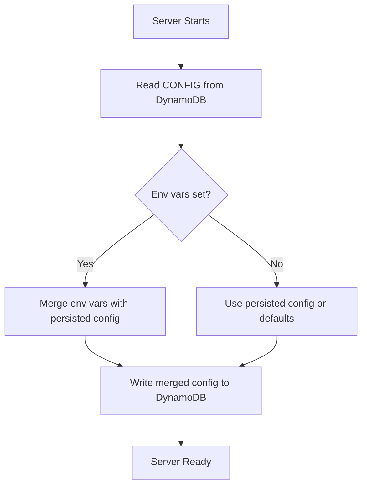

# Configuration

## URI Format

The backend store URI tells the plugin where to find DynamoDB:

```
dynamodb://<region>/<table-name>
dynamodb://<host>:<port>/<table-name>
dynamodb://http://<host>:<port>/<table-name>
```

**Examples:**

| URI | Description |
|-----|-------------|
| `dynamodb://us-east-1/my-table` | AWS region us-east-1 |
| `dynamodb://eu-west-1/prod-mlflow` | AWS region eu-west-1 |
| `dynamodb://localhost:8000/test-table` | DynamoDB Local |
| `dynamodb://http://dynamodb.local:8000/dev` | Explicit endpoint URL |

!!! note
    When a region is specified (e.g., `us-east-1`), the plugin uses the default AWS SDK endpoint for that region. When a `host:port` is specified, it is treated as a local or custom endpoint.

## Environment Variables

### Server

| Variable | Description | Default |
|----------|-------------|---------|
| `MLFLOW_FLASK_SERVER_SECRET_KEY` | **Required** when using `--app-name dynamodb-auth`. Static secret for CSRF protection. Must be consistent across all server instances. | _(none)_ |
| `MLFLOW_AUTH_ADMIN_USERNAME` | Admin username created on first startup | `admin` |
| `MLFLOW_AUTH_ADMIN_PASSWORD` | Admin password created on first startup | `password1234` |

!!! danger "Change Default Credentials"
    Always change the default admin password in production. Set `MLFLOW_AUTH_ADMIN_USERNAME` and `MLFLOW_AUTH_ADMIN_PASSWORD` before first startup.

### TTL Retention

These variables control how long data is retained before DynamoDB TTL removes it. Set to `0` to disable TTL for a category.

| Variable | Description | Default |
|----------|-------------|---------|
| `MLFLOW_DYNAMODB_SOFT_DELETED_RETENTION_DAYS` | Days to keep soft-deleted experiments and runs before TTL removal | `90` |
| `MLFLOW_DYNAMODB_TRACE_RETENTION_DAYS` | Days to keep trace data (info, tags, spans) before TTL removal | `30` |
| `MLFLOW_DYNAMODB_METRIC_HISTORY_RETENTION_DAYS` | Days to keep per-step metric history before TTL removal | `365` |

### Tag Denormalization

| Variable | Description | Default |
|----------|-------------|---------|
| `MLFLOW_DYNAMODB_DENORMALIZE_TAGS` | Comma-separated glob patterns for tags to denormalize onto META items | `mlflow.*` |

Tags matching these patterns are copied as top-level attributes on the run/experiment META item, enabling fast filter queries without scanning tag items.

**Example:**

```bash
export MLFLOW_DYNAMODB_DENORMALIZE_TAGS="mlflow.*,team,env"
```

This denormalizes all `mlflow.*` tags plus `team` and `env` tags onto META items.

!!! warning
    The `mlflow.*` pattern is always included regardless of what you set. You cannot remove it.

### Full-Text Search

| Variable | Description | Default |
|----------|-------------|---------|
| `MLFLOW_DYNAMODB_FTS_TRIGRAM_FIELDS` | Comma-separated entity fields with trigram indexing enabled | _(empty)_ |

Entity name fields (`experiment_name`, `run_name`, `model_name`) always have trigram indexing. This variable adds indexing for additional fields.

### Workspaces

| Variable | Description | Default |
|----------|-------------|---------|
| `MLFLOW_ENABLE_WORKSPACES` | Set to `1` to enable multi-workspace support | _(disabled)_ |

See [Workspaces](workspaces.md) for details.

## CONFIG Items in DynamoDB

Configuration is stored in DynamoDB itself under `PK=CONFIG`. This allows the plugin to persist and share configuration across multiple server instances.

### Denormalize Tags Config

Stored as `PK=CONFIG, SK=DENORMALIZE_TAGS`:

```json
{
  "PK": "CONFIG",
  "SK": "DENORMALIZE_TAGS",
  "patterns": ["mlflow.*", "team", "env"]
}
```

Manage via CLI:

```bash
mlflow-dynamodbstore denormalize-tags show --table my-table --region us-east-1
mlflow-dynamodbstore denormalize-tags set --table my-table --region us-east-1 \
  --pattern "mlflow.*" --pattern "team" --pattern "env"
```

### Per-Experiment Denormalize Config

Each experiment can have additional denormalize patterns beyond the global config:

```bash
mlflow-dynamodbstore denormalize-tags set --table my-table --region us-east-1 \
  --experiment-id 1 --pattern "custom_tag"
```

The effective patterns for a run are the union of global and per-experiment patterns.

### TTL Policy Config

Stored as `PK=CONFIG, SK=TTL_POLICY`:

```json
{
  "PK": "CONFIG",
  "SK": "TTL_POLICY",
  "trace_retention_days": 30,
  "soft_deleted_retention_days": 90,
  "metric_history_retention_days": 365
}
```

Manage via CLI:

```bash
mlflow-dynamodbstore ttl-policy show --table my-table --region us-east-1
mlflow-dynamodbstore ttl-policy set --table my-table --region us-east-1 \
  --trace-retention-days 60 --metric-history-retention-days 180
```

### FTS Trigram Fields Config

Stored as `PK=CONFIG, SK=FTS_TRIGRAM_FIELDS`:

```json
{
  "PK": "CONFIG",
  "SK": "FTS_TRIGRAM_FIELDS",
  "fields": ["description"]
}
```

Manage via CLI:

```bash
mlflow-dynamodbstore fts-trigrams show --table my-table --region us-east-1
mlflow-dynamodbstore fts-trigrams set --table my-table --region us-east-1 \
  --field experiment_name --field run_name --field description
```

## Config Reconciliation

On server startup, the plugin runs a **reconciliation** step that merges environment variables with the persisted CONFIG items in DynamoDB:

1. **Denormalize patterns**: Environment variable patterns are merged (union) with existing patterns in DynamoDB. New patterns from the env var are appended; existing patterns are preserved.
2. **TTL policy**: Environment variable overrides replace the corresponding field in the persisted policy. Fields not specified in env vars keep their persisted values.
3. **FTS trigram fields**: Not reconciled from env vars; managed exclusively via the CLI.



!!! tip "Config Precedence"
    Environment variables do **not** replace the full config -- they are **additive** for denormalize patterns and **override individual fields** for TTL policy. This means you can use env vars for deployment-time overrides while preserving operator-managed settings in DynamoDB.
