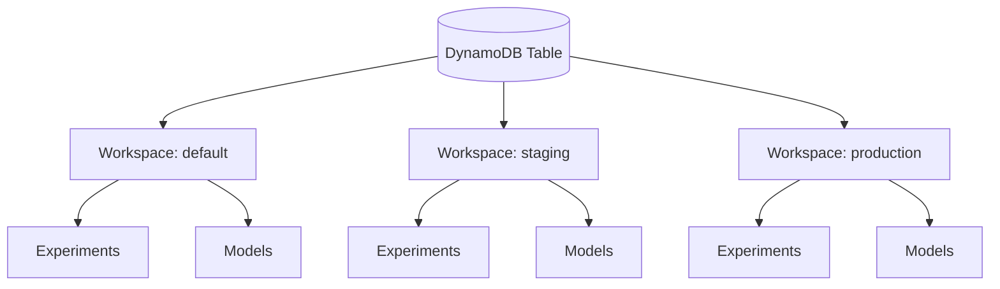

# Workspaces

Workspaces provide logical isolation of experiments, models, and artifacts within a single MLflow deployment. Each workspace acts as an independent namespace, making it easy to separate teams, environments, or projects.

## Enabling Workspaces

Set the environment variable before starting the server:

```bash
export MLFLOW_ENABLE_WORKSPACES=1

mlflow server \
  --app-name dynamodb-auth \
  --backend-store-uri dynamodb://us-east-1/my-table \
  --default-artifact-root s3://my-bucket/mlflow-artifacts
```

!!! note
    When workspaces are enabled, a `default` workspace is automatically created on first startup. All existing data is accessible through the `default` workspace.

## How Workspaces Work

Each workspace is stored in DynamoDB as:

```
PK = WORKSPACE#<name>
SK = META
```

Workspaces are indexed on GSI2 for fast listing. Experiments and models within a workspace are scoped by the workspace name in their key structure.



## Managing Workspaces

### Create a Workspace

```bash
mlflow-dynamodbstore delete-workspace --help  # See available workspace CLI commands
```

Workspaces are managed through the workspace store API. Each workspace has:

- **name** -- unique identifier (e.g., `staging`, `production`, `team-ml`)
- **description** -- optional human-readable description
- **default_artifact_root** -- per-workspace artifact location

### Workspace Properties

| Property | Description | Required |
|----------|-------------|----------|
| `name` | Unique workspace identifier | Yes |
| `description` | Human-readable description | No |
| `default_artifact_root` | S3 path for artifacts (overrides server default) | No |

## Scoping Experiments and Models

When workspaces are enabled, experiments and models are scoped to the active workspace. This means:

- Experiment names are unique **within** a workspace, not globally
- Model names are unique **within** a workspace
- Searches return results only from the active workspace

!!! tip
    Use workspace-specific artifact roots to ensure complete data isolation:

    ```
    default workspace:    s3://my-bucket/mlflow/default/
    staging workspace:    s3://my-bucket/mlflow/staging/
    production workspace: s3://my-bucket/mlflow/production/
    ```

## Artifact Isolation

Each workspace can have its own `default_artifact_root`. When a run is created without an explicit artifact URI, the workspace's artifact root is used. This provides:

- **Storage isolation** -- each workspace writes to a separate S3 prefix
- **Access control** -- use S3 bucket policies or IAM to restrict access per workspace
- **Cost tracking** -- separate S3 prefixes enable per-workspace cost allocation tags

If a workspace does not have a `default_artifact_root` set, the server-level `--default-artifact-root` is used as a fallback.

## Workspace Permissions

When the `dynamodb-auth` app is active, workspace access is controlled through the auth plugin:

- Users can be granted read or write access to specific workspaces
- Workspace admins can manage experiments and models within their workspace
- The `default` workspace cannot be deleted

!!! warning
    Deleting a workspace removes the workspace metadata but does **not** automatically delete the experiments, runs, or models within it. Use the `delete-workspace` CLI command for a clean teardown:

    ```bash
    mlflow-dynamodbstore delete-workspace \
      --table my-table --region us-east-1 \
      --workspace staging --confirm
    ```

## Best Practices

1. **Use descriptive names** -- choose workspace names that reflect their purpose (e.g., `team-nlp`, `env-staging`, `project-forecasting`)
2. **Set artifact roots** -- always configure per-workspace artifact roots for proper isolation
3. **Plan before enabling** -- enabling workspaces changes how experiments and models are scoped; plan your workspace structure before enabling in production
4. **Use the default workspace** -- keep the `default` workspace for shared or legacy experiments
