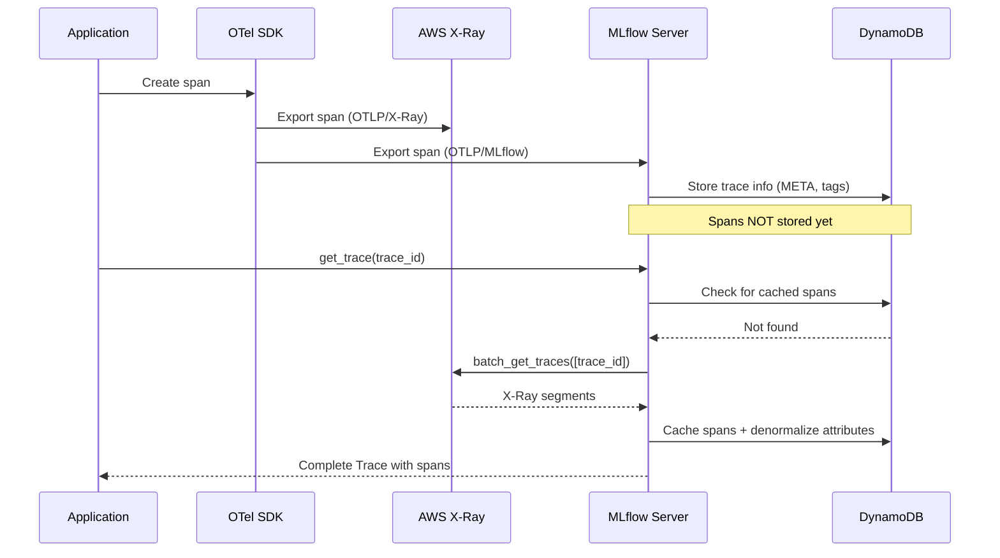

# X-Ray Integration

mlflow-dynamodbstore integrates with AWS X-Ray to provide span-level observability for MLflow traces. When you instrument your application with OpenTelemetry, spans are exported to X-Ray and lazily cached in DynamoDB when accessed through the MLflow API.

## How It Works



The key insight is that **trace metadata** (experiment, tags, timestamps) flows through MLflow, while **span data** (inputs, outputs, timing, attributes) flows through X-Ray. On first access, spans are fetched from X-Ray, converted, and cached in DynamoDB.

## Dual-Export OTel Setup

Configure OpenTelemetry to export spans to both MLflow and X-Ray simultaneously:

```python
from opentelemetry import trace
from opentelemetry.sdk.trace import TracerProvider
from opentelemetry.sdk.trace.export import BatchSpanProcessor

# X-Ray exporter
from opentelemetry.exporter.otlp.proto.grpc.trace_exporter import OTLPSpanExporter as GrpcExporter

# MLflow exporter
from mlflow.tracing.export.mlflow import MlflowSpanExporter

# Annotation processor (maps MLflow attributes to X-Ray annotations)
from mlflow_dynamodbstore.otel.annotation_processor import AnnotationSpanProcessor

provider = TracerProvider()

# Add the annotation processor FIRST so annotations are set before export
provider.add_span_processor(AnnotationSpanProcessor())

# Export to X-Ray via OTLP (e.g., through the ADOT collector)
provider.add_span_processor(
    BatchSpanProcessor(GrpcExporter(endpoint="http://localhost:4317"))
)

# Export to MLflow
provider.add_span_processor(
    BatchSpanProcessor(MlflowSpanExporter())
)

trace.set_tracer_provider(provider)
```

!!! tip "ADOT Collector"
    The AWS Distro for OpenTelemetry (ADOT) collector can receive OTLP spans and forward them to X-Ray. This is the recommended setup for production:

    ```yaml
    # otel-collector-config.yaml
    receivers:
      otlp:
        protocols:
          grpc:
            endpoint: 0.0.0.0:4317

    exporters:
      awsxray:
        region: us-east-1

    service:
      pipelines:
        traces:
          receivers: [otlp]
          exporters: [awsxray]
    ```

## Annotation Processor

The `AnnotationSpanProcessor` copies MLflow span attributes into X-Ray annotation attributes. X-Ray annotations are indexed key-value pairs that enable filter queries.

### Default Annotation Mapping

| MLflow Attribute | X-Ray Annotation | Description |
|-----------------|------------------|-------------|
| `mlflow.spanType` | `mlflow_spanType` | Span type (e.g., `LLM`, `RETRIEVER`) |
| `name` (span name) | `mlflow_spanName` | The span's display name |
| `status` (span status) | `mlflow_spanStatus` | Status code (`OK`, `ERROR`, `UNSET`) |
| `mlflow.chat_model` | `mlflow_chatModel` | Chat model identifier |
| `mlflow.invocation_params.model_name` | `mlflow_modelName` | Model name from invocation params |

### Custom Annotation Config

Pass a custom mapping to the processor:

```python
from mlflow_dynamodbstore.otel.annotation_processor import AnnotationSpanProcessor

custom_config = {
    "mlflow.spanType": "mlflow_spanType",
    "name": "mlflow_spanName",
    "status": "mlflow_spanStatus",
    "mlflow.chat_model": "mlflow_chatModel",
    "my.custom.attribute": "my_custom_annotation",
}

processor = AnnotationSpanProcessor(config=custom_config)
```

!!! warning
    X-Ray annotation names must use only alphanumeric characters and underscores. The default config already follows this convention.

## Span Search via X-Ray

When you search for traces with span-level filters, the plugin translates supported predicates into X-Ray filter expressions:

```python
import mlflow

# This filter is translated to an X-Ray annotation query
traces = mlflow.search_traces(
    experiment_ids=["1"],
    filter_string="span.mlflow.spanType = 'LLM'",
)
```

The plugin translates equality filters on mapped annotation attributes into X-Ray filter expressions like:

```
annotation.mlflow_spanType = "LLM"
```

Filters that cannot be translated to X-Ray expressions are applied as post-filters on the results.

## Lazy Caching

Spans are cached in DynamoDB the first time a trace is accessed via `get_trace()`. The cache entry is stored as:

```
PK = EXP#<experiment_id>
SK = T#<trace_id>#SPANS
```

The cached spans item contains the full span data as a JSON blob and inherits the same TTL as the trace META item.

On cache, the plugin also denormalizes span attributes onto the trace META item:

- `span_types` -- set of all span types in the trace
- `span_statuses` -- set of all span statuses
- `span_names` -- set of all span names

This enables filtering traces by span attributes without reading the full span data.

## Pre-Caching with the CLI

For bulk operations or to ensure spans are cached before X-Ray retention expires, use the CLI:

```bash
mlflow-dynamodbstore cache-spans \
  --table my-table \
  --region us-east-1 \
  --experiment-id 1 \
  --experiment-id 2
```

The command:

1. Queries all trace META items for the given experiments
2. Skips traces that already have cached spans
3. Calls `get_trace()` for each uncached trace, triggering the lazy cache
4. Reports counts of cached and already-cached traces

!!! tip "Run Before X-Ray Expiry"
    X-Ray retains trace data for **30 days** by default. If your trace retention in DynamoDB is longer than 30 days, run `cache-spans` periodically to ensure spans are cached before X-Ray deletes them.

    ```bash
    # Cache spans for traces up to 25 days old (safety margin)
    mlflow-dynamodbstore cache-spans \
      --table my-table \
      --region us-east-1 \
      --experiment-id 1 \
      --days 25
    ```

## Retention Considerations

X-Ray and DynamoDB have independent retention policies:

| System | Default Retention | Configurable? |
|--------|------------------|---------------|
| AWS X-Ray | 30 days | No (AWS-managed) |
| DynamoDB trace items | 30 days | Yes (`MLFLOW_DYNAMODB_TRACE_RETENTION_DAYS`) |
| DynamoDB cached spans | Same as trace | Inherits trace TTL |

!!! warning "Alignment Matters"
    If your DynamoDB trace retention exceeds 30 days, you **must** pre-cache spans before X-Ray deletes them. Otherwise, `get_trace()` will return traces without span data.

    **Recommended approach:**

    1. Set DynamoDB trace retention to match or be less than X-Ray's 30 days, **or**
    2. Run `cache-spans` on a schedule (e.g., weekly) to pre-cache before X-Ray expiry
